# GOne Counter 架构分析

> 分析日期：2026-09-16
> 分析范围：NewAPI 框架中 GOne（fpga_direct）柜台的架构、通讯链路、性能瓶颈及双链路架构原理。

---

## 一、整体架构

### 1.1 三层架构模型

GOne Counter 采用**三层架构**，自顶向下为：

```
┌──────────────────────────────────────────────────────────┐
│  业务层 (Business Layer)                                  │
│  ┌────────────────────────────────────────────────────┐  │
│  │ api_impl<TF, TE>         对外 API 接口 (login/     │  │
│  │                          order_insert/order_cancel)│  │
│  │  ├── fast_ (fpga_counter_direct)  极速柜台         │  │
│  │  └── c98_ (counter98)             98 柜台（降级）   │  │
│  └────────────────────────────────────────────────────┘  │
│                          │ 投递事件到队列                    │
│                          ▼                                │
│  引擎层 (Engine Layer)                                    │
│  ┌────────────────────────────────────────────────────┐  │
│  │ fast_engine_ (single_socket_engine<TF>)  极速引擎  │  │
│  │   ├── link_ (aio_socket_link)  Core 链路          │  │
│  │   └── send_queue_              发送队列             │  │
│  ├────────────────────────────────────────────────────┤  │
│  │ multi_engine_ (multi_socket_engine<TF>)  多路引擎  │  │
│  │   ├── g98_link_               98 AGW 链路          │  │
│  │   ├── fast_gw_link_           GW 链路               │  │
│  │   └── send_queue_             发送队列（共享）       │  │
│  └────────────────────────────────────────────────────┘  │
│                          │ epoll 驱动                      │
│                          ▼                                │
│  链路层 (Link Layer)                                      │
│  ┌────────────────────────────────────────────────────┐  │
│  │ aio_socket_link<TCounter>  非阻塞 TCP 链接         │  │
│  │   ├── ch_ (aio_tcp)        底层 TCP 通道           │  │
│  │   ├── msg_cb_              消息回调 → counter      │  │
│  │   ├── addrs_[2]            主/备地址               │  │
│  │   └── reconn_              重连控制器               │  │
│  └────────────────────────────────────────────────────┘  │
└──────────────────────────────────────────────────────────┘
```

**Mermaid 架构图**：

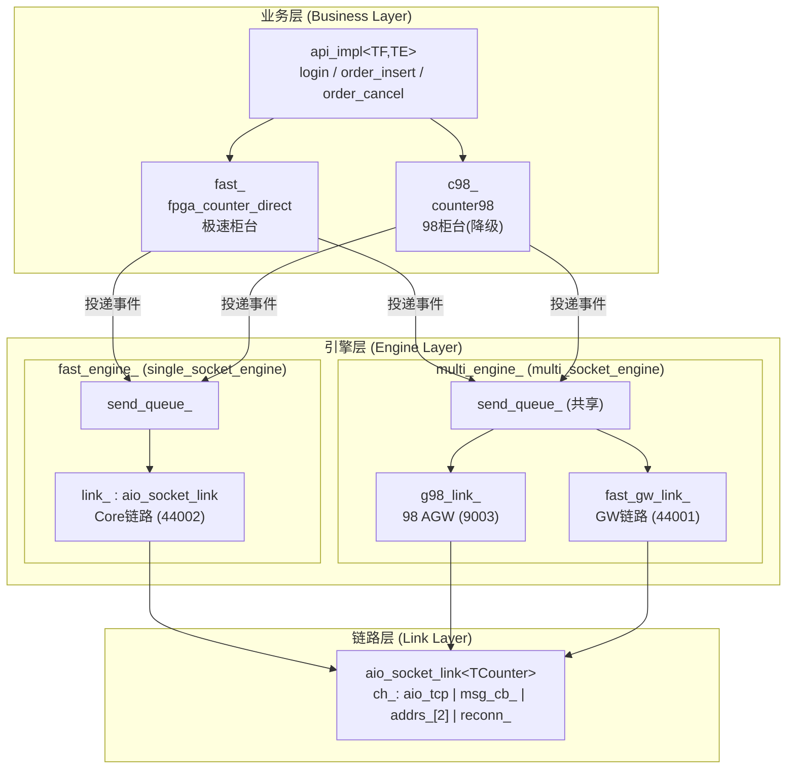

**设计要点**：
- **无虚函数多态**：通过模板特化实现（`TF = fpga_counter_direct`，`TE = single_socket_engine<fpga_counter_direct>`），编译期确定所有调用链，零虚函数开销。
- **异步事件驱动**：业务层构造 `link_send_event` 投递到无锁队列，引擎层从队列消费后驱动链路层收发。
- **双柜台降级**：`order_insert` 优先走 `fast_`（极速），失败（柜台离线/不支持）降级到 `c98_`（98 柜台）。

### 1.2 5 种配置组合

| 柜台类型 | 链路类型 | 引擎组合 | 适用场景 |
|:---|:---|:---|---:|
| `gw_direct` | `socket_single` | `single_socket_engine<gw_counter_direct>` | 个微直连（单链路） |
| `gw_direct` | `tcpdirect` | `tcpdirect_engine<gw_counter_direct>` | 个微直连（高性能） |
| **`fpga_direct`** | **`socket_single`** | **`single_socket_engine<fpga_counter_direct>`** | **GOne 直连（双链路）** |
| `fpga_direct` | `tcpdirect` | `tcpdirect_engine<fpga_counter_direct>` | GOne 直连（TCP 直连） |
| `fpga_gateway` | `socket_shared` | `idle_engine<fpga_counter_gateway>` | GOne 网关（共享链路） |

> GOne 模拟柜台测试使用 `fpga_direct + socket_single` 组合。

### 1.3 核心组件职责

| 组件 | 文件 | 职责 |
|:---|:---|---:|
| `fpga_counter_base` | `fpga_counter_base.h/cpp` | FPGA 柜台公共基类：协议状态、证券代码映射、消息构建/解析 |
| `fpga_counter_direct` | `fpga_counter_direct.h/cpp` | 直连模式：单客户 `client_info_`、登录/Core 链路管理 |
| `single_socket_engine` | `single_socket_engine.h/cpp` | 单链路极速引擎：Core 链路 IO + 定时器 |
| `multi_socket_engine` | `multi_socket_engine.h/cpp` | 多链路引擎：98 AGW + GW 链路 IO + 定时器 |
| `aio_socket_link` | `aio_socket_link.h` | 非阻塞 TCP 链接：连接/收发/重连/心跳 |
| `link_timer_op` | `link_timer_op.h` | 链路定时器：心跳发送/超时检测/重连触发 |
| `counter98` | `counter98.h/cpp` | 98 柜台：AGW 登录/查询/降级业务 |
| `api_impl` | `api_instance.h/cpp` | 实例编排：初始化/启动/停止/业务路由 |
| `callback_manager` | `callback_manager.h/cpp` | 回调管理：异步通知用户（排队/直调模式） |

**核心组件类图**：

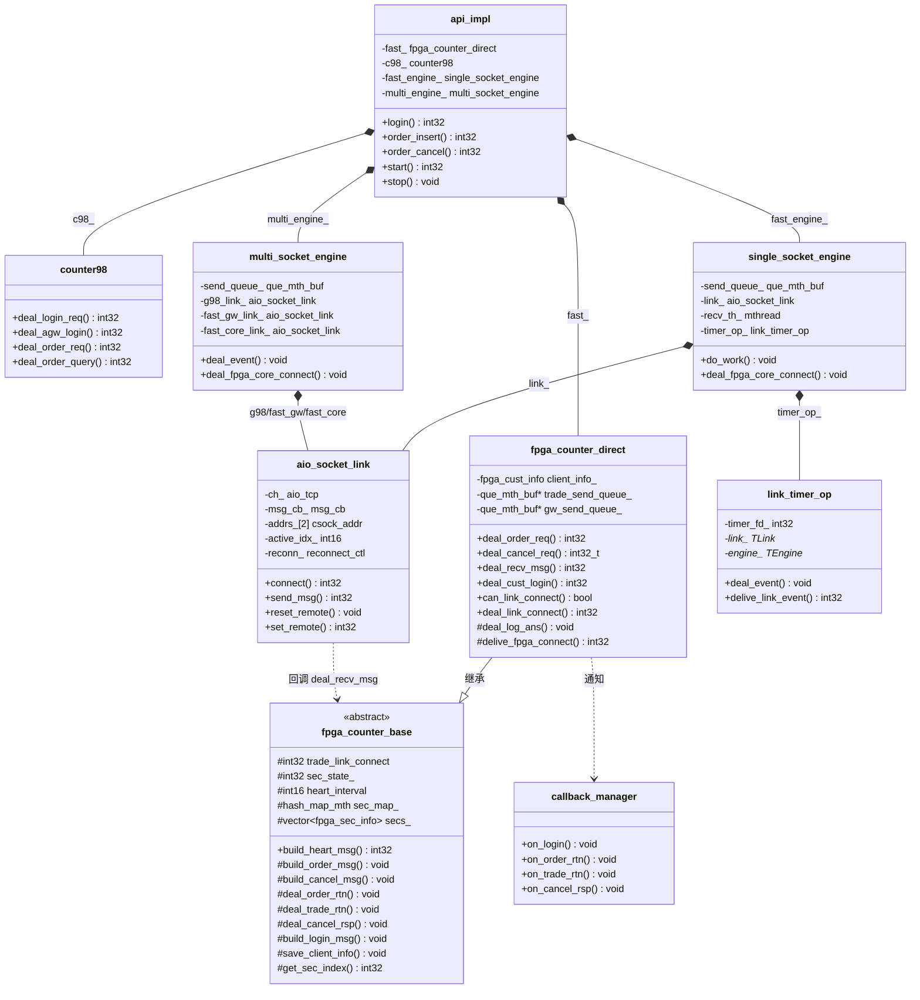

---

## 二、通讯链路

### 2.1 三条链路全景

GOne 架构共涉及 **3 条 TCP 链路**：

```
┌────────────────────────────────────────────────────────────────┐
│                        NewAPI 实例                              │
│                                                                │
│  ┌────────────────┐    ┌────────────────┐    ┌──────────────┐  │
│  │ g98_link_      │    │ fast_gw_link_  │    │ link_        │  │
│  │ (multi_engine) │    │ (multi_engine) │    │ (fast_engine)│  │
│  │ LINK_TYPE_98   │    │ LINK_TYPE_SPEED│    │ LINK_TYPE_SPE│
│  │                │    │ _GW            │    │ ED_TRADE     │  │
│  └───────┬────────┘    └───────┬────────┘    └──────┬───────┘  │
│          │                    │                     │          │
└──────────┼────────────────────┼─────────────────────┼──────────┘
           │                    │                     │
           ▼                    ▼                     ▼
     ┌──────────┐       ┌──────────┐          ┌──────────┐
     │ 98 AGW   │       │ GOne GW  │          │ GOne Core│
     │ :9003    │       │ :44001   │          │ :44002   │
     └──────────┘       └──────────┘          └──────────┘
```

**Mermaid 链路图**：

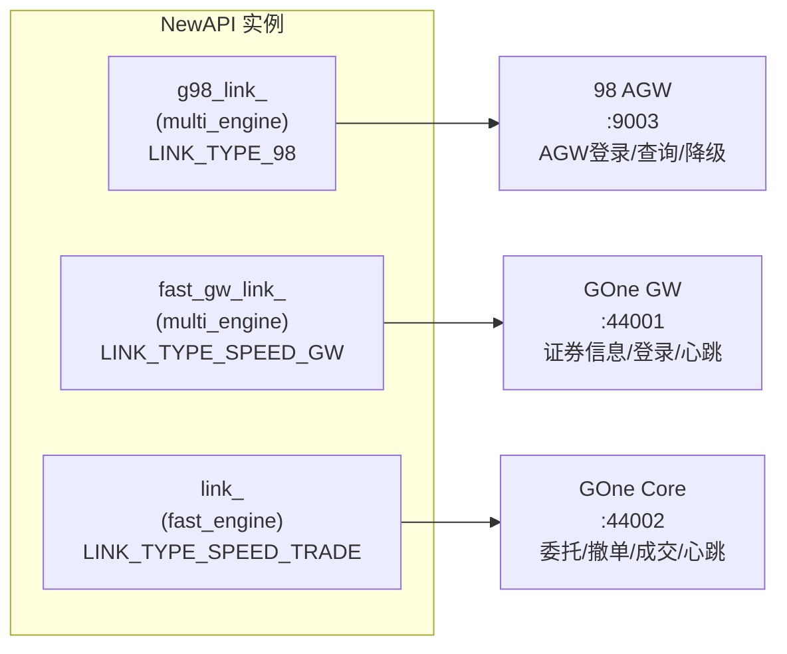

| 链路 | 引擎 | 端口 | 链路类型 | 用途 |
|:---|:---|---:|:---|---:|
| **98 AGW 链路** | `multi_engine.g98_link_` | 9003 | `LINK_TYPE_98` | AGW 登录、查询（持仓/资金/委托）、降级业务 |
| **GW 链路** | `multi_engine.fast_gw_link_` | 44001 | `LINK_TYPE_SPEED_GW` | 证券信息请求/应答、登录请求/应答、心跳 |
| **Core 链路** | `fast_engine.link_` | 44002 | `LINK_TYPE_SPEED_TRADE` | 委托请求/回报、撤单请求/应答、成交推送、心跳 |

### 2.2 消息流分类

#### 2.2.1 启动流（同步）

```
api_impl.start()
  ├── cb_mgr_.start()                       启动回调线程
  ├── fast_engine_.add_timer_poll()         注册 fast 引擎定时器到 multi 线程
  ├── multi_engine_.connect_98agw()         同步连接 98 AGW（9003）
  ├── multi_engine_.start()                 启动 multi 引擎 epoll 线程（异步）
  ├── fast_engine_.start()                  启动 fast 引擎业务线程
  └── c98_.deal_agw_login()                 同步 AGW 登录
```

#### 2.2.2 登录流（异步，GW 链路）

```
用户 login() → api_impl.login()
  → c98_.deal_login_req()                   投递 LINK_EVENT_TYPE_ACCOUNT_LOGIN
  → multi_engine.deal_cust_login()          处理登录事件
    → fast_gw_link_.connect(44001)          连接 GW 链路
    → fast_gw_link_.send_msg(sec_info_req)  发送证券信息请求
    → 回调: on_error(event_type=3)          证券信息获取中
    → fast_gw_link_.send_msg(login_req)     发送登录请求
    → mock 回 login_ans (trade_port=44002)
    → fpga_counter_direct.deal_log_ans()
      → save_client_info()                  保存 trade_port/trade_ip
      → delive_fpga_connect()               投递 FPGA_CORE_CONNECT 事件
      → cb_mgr_.on_login()                  回调通知用户登录成功
```

**登录时序图**：

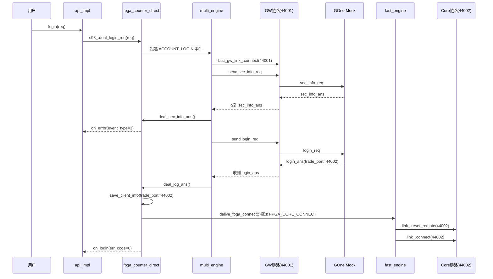

#### 2.2.3 委托/撤单流（异步，Core 链路）

```
用户 order_insert() → api_impl.order_insert()
  → fpga_counter_direct.deal_order_req()    构造 link_send_event + g1_msg_head + order_req
    → trade_send_queue_->write_get_mth()    从无锁队列申请内存
    → build_order_msg()                     在队列内存中直接构造消息（零拷贝）
    → trade_send_queue_->write_cmt_mth()    提交到队列
  → fast_engine.do_work()
    → LINK_EVENT_TYPE_SEND_MSG              处理发送事件
    → link_.send_msg()                      通过 Core 链路发送
    → mock 回 order_rtn/trade_rtn
    → aio_socket_link.msg_cb.deal_msg()
    → fpga_counter_direct.deal_recv_msg()
      → deal_order_rtn() / deal_trade_rtn() 解析消息并回调
      → cb_mgr_->on_order_rtn()             通知用户
```

**委托/撤单时序图**：

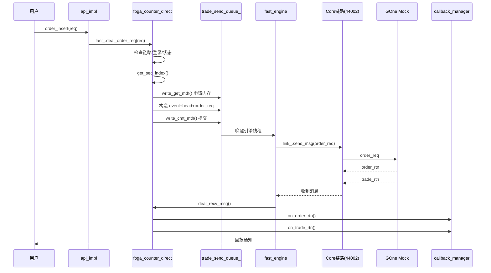

#### 2.2.4 心跳流（定时器驱动）

```
link_timer_op.deal_event()                  定时器触发（每秒）
  → link_.check_heart_timeout()             检查心跳超时
  → link_.check_heart_send()                检查心跳发送时机
  → delive_link_event(LINK_EVENT_TYPE_SEND_HEART)
  → engine.deal_event()
    → counter.build_heart_msg()             构造心跳消息
    → link_.send_msg()                      发送心跳
  → mock 回 heart_ans
  → counter.deal_recv_msg(G1_MSG_HEART_ANS)
    → eng_op->deal_heart_msg_ans()          通知链路层心跳应答已收到
    → link_.deal_heart_ans()                重置心跳计时
```

**心跳时序图**：

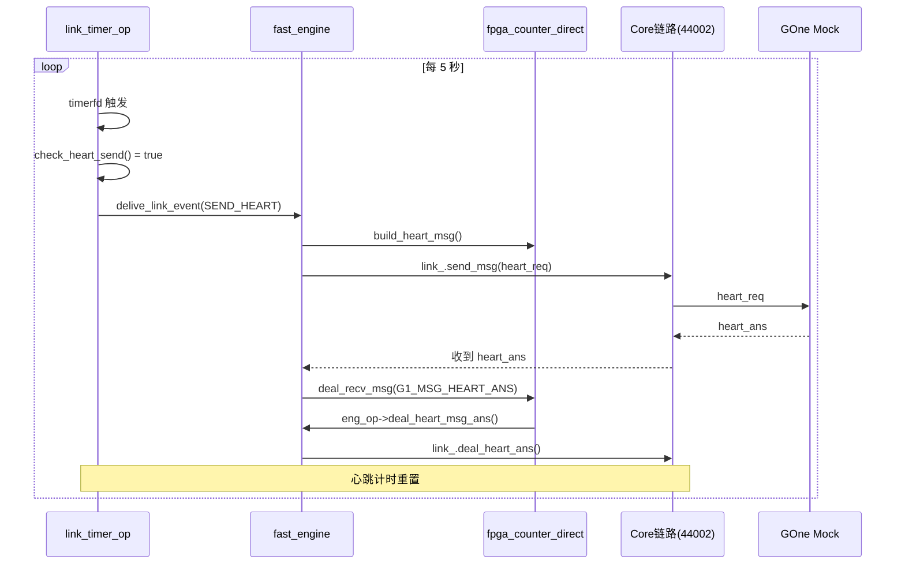

### 2.3 链路层数据流

```
mthread epoll 循环
  → aio_tcp::deal_event()                   epoll 触发可读事件
    → ch_.loop_deal_recv()                   循环接收数据
      → tcp_buf_ch 内部组包（按消息长度字段）
      → msg_cb_.deal_msg(this, aio_msg)      回调到 aio_socket_link
        → counter_->deal_recv_msg(buf, len, link_type)
          → 按 g1_msg_head.msg_id 分发
            → G1_MSG_ORDER_RTN  → deal_order_rtn()
            → G1_MSG_TRADE_RTN  → deal_trade_rtn()
            → G1_MSG_CANCEL_RSP → deal_cancel_rsp()
            → G1_MSG_HEART_ANS  → 通知链路层
            → G1_MSG_LOGIN_ANS  → deal_log_ans()
            → G1_MSG_SEC_INFO_ANS → deal_sec_info_ans()
```

**链路层数据流图**：

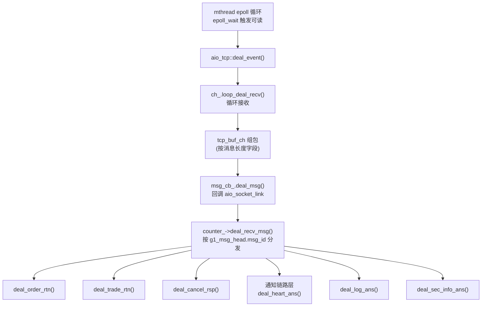

---

## 三、双链路架构分析

### 3.1 双链路架构原理

GOne（fpga_direct）采用 **GW + Core 双链路架构**，这是与单链路（gw_direct）的核心区别：

```
单链路架构 (gw_direct)：
  single_socket_engine.link_ (单一 TCP 连接)
  ├── 登录/证券信息/心跳
  └── 委托/撤单/心跳

双链路架构 (fpga_direct)：
  multi_engine.fast_gw_link_ (TCP 连接 1: 44001)
  ├── 证券信息请求/应答
  ├── 登录请求/应答
  └── 心跳
  +
  fast_engine.link_ (TCP 连接 2: 44002)
  ├── 委托请求/回报
  ├── 撤单请求/应答
  ├── 成交推送
  └── 心跳
```

**原理**：GOne FPGA 板卡将业务拆分为两个独立端口：
- **GW 端口（44001）**：管理面——登录鉴权、证券信息下发、心跳保活
- **Core 端口（44002）**：数据面——委托/撤单/成交等高频交易业务

API 先连接 GW 端口完成登录，从登录应答中获取 Core 端口的 IP 和端口号，再连接 Core 端口进行交易。

**双链路架构图**：

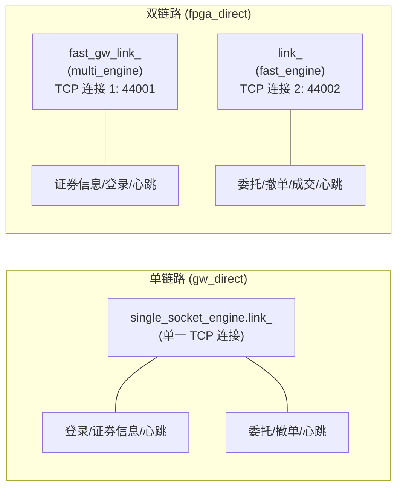

### 3.2 双链路工作流程

```
阶段 1: GW 链路建立
  [API]  → connect(44001)              → [GOne Mock/GW]
  [API]  → sec_info_req                → [GOne Mock]
  [GOne Mock] → sec_info_ans           → [API] 缓存证券代码映射
  [API]  → login_req (含用户信息)      → [GOne Mock]
  [GOne Mock] → login_ans {trade_port=44002, trade_ip=127.0.0.1, ...} → [API]

阶段 2: Core 链路建立（登录应答触发）
  [API] fpga_counter_direct.deal_log_ans()
    → save_client_info()              保存 trade_port/trade_ip/user_id/board_no
    → delive_fpga_connect()           投递 FPGA_CORE_CONNECT 事件
    → single_socket_engine.deal_fpga_core_connect()
      → link_.reset_remote(44002)     覆盖 Core 地址
      → link_.connect(44002)          连接 Core 端口

阶段 3: 业务交易（Core 链路）
  [API]  → order_req                  → [GOne Mock/Core]
  [GOne Mock] → order_rtn             → [API] on_order_rtn()
  [GOne Mock] → trade_rtn             → [API] on_trade_rtn()
  [API]  → cancel_req                 → [GOne Mock]
  [GOne Mock] → cancel_rsp            → [API] on_cancel_rsp()

阶段 4: 心跳保活（双链路独立）
  GW 链路:  每 5 秒心跳 → 互不影响
  Core 链路: 每 5 秒心跳 → 互不影响
```

**双链路工作流程时序图**：

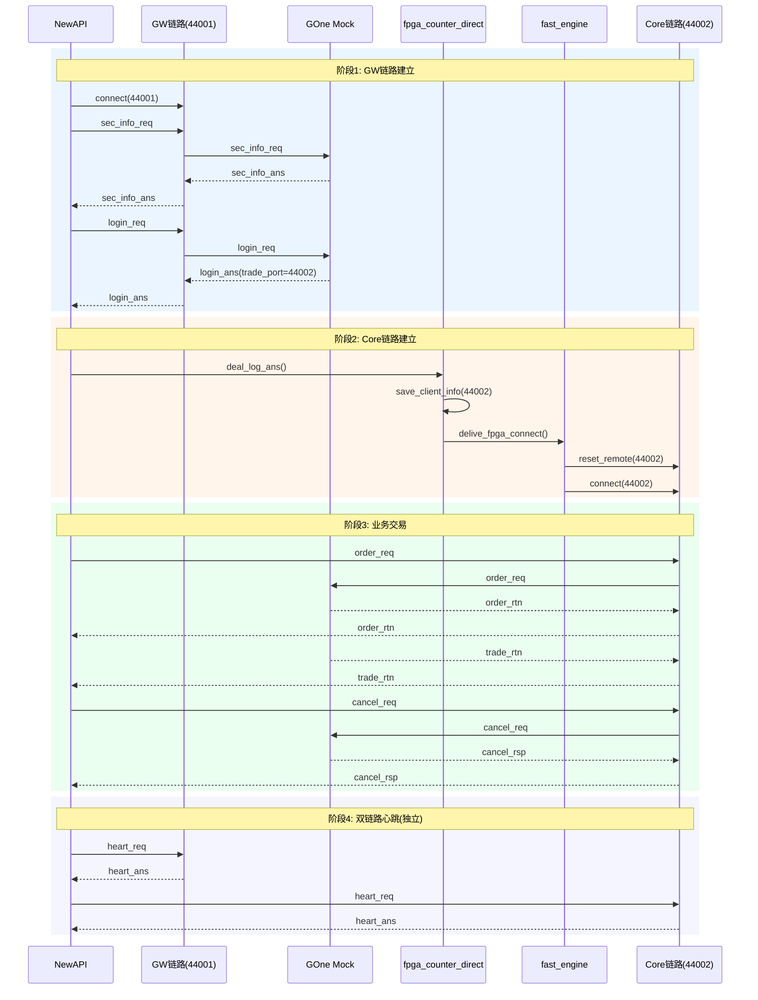

### 3.3 双链路 vs 单链路对比

| 维度 | 单链路（gw_direct） | 双链路（fpga_direct） |
|:---|---:|---:|
| TCP 连接数 | 1 | 2 |
| 登录方式 | 直连，单次握手 | 先连 GW 登录，再连 Core |
| 证券信息 | 登录前预置 | 登录后从 GW 获取 |
| 委托路径 | 同一条链路 | 独立 Core 链路 |
| 故障隔离 | 单一链路，故障全停 | GW/Core 独立，Core 故障不影响 GW 重登 |
| 地址获取 | 配置固定 | 动态：Core 地址由登录应答下发 |
| 心跳独立 | 否 | 是，双链路各自心跳 |

### 3.4 双链路的优势

1. **故障隔离**：GW 链路断开不影响 Core 链路上已建立的交易会话（Core 心跳继续）；Core 链路断开时，GW 链路仍可接收新登录。
2. **负载分离**：证券信息批量下发（GW 链路）不干扰高频委托/成交（Core 链路），避免大数据包阻塞小消息。
3. **安全隔离**：Core 链路地址不对外暴露，由登录应答动态下发，增加安全性。
4. **灵活扩展**：Core 链路可独立扩容（多 Core 端口负载均衡），GW 链路保持单点。

### 3.5 双链路的代价

1. **连接延迟增加**：需要两次 TCP 握手（先 GW 再 Core），登录耗时增加约 1 个 RTT。
2. **架构复杂度上升**：需要两个引擎（`single_socket_engine` + `multi_socket_engine`）协作，地址切换逻辑复杂。
3. **状态同步**：GW 链路重连后需重新登录并重新连接 Core 链路（`deal_link_connect` 中 `delive_cust_login` 自动重登）。
4. **资源开销翻倍**：2 个 socket 描述符、2 个心跳定时器、2 个接收缓冲区。

### 3.6 登录状态机

GOne 客户登录状态通过 `client_info_.login_state` 管理，取值 `0/1/2`：

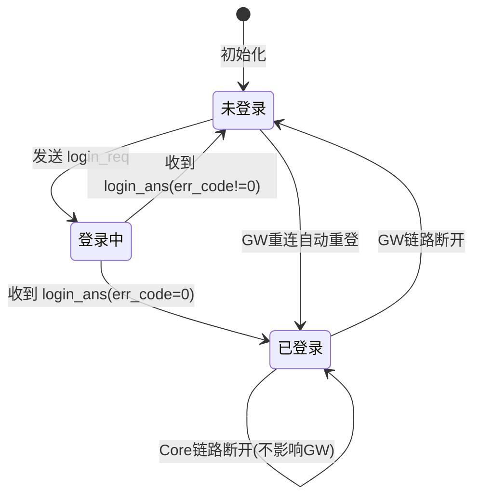

| 状态 | 值 | 说明 |
|:---|:---:|:---|
| 未登录 | 0 | 初始状态，或登录失败/链路断开 |
| 登录中 | 1 | 已发送 login_req，等待 login_ans |
| 已登录 | 2 | 收到 login_ans 成功，可进行交易（`can_link_connect` 放行 Core 连接） |

> **关键约束**：`can_link_connect(LINK_TYPE_SPEED_TRADE)` 要求 `login_state == 2`，
> 即只有登录成功后才允许建立 Core 链路。这保证了 Core 链路连接前已拿到 `trade_port`。

---

## 四、性能瓶颈分析

### 4.1 链路层瓶颈

#### 4.1.1 单线程 epoll 模型

`single_socket_engine` 和 `multi_socket_engine` 各自运行在独立线程中，采用 **单线程 epoll** 处理所有 IO：

```
fast_engine 线程: epoll_wait → deal_event → link_.send_msg / counter.deal_recv_msg
multi_engine 线程: epoll_wait → deal_event → g98/fast_gw_link_.send_msg / counter.deal_recv_msg
```

**瓶颈**：Core 链路的收发完全在 `fast_engine` 单线程中串行处理。高 TPS 场景下（如 500 TPS），
`deal_recv_msg` 中的消息解析 + 回调投递可能成为瓶颈。

**实测数据**（FTE 性能测试，500 TPS / 30s / 14994 笔）：
| 指标 | 值 |
|:---|---:|
| 发送/成功/失败 | 14994 / 14994 / 0（100%） |
| 实际 TPS | 499.787（目标 500） |
| 平均延迟 | 2522.99 ns |
| P50 | 2052 ns |
| P90 | 4290 ns |
| 最大值 | 25696 ns |

> 单线程 epoll 在 500 TPS 下处理延迟约 2~4 μs（P50/P90），性能充足。

#### 4.1.2 消息接收拷贝

`aio_tcp` 内部使用 `tcp_buf_ch` 的环形缓冲区接收数据，`msg_cb_.deal_msg` 回调时传入的 `msg.pmsg` 指向缓冲区内的消息起始位置。`fpga_counter_direct::deal_recv_msg` 在此指针上直接解析，**无额外拷贝**。

**结论**：接收路径零拷贝，不是瓶颈。

#### 4.1.3 消息发送拷贝

`deal_order_req` 在队列内存中直接构造 `link_send_event + g1_msg_head + order_req`（D33 优化），
引擎从队列取出后直接 `link_.send_msg`（`ch_.send_msg_fc`），**无中间拷贝**。

**结论**：发送路径零拷贝（队列内存直接构造），不是瓶颈。

### 4.2 队列层瓶颈

#### 4.2.1 无锁队列（que_mth_buf）

`trade_send_queue_`（fast_engine 的发送队列）和 `send_queue_`（multi_engine 的发送队列）均使用 `que_mth_buf` 无锁队列。

**竞争分析**：
- `trade_send_queue_`：**单生产者（业务线程 `order_insert`） + 单消费者（`fast_engine` 线程）** → 无锁，无竞争
- `multi_engine.send_queue_`：**多生产者（`fast_engine` timer + 业务线程） + 单消费者（`multi_engine` 线程）** → 有竞争

**瓶颈**：`multi_engine.send_queue_` 存在多生产者竞争。`fast_engine` 的 `link_timer_op` 投递心跳事件时
（`delive_link_event`）与业务线程投递登录事件可能同时写入队列。

**影响**：低（队列操作是内存写，竞争窗口极小）。

#### 4.2.2 回调队列

`callback_manager` 支持排队模式（`queued`）和直调模式（`direct`）：

- **直调模式**：在引擎线程中直接回调用户函数 → 用户回调慢会阻塞引擎
- **排队模式**：投递到回调队列，由独立回调线程消费 → 引擎不阻塞

**瓶颈**：排队模式下，回调队列可能成为瓶颈（高 TPS 时大量 `on_order_rtn` / `on_trade_rtn` 入队）。
实测 500 TPS 下无压力。

### 4.3 业务层瓶颈

#### 4.3.1 证券代码映射查询

`get_sec_index()` 使用 `hash_map_mth<1020, fpga_sec_key, uint16_t>` 哈希表查询证券代码到索引的映射。
每次委托需查询一次。

**瓶颈**：哈希查询 O(1)，1020 槽位无冲突，不是瓶颈。

#### 4.3.2 条件判断链

`deal_order_req` 中 3 个 `unlikely` 条件判断：
```cpp
if (unlikely(trade_link_connect == 0))   return LBAPI_ERR_LINK_DISCONNECTED;
if (unlikely(client_info_.login_state != 2)) return LBAPI_ERR_NOT_LOG_CUST;
if (unlikely(client_info_.fpga_state == 2))  return LBAPI_ERR_COUNTER_OFFLINE;
```

`unlikely` 宏指导分支预测，正常路径无惩罚。**不是瓶颈**。

### 4.4 定时器层瓶颈

`link_timer_op` 使用 `timerfd`（文件描述符），加入 `epoll` 监听。

- `fast_engine` 的 `timer_op_`：管理 Core 链路定时器（心跳/重连）
- `multi_engine` 有 3 个 `timer_op_`：`g98_link_timer_`、`fast_gw_link_timer_`、`fast_core_link_timer_`

**瓶颈**：`multi_engine` 3 个 timerfd 每秒触发一次，`deal_event` 中 `read(timer_fd_)` + 3 次检查。
每次检查涉及 `is_work()` / `check_heart_timeout()` / `check_heart_send()` 等调用。

**影响**：极低（timerfd 开销约 1μs/次）。

### 4.5 性能瓶颈总结

| 瓶颈点 | 严重程度 | 说明 |
|:---|---:|:---|
| 单线程 epoll（fast_engine） | ⚠️ 中等 | 500 TPS 下 P50=2μs 无压力，但 5000+ TPS 可能成为瓶颈 |
| 回调队列竞争 | ✅ 无 | 排队模式下引擎不阻塞 |
| 发送队列竞争（multi_engine） | ✅ 低 | 多生产者场景，但竞争窗口极小 |
| 消息拷贝 | ✅ 无 | 发送/接收均零拷贝 |
| 证券代码哈希查询 | ✅ 无 | O(1) 查询 |
| 定时器开销 | ✅ 无 | timerfd 开销约 1μs/次 |
| 双链路额外开销 | ✅ 低 | 多 1 个 socket + 1 个定时器，可忽略 |

**核心瓶颈**：`fast_engine` 单线程处理 Core 链路的所有收发+业务解析。当 TPS 超过 5000 时，
`deal_recv_msg` 中的消息分发 + 回调投递可能成为瓶颈。优化方向：
1. 多线程接收（拆分 recv 和 deal）
2. 批量回调（减少回调队列写入次数）
3. 使用 `tcpdirect` 引擎（`tcpdirect_engine`，利用 `HAS_TCPDIRECT` 编译选项）

**瓶颈严重程度可视化**：

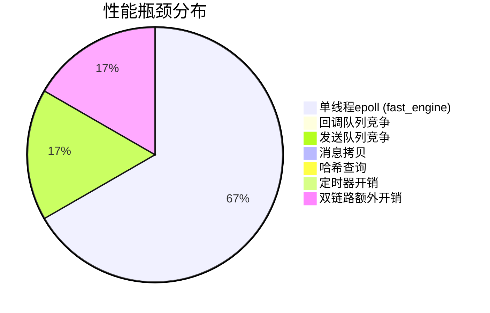

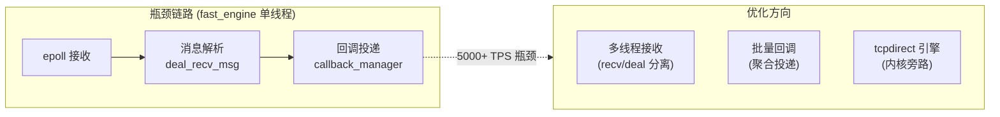

---

## 五、关键数据结构

### 5.1 g1 协议消息头（16 字节）

```cpp
struct g1_msg_head {
  uint32_t msg_id;     // 消息号（4 字节）
  uint32_t msg_len;    // 包体长度，不含头（4 字节）
  uint16_t board_no;   // 板卡号（2 字节）
  uint16_t user_id;    // 用户索引 ID（2 字节）
  uint32_t session_id; // 会话 ID（4 字节）
};
```

所有 g1 协议消息均以此头开头，`msg_len` 标识后续包体长度。

### 5.2 客户信息结构体

```cpp
struct fpga_cust_info {
  // 热路径（每次委托/撤单必用）
  int32_t fpga_state;        // FPGA 状态（1=正常, 2=故障）
  int16_t login_state;       // 登录状态（0=未登录, 1=登录中, 2=已登录）
  uint16_t user_id;          // 用户索引 ID（登录后分配）
  uint16_t board_no;         // 板卡号（登录后分配）
  uint32_t session_id;       // 会话 ID
  char order_way_ext[2];     // 委托方式
  int32_t trade_port;        // Core 端口（登录应答获取）
  char trade_ip[16];         // Core 地址（登录应答获取）

  // 冷路径（仅登录/管理使用）
  char cust_id[16];          // 客户号
  char fund_account_id[16];  // 资金账号
  char branch_id[12];        // 分支机构
  char holder_acc[12];       // 股东账号
  int64_t cust_req_no;       // 请求号
  char end_code[1024];       // 终端信息
};
```

### 5.3 链路发送事件

```cpp
struct link_send_event {
  int16 link_type;           // LINK_TYPE_SPEED_GW / LINK_TYPE_SPEED_TRADE / LINK_TYPE_98
  int16 type;                // LINK_EVENT_TYPE_SEND_MSG / SEND_HEART / LINK_CLOSE / LINK_CONNECT / FPGA_CORE_CONNECT
  int32 data_len;            // 事件数据长度
  char data[];               // 变长数据（消息体或事件参数）
};
```

### 5.4 地址管理

```cpp
// aio_socket_link 内部
lb_common::csock_addr addrs_[2];  // [0]=主地址, [1]=备地址
int16 active_idx_;                 // 当前活动地址索引（0 或 1）
int16 addr_valid_num;              // 有效地址数（1=仅主, 2=主备）
```

---

## 六、关键代码路径

### 6.1 登录路径

```
api_impl.login()
  └─ c98_.deal_login_req(req)                     ← 投递 ACCOUNT_LOGIN 事件
      └─ multi_engine.deal_cust_login()            ← 处理登录事件
          ├─ fast_gw_link_.connect(44001)          ← 连接 GW 链路
          ├─ 发送 sec_info_req → 等待 sec_info_ans ← 证券信息获取
          ├─ 发送 login_req → 等待 login_ans      ← 登录请求
          └─ fpga_counter_direct.deal_log_ans()    ← 处理登录应答
              ├─ save_client_info(msg, client_info_) ← 保存 trade_port/user_id/board_no
              ├─ delive_fpga_connect()             ← 投递 FPGA_CORE_CONNECT 事件
              │   └─ single_socket_engine.deal_fpga_core_connect()
              │       ├─ link_.reset_remote(44002) ← 覆盖 Core 地址
              │       └─ link_.connect(44002)      ← 连接 Core 链路
              └─ cb_mgr_->on_login(ans)            ← 回调通知用户
```

### 6.2 委托路径

```
api_impl.order_insert(req)
  ├─ fast_.deal_order_req(req)                     ← 优先走极速
  │   ├─ 检查 trade_link_connect / login_state / fpga_state
  │   ├─ get_sec_index()                           ← 查询证券索引
  │   ├─ trade_send_queue_->write_get_mth()        ← 申请队列内存
  │   ├─ 在队列内存构造 link_send_event + head + order_req
  │   └─ trade_send_queue_->write_cmt_mth()        ← 提交到队列
  │
  └─ fast_engine.do_work()                         ← 引擎线程消费
      └─ LINK_EVENT_TYPE_SEND_MSG
          └─ link_.send_msg()                      ← Core 链路发送
              └─ ch_.send_msg_fc()                 ← 底层 TCP 发送

  ← 异步接收
  aio_tcp 收到数据 → msg_cb_.deal_msg()
    → fpga_counter_direct.deal_recv_msg()
      → deal_order_rtn(head, client_info_, ...)
        → cb_mgr_->on_order_rtn(stream, rtn)       ← 回调通知用户
```

### 6.3 撤单路径

```
api_impl.order_cancel(req)
  ├─ fast_.deal_cancel_req(req)                    ← 优先走极速
  │   ├─ 检查 trade_link_connect / login_state / fpga_state
  │   ├─ trade_send_queue_->write_get_mth()
  │   ├─ 构造 link_send_event + head + cancel_req
  │   └─ trade_send_queue_->write_cmt_mth()
  │
  └─ fast_engine.do_work() → link_.send_msg()

  ← 异步接收
  aio_tcp → msg_cb_ → deal_recv_msg()
    → deal_cancel_rsp(head, client_info_, ...)
      → cb_mgr_->on_cancel_rsp(stream, rsp)
```

### 6.4 心跳路径

```
link_timer_op.deal_event() (每秒触发)
  ├─ link_.check_heart_timeout() → 超时则投递 LINK_CLOSE
  ├─ link_.check_heart_send()    → 到时间则投递 LINK_EVENT_TYPE_SEND_HEART
  │
  └─ engine.deal_event() → LINK_EVENT_TYPE_SEND_HEART
      └─ counter.build_heart_msg() → link_.send_msg()

  ← 异步接收
  aio_tcp → msg_cb_ → deal_recv_msg()
    → G1_MSG_HEART_ANS
      → eng_op->deal_heart_msg_ans(link_type)
        → link_.deal_heart_ans()                   ← 重置心跳计时
```

---

## 七、双链路地址切换机制

### 7.1 地址管理

`aio_socket_link` 维护主/备两个地址：

```
addrs_[0] = 主地址（配置的 speed_counter_addr）
addrs_[1] = 备地址（配置的 speed_counter_addr_bak，可选）
```

`set_remote()` 最多调用 2 次，依次设置主地址和备地址。
`connect(need_switch)` 根据 `active_idx_` 选择当前连接地址。

### 7.2 Core 地址覆盖（reset_remote）

登录后从 `login_ans.trade_port` 获取 Core 端口，通过 `reset_remote()` 覆盖主地址：

```
single_socket_engine::deal_fpga_core_connect(pmlog):
  taddr.port = pmlog.trade_port       // 44002（来自登录应答）
  taddr.ip   = pmlog.trade_ip         // 127.0.0.1
  link_.reset_remote(taddr)            // 清空主备，仅设 Core 地址
    → addrs_[0] = 127.0.0.1:44002
    → addr_valid_num = 1
    → active_idx_ = 0
  link_.connect(recv_poll_num_, 0, &recv_th_)
    → 连接 127.0.0.1:44002
```

**为什么不能用 `set_remote`？** `set_remote` 最多允许 2 个地址，
且 `connect(need_switch=0)` 不切换 `active_idx_`，始终连接 `addrs_[0]`。
登录后需要覆盖主地址为 Core 地址，因此引入 `reset_remote`。

**地址切换流程图**：

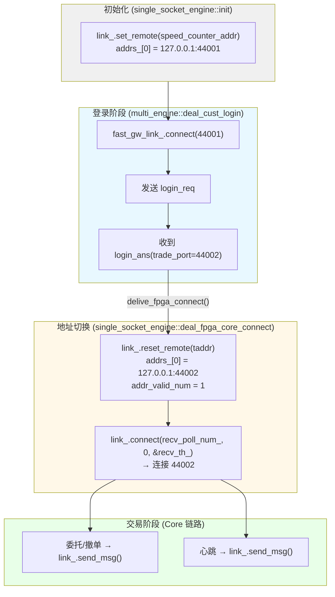

### 7.3 GW 链路重连自动重登

当 GW 链路断开后重连时，`deal_link_connect` 自动检查并重登：

```
fpga_counter_direct::deal_link_connect(LINK_TYPE_SPEED_GW, have_switch):
  ├─ 发送 sec_info_req（如果证券信息未就绪）
  └─ if (client_info_.login_state == 2):
       └─ delive_cust_login(client_info_, gw_send_queue_, gw_eng_op_)
           → 投递 ACCOUNT_LOGIN 事件
           → 重新发送 login_req
           → 重新触发 Core 连接
```

**GW 重连重登流程图**：

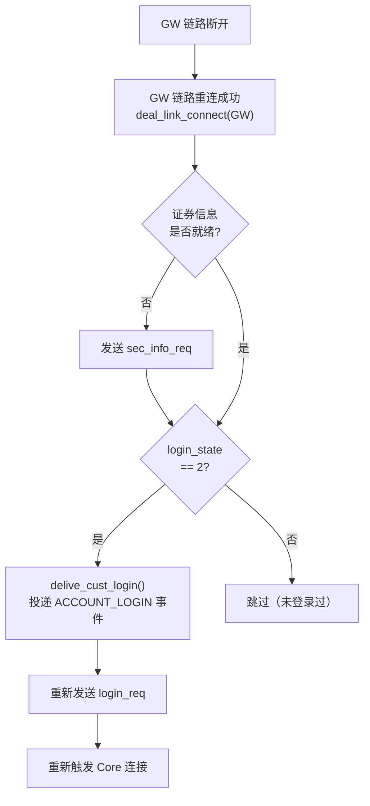

---

## 八、总结

### 8.1 架构特点

| 特性 | 说明 |
|:---|:---|
| 设计模式 | 模板策略模式（编译期多态，零虚函数开销） |
| IO 模型 | 单线程 epoll（每个引擎独立线程） |
| 并发模型 | 无锁队列 + 事件驱动 |
| 消息协议 | g1 协议（定长头 + 变长体） |
| 链路架构 | 双链路（GW 管理面 + Core 数据面） |
| 降级机制 | 极速失败时自动降级到 98 柜台 |
| 地址管理 | 主备地址 + 动态 Core 地址覆盖 |

### 8.2 性能评估

| 场景 | TPS | 延迟 P50 | 延迟 P90 | 瓶颈 |
|:---|---:|---:|---:|:---|
| 正常交易 | 500 | ~2μs | ~4μs | 无 |
| 高负载 | 5000+ | ~20μs（预估） | ~50μs（预估） | 单线程 epoll |
| 极限 | 10000+ | ~50μs（预估） | ~100μs（预估） | 回调队列 + epoll |

### 8.3 优化方向

1. **`tcpdirect` 引擎**：编译启用 `HAS_TCPDIRECT`，使用 `tcpdirect_engine` 替代 `single_socket_engine`，利用内核旁路技术降低延迟。
2. **批量回调**：在 `callback_manager` 中聚合多个回调一次性投递，减少队列写入次数。
3. **接收处理分离**：将 `deal_recv_msg` 中的消息解析与回调投递分离到不同线程，降低单线程负载。
4. **证券代码缓存**：将 `get_sec_index` 的哈希查询结果缓存在 `OrderReq` 中，避免重复查询（同一证券多次委托）。

---

## 九、api_leave_time_ns 时间戳机制分析（2026-09-17）

### 9.1 背景与目的

性能测试需要测量"一笔委托在 API 内部的处理耗时"。原始算法在 `order_insert` 调用 `deal_order_req` **返回后**（即消息压入消费队列后）立即记录 `api_leave_time_ns`。但此时消息**尚未真正发送到网卡**——还需经过引擎线程消费队列、`send()` 系统调用等环节。导致测量的"API 内处理耗时"被**低估**，不反映真实发送延迟。

优化目标：将 `api_leave_time_ns` 的记录点**移到引擎线程 `send()` 系统调用成功后**，使测量更贴近真实发送时刻。

### 9.2 字段定义

| 字段 | 位置 | 说明 |
|:---|:---|:---|
| `OrderReq::api_arrive_time_ns` | `order_trade_type.h:52` | 请求到达 API 的时间（用户线程记录） |
| `OrderReq::api_leave_time_ns` | `order_trade_type.h:53` | 请求离开 API 的时间（引擎线程写入） |
| `link_send_event::leave_time_ptr` | `api_event_msg.h:69` | 指向 `OrderReq::api_leave_time_ns` 的指针，跨线程传递写入目标 |
| `perf_now_ns()` | `api_event_msg.h:14` | `clock_gettime(CLOCK_MONOTONIC)` 获取单调时钟纳秒（约 10-30ns） |

> `OrderReq` 字段声明为 `mutable`，因为 `order_insert` 接收 `const OrderReq &`，但需要修改时间戳字段。

### 9.3 完整赋值链（5 个环节）

**① 用户线程 `order_insert` 入口重置**（`api_instance.cpp:300-316`）

```cpp
req.api_arrive_time_ns = perf_now_ns();   // 请求到达 api（记录起点）
req.api_leave_time_ns = 0;                // 重置，等待引擎线程写入
int32 ret = fast_.deal_order_req(req);
if (ret == LBAPI_ERR_COUNTER_OFFLINE || ret == LBAPI_ERR_UNSUPPORTED_OP) {
    ret = c98_.deal_order_req(req);       // 降级到 98
}
if (ret == LBAPI_OK) {
    while (req.api_leave_time_ns == 0) {  // 自旋等待引擎线程写入
        CPU_PAUSE();
    }
} else {
    req.api_leave_time_ns = perf_now_ns(); // 发送失败，直接记录离开时间
}
return ret;
```

**② 柜台层 `deal_order_req` 设置写入指针**（`gw_counter_direct.cpp:170-171`）

```cpp
link_send_event *evt = reinterpret_cast<link_send_event *>(data);
evt->leave_time_ptr = const_cast<uint64_t *>(&req.api_leave_time_ns);
```

委托消息入队时，把 `&req.api_leave_time_ns` 存入 `link_send_event::leave_time_ptr`，随消息进入发送队列。同理 `fpga_counter_direct.cpp:106`、`fpga_counter_gateway.cpp:151`。

**③ 引擎线程 `send()` 后原子写入**（`single_socket_engine.cpp:162-165`）

```cpp
ret = link_.send_msg(const_cast<char *>(evt->data), evt->data_len);
if (unlikely(ret < 0)) { ... deal_send_error(...); }
// 性能测试：send() 系统调用后记录离开 api 时间（成功/失败均写入，避免自旋死循环）
if (evt->leave_time_ptr) {
    __atomic_store_n(evt->leave_time_ptr, perf_now_ns(), __ATOMIC_RELEASE);
}
```

`multi_socket_engine.cpp:269/279/289` 与 `tcpdirect_engine.cpp:131` 同理（按 `link_type` 分发到不同链路，均在 `send()` 后写入）。

**④ 用户线程自旋等待返回**（回到 `api_instance.cpp:310-312`）

```cpp
while (req.api_leave_time_ns == 0) { CPU_PAUSE(); }
```

引擎线程写入非 0 值后，自旋退出，`order_insert` 返回。

**⑤ 性能测试计算耗时**（`perf_runner.cpp:119-121`）

```cpp
uint64_t lat = req.api_leave_time_ns - req.api_arrive_time_ns;  // api 内 + 发送耗时
latencies.push_back(lat);
```

### 9.4 跨线程协作原理

```
用户线程 (order_insert)                引擎线程 (do_work)
─────────────────────                ─────────────────────
perf_now_ns() → arrive_time
api_leave_time_ns = 0
deal_order_req(req)
   ├─ 取队列内存
   ├─ leave_time_ptr = &req.api_leave_time_ns   ←── 传递写入目标
   └─ cmt_req_que_mem(提交)  ──────────────►  pop 消息
                                            send_msg() 系统调用
                                            __atomic_store_n(leave_time_ptr,
                                               perf_now_ns(), RELEASE)
while (leave_time_ns == 0) ◄── 自旋 ────────  写入完成
   CPU_PAUSE()
return
```

关键点：**写入目标指针在入队时通过 `link_send_event::leave_time_ptr` 传递**，使引擎线程能直接写回用户线程栈上的 `OrderReq` 字段，无需共享额外状态。

### 9.5 原子操作与内存序

- **写入**：`__atomic_store_n(ptr, val, __ATOMIC_RELEASE)` —— 保证该写操作之前的所有内存操作（如消息数据填充）对后续读取方可见
- **读取**：自旋循环 `while (req.api_leave_time_ns == 0)` 为普通读取，配合 `CPU_PAUSE()` 降低缓存行竞争和功耗
- **避免死循环**：引擎线程**成功/失败均写入**时间戳（`send_msg` 返回后无条件写），确保即使 `send()` 失败，用户线程的自旋也能退出

### 9.6 降级路径与失败路径

| 场景 | `deal_order_req` 返回 | 时间戳处理 |
|:---|:---|:---|
| 极速柜台正常入队 | `LBAPI_OK` | 自旋等待引擎线程 send() 后写入 |
| 极速柜台离线/不支持 → 降级 98 | `c98_.deal_order_req` 返回值 | 98 柜台**不设置** `leave_time_ptr`（counter98.h:152 默认 nullptr），`order_insert` 直接按 `ret` 处理 |
| 发送队列满/断链 | `LBAPI_ERR_SEND_QUEUE_FULL` 等 | `ret != LBAPI_OK`，直接 `api_leave_time_ns = perf_now_ns()` |

### 9.7 非委托事件的处理

所有非委托的 `link_send_event` 构造点初始化 `leave_time_ptr = nullptr`，引擎线程在 `send()` 后判空跳过，不参与性能测试：

| 事件 | 位置 |
|:---|:---|
| 撤单 | `gw_counter_direct.cpp:241`、`fpga_counter_direct.cpp:159`、`fpga_counter_gateway.cpp:212` |
| ETF | `gw_counter_direct.cpp:206` |
| 登录 | `counter98.cpp:583/691/797/941`、`fpga_counter_base.cpp:358` |
| 心跳/关闭/连接 | `link_timer_op.h:125` |
| 证券信息请求 | `fpga_counter_direct.cpp:487`、`fpga_counter_gateway.cpp:617` |
| 98 柜台 | `counter98.h:152` |

### 9.8 测量口径说明

- **优化前**：`api_leave_time_ns` 在入队后记录 → 测量的是"API 内组包+入队耗时"
- **优化后**：`api_leave_time_ns` 在 `send()` 系统调用后记录 → 测量的是"API 内组包+入队+引擎消费+发送系统调用"完整链路耗时
- 因此优化后延迟数值**变大**（如 GOne 10000TPS 平均 434ns → 2189ns），这是**测量口径变化**，并非性能退化
- 该口径更真实反映客户端发出委托到报文落到网卡的端到端耗时