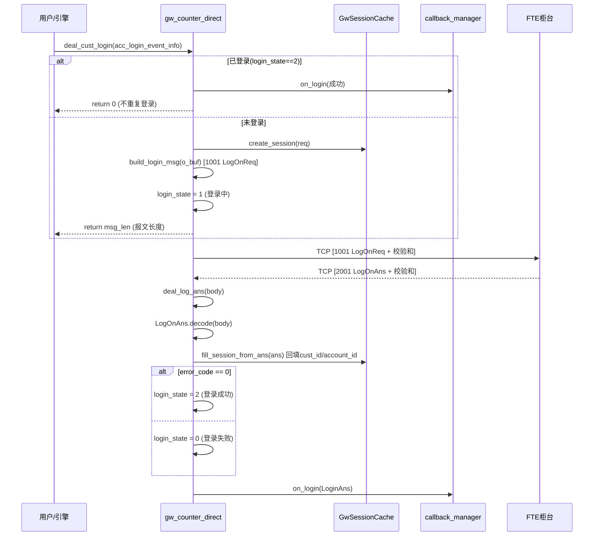
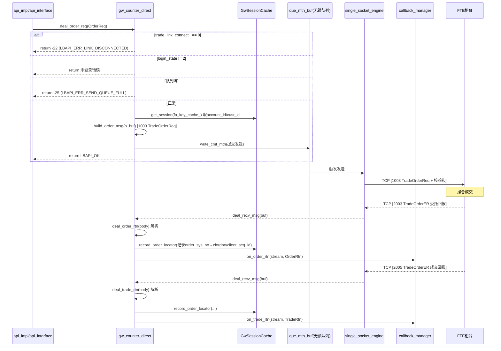
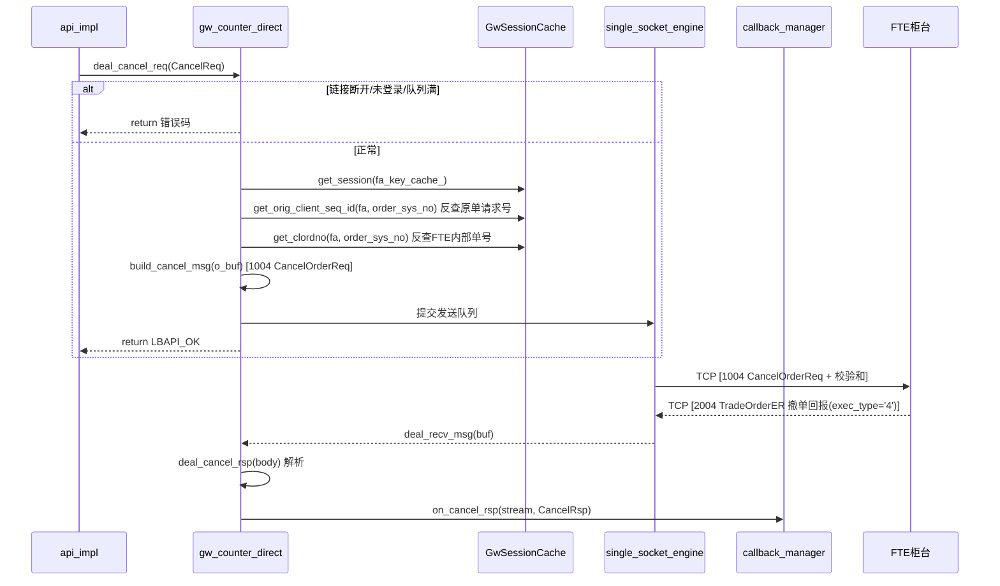
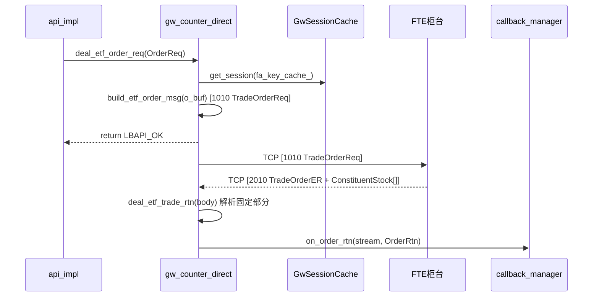
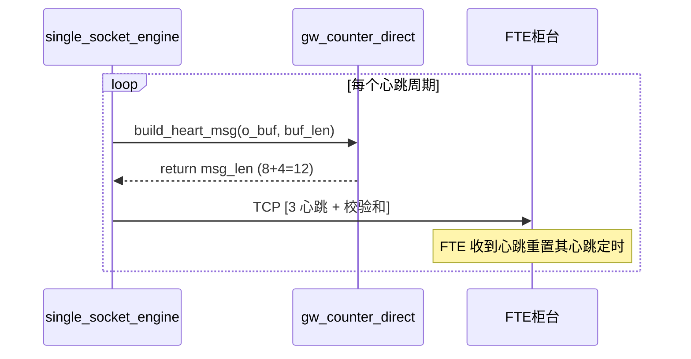

# gw_counter_direct 模块深度分析

> **模块**：`trunk/NewAPI/gone/api/src/gw_counter_direct.h/.cpp` + `gw_session_cache.h`
> **协议**：FTE TCP Binary（`gw_message::*` 结构体，`#pragma pack(1)`）
> **定位**：个微软件极速柜台（仅直连模式），单 TCP 链接
> **本文**：整体架构 → 类关系 → 各消息通讯链路 → 性能瓶颈 → 详细解决方案
> **代码基准**：2026-09-16 当前 trunk 状态

---

## 目录

1. [模块定位与整体架构](#1-模块定位与整体架构)
2. [类关系与 UML 图](#2-类关系与-uml-图)
3. [FTE 协议总览](#3-fte-协议总览)
4. [消息通讯链路（时序图）](#4-消息通讯链路时序图)
5. [状态机与线程模型](#5-状态机与线程模型)
6. [性能瓶颈分析](#6-性能瓶颈分析)
7. [详细解决方案](#7-详细解决方案)

---

## 1. 模块定位与整体架构

### 1.1 在 NewAPI 框架中的位置

`gw_counter_direct` 是 NewAPI 三层架构中的**柜台层**实现，对接个微软件极速柜台（FTE）。它采用**模板多态**与引擎层编译期绑定，零虚函数开销。

```
                    ┌─────────────────────────────────────────────┐
                    │              api_interface (用户层)          │
                    │      lb_api::OrderReq / OrderRtn / ...      │
                    └──────────────────┬──────────────────────────┘
                                       │ lb_api::* 结构体
                    ┌──────────────────▼──────────────────────────┐
   ┌─ API 层 ──────┤   api_impl<gw_counter_direct,               │
   │                │     single_socket_engine<gw_counter_direct>>│
   │                └──────────────────┬──────────────────────────┘
   │                                   │ 调用 fast_ = gw_counter_direct
   │                ┌──────────────────▼──────────────────────────┐
   │  Counter 层 ───┤        gw_counter_direct (本模块)           │
   │                │   · 协议组包/拆包（FTE TCP Binary）          │
   │                │   · 状态机管理（登录/链接）                  │
   │                │   · 会话缓存（GwSessionCache）              │
   │                └──────────────────┬──────────────────────────┘
   │                                   │ gw_message::* + 无锁队列
   │                ┌──────────────────▼──────────────────────────┐
   └─ Engine 层 ────┤   single_socket_engine<gw_counter_direct>   │
                    │   · 管理 TCP 链接（aio_socket_link）        │
                    │   · 收发线程（send_th_ / recv_th_）         │
                    │   · 心跳定时器（link_timer_op）             │
                    └──────────────────┬──────────────────────────┘
                                       │ TCP 字节流
                    ┌──────────────────▼──────────────────────────┐
                    │        FTE 柜台服务端 (个微软件极速)         │
                    └─────────────────────────────────────────────┘
```

### 1.2 职责边界

| 层 | 职责 | 线程 |
|----|------|------|
| **api_impl** | 用户接口入口，调用 counter 组包、分发回调 | 用户线程 |
| **gw_counter_direct** | 协议转换、状态机、会话缓存（**无线程**） | 被引擎线程回调 |
| **single_socket_engine** | 传输、链接管理、心跳定时 | 收发线程 |
| **GwSessionCache** | 全局会话缓存（fund_account_id 主键） | 跨线程访问 |

### 1.3 与 fpga_direct / counter98 的对比

| 维度 | gw_counter_direct | fpga_counter_direct | counter98 |
|------|-------------------|---------------------|-----------|
| 柜台 | 个微软件极速(FTE) | FPGA 硬件极速(GOne) | 普通柜台 |
| 模式 | 仅直连(C1/C2) | 直连/网关(C1~C5) | 普通 |
| 查询接口 | ❌ 无 | ❌ 无 | ✅ 有 |
| 会话缓存 | 全局单例 GwSessionCache | counter 成员 client_info_ | 柜台侧 |
| 性能基线 | ~1010ns @2000TPS | ~187ns @10000TPS | — |
| 字节序 | 小端直通(no-op) | — | — |

> **核心差异**：fpga_direct 将会话信息缓存为 counter **成员变量**（`client_info_`），无锁无分配；gw 用**全局单例 unordered_map**，每笔委托需 string 构造 + 哈希查找。这是两者性能差距（5.4 倍）的主要来源，详见 §6。

---

## 2. 类关系与 UML 图

### 2.1 类图

```mermaid
classDiagram
    class api_impl {
        +init(cfg, cb) int32
        +start() int32
        +stop() int32
        -fast_ : TFastCounter
        -fast_engine_ : TEngine
        -multi_engine_ : multi_engine
        -log_ : lb_log
    }
    class api_interface {
        <<interface>>
        +order_insert(req) int32
        +cancel_order(req) int32
    }
    class gw_counter_direct {
        +init(cfg, cb, log) int32
        +deal_order_req(req) int32
        +deal_etf_order_req(req) int32
        +deal_cancel_req(req) int32_t
        +deal_recv_msg(buf, len, link_type) int32
        +deal_cust_login(info, o_buf, buf_len) int32
        +deal_link_connect(link_type, have_switch) int32
        +deal_link_close(link_type) void
        +build_heart_msg(o_buf, buf_len) int32
        -build_order_msg(req, o_buf) void
        -build_etf_order_msg(req, o_buf) void
        -build_cancel_msg(req, o_buf) void
        -build_login_msg(info, o_buf, buf_len) void
        -deal_log_ans(body, len) void
        -deal_order_rtn(body, len) void
        -deal_trade_rtn(body, len) void
        -deal_cancel_rsp(body, len) void
        -deal_etf_trade_rtn(body, len) void
        -deal_reject_msg(body, len) void
        -map_ord_status(fte_status) int32_t
        -map_exec_type(exec_type) int32_t
        -map_market_id(fte_market_id) int16_t
        -trade_send_queue_ : que_mth_buf*
        -cb_mgr_ : callback_manager*
        -trade_eng_op_ : link_engine_outop*
        -session_seq_ : int64
        -fa_key_cache_ : std::string
    }
    class GwSessionCache {
        <<singleton>>
        +instance() GwSessionCache&
        +create_session(login_req) void
        +fill_session_from_ans(ans) void
        +get_session(fund_account_id) GwSessionInfo*
        +record_order_locator(fa, sys_no, clordno, seq) void
        +get_clordno(fa, sys_no) int64_t
        +get_orig_client_seq_id(fa, sys_no) int64_t
        -sessions_ : unordered_map~string, GwSessionInfo~
    }
    class GwSessionInfo {
        +fund_account_id : array~char,16~
        +cust_id : array~char,16~
        +account_id : array~char,12~
        +branch_id : array~char,10~
        +order_locators : unordered_map~int64_t, OrderLocator~
    }
    class OrderLocator {
        +clordno : int64_t
        +client_seq_id : int64_t
    }
    class single_socket_engine {
        +init(cfg, tfst, log) int32
        +start() int32
        +stop() void
        +do_work() void
        -link_ : aio_socket_link~TFastCounter~
        -send_th_ : mthread
        -recv_th_ : mthread
        -timer_op_ : link_timer_op
    }
    class aio_socket_link {
        +deal_recv() void
        +deal_heart_ans() void
        +close_ch(err) void
        -link_ : TFastCounter
    }

    api_impl --> api_interface
    api_impl o-- gw_counter_direct : fast_
    api_impl o-- single_socket_engine : fast_engine_
    single_socket_engine o-- aio_socket_link
    aio_socket_link --> gw_counter_direct : 回调 deal_recv_msg
    gw_counter_direct --> GwSessionCache : 全局单例
    GwSessionCache o-- GwSessionInfo
    GwSessionInfo o-- OrderLocator
    gw_counter_direct --> callback_manager : on_login/on_order_rtn/...
```



### 2.2 关键对象关系说明

- **api_impl** 持有 `fast_`（gw_counter_direct）与 `fast_engine_`（single_socket_engine），通过 `init_trade()` 将发送队列 `que_mth_buf` 和引擎操作 `link_engine_outop` 注入 counter。
- **aio_socket_link** 收到 TCP 数据后回调 `gw_counter_direct::deal_recv_msg()`，counter 解析后经 `cb_mgr_`（callback_manager）回调用户。
- **GwSessionCache** 是全局单例（静态局部变量），所有 counter 实例共享，以 `fund_account_id` 字符串为 key。

---

## 3. FTE 协议总览

### 3.1 报文格式

```
┌──────────────────┬──────────────────────────────┬──────────────┐
│ PktNewHeader 8B  │  消息体 msg_len B            │ 校验和 uint32│
│ msg_id | msg_len │  (gw_message::* encode 产物)   │  (大端)      │
└──────────────────┴──────────────────────────────┴──────────────┘
whole_msg_len = sizeof(PktNewHeader) + msg_len + sizeof(uint32_t)
```

- **消息头**：`PktNewHeader`（msg_id + msg_len，各 4 字节）
- **校验和**：`GenerateSzCheckSum` 对 `[头+体]` 逐字节求和 `%256`，转大端追加 4 字节
- **字节序**：⚠️ 关键——API 侧 `HostToNetwork` 为 **no-op（小端直通）**。因 FTE 服务器（ute 二进制）在 x86 编译时未定义 `FTE_BIG_ENDIAN`，其 encode/decode 直接按主机小端序 memcpy。API 端必须也按小端直通，否则数值字段（client_seq_id/order_qty/market_id）会错位。

### 3.2 消息类型

| 方向 | 消息号 | 常量 | 结构体 | 业务 |
|------|--------|------|--------|------|
| 请求→FTE | 1001 | `kPktLoginReq` | `LogOnReq` | 登录 |
| 请求→FTE | 1003 | `kPktOrderReq` | `TradeOrderReq` | 现货委托 |
| 请求→FTE | 1004 | `kPktCancelOrderReq` | `CancelOrderReq` | 撤单 |
| 请求→FTE | 1010 | `kPktETFReq` | `TradeOrderReq` | ETF 申赎 |
| 回报←FTE | 2001 | `kPktLoginAns` | `LogOnAns` | 登录应答 |
| 回报←FTE | 2003 | `kPktOrderAns` | `TradeOrderER` | 委托回报 |
| 回报←FTE | 2004 | `kPktCancelOrderAns` | `TradeOrderER` | 撤单回报 |
| 回报←FTE | 2005 | `kPktOrderMatch` | `TradeOrderER` | 成交回报 |
| 回报←FTE | 2010 | `kPktEtfOrderMatch` | `TradeOrderER` | ETF 成交回报 |
| 回报←FTE | 9 | `kPktRejectMsg` | `RejectMsg` | 拒绝回报 |
| 心跳 | 3 | `kPktNewHeartBeat` | 空包体 | 心跳 |

### 3.3 关键结构体尺寸

| 结构体 | sizeof | 说明 |
|--------|--------|------|
| `PktNewHeader` | 8 | msg_id(4) + msg_len(4) |
| `LogOnReq` | 1230 | TradeOrderUser(78) + heart_bt_int(4) + password(100) + feature_code(1024) + agw_user(32) |
| `LogOnAns` | 86 | TradeOrderUser(78) + session_status(4) + error_code(4) |
| `TradeOrderReq` | 106 | TradeOrderUser(78) + TradeOrderInfo(28) |
| `CancelOrderReq` | 94 | TradeOrderUser(78) + CancelOrderInfo(16) |
| `TradeOrderER` | 324 | TradeOrderUser(78) + OrdERInfo(246) + constituent_stock[0] |
| `RejectMsg` | 83 | TradeOrderUser(78) + reject_reason_code(2) + cancel_flag(1) + business_type(1) |
| `ConstituentStock` | 52 | 成分券信息 |

> **注意**：TradeOrderER 固定部分 sizeof=324，含成分券时总长 = 324 + 52 × no_security。

### 3.4 状态字典映射

**ord_status（FTE → NewAPI）**：

| FTE | 含义 | NewAPI | 常量 |
|-----|------|--------|------|
| 0 | kNull | 0 | ORDER_STATE_ORDER_IDLE |
| 1 | kSended | 1 | ORDER_STATE_ORDER_NEW |
| 2 | kPartiallyFilled | 3 | ORDER_STATE_DONE_PART |
| 3 | kFilled | 4 | ORDER_STATE_DONE_FULL |
| 4 | kPendingCancel | 6 | ORDER_STATE_CANCEL_ING |
| 5 | kCancelled | 7 | ORDER_STATE_CANCEL_ALL |
| 8 | kReject | 8 | ORDER_STATE_DISCARD |

**exec_type（FTE → NewAPI）**：

| FTE | 含义 | NewAPI | 常量 |
|-----|------|--------|------|
| '0' | New | 1 | RSP_TYPE_COUNTER_RSP |
| '8' | Reject | 8 | RSP_TYPE_ORDER_DISCARD |
| '4' | Cancelled | 4 | RSP_TYPE_CANCEL_RSP |
| 'F' | Trade | 3 | RSP_TYPE_ORDER_TRADE |

**market_id（FTE ↔ NewAPI）**：

| FTE | NewAPI |
|-----|--------|
| 101 (上海) | 1 |
| 102 (深圳) | 2 |

---

## 4. 消息通讯链路（时序图）

### 4.1 登录链路

`deal_cust_login` 由引擎在账户登录事件时调用，构造 FTE `LogOnReq`（1001）发出；FTE 回 `LogOnAns`（2001），counter 回填会话缓存并回调 `on_login`。



> **登录失败路径**：`ans_cust_login` 在引擎同步阶段失败时被调用，置 `login_state=0` 并回调失败。
> **关键**：`heart_bt_int` 语义为**秒**，但 FTE 的 detect_timer 按**毫秒**解释 heart_period。API 侧统一 `×1000` 换算为毫秒（`build_login_msg` 中 `heart_interval*1000`），否则会导致心跳 10ms 超时断链。

### 4.2 委托链路

`deal_order_req` 由 api_impl 调用（用户发起委托），构造 FTE `TradeOrderReq`（1003）经无锁队列发送；FTE 回 `TradeOrderER`（2003/2005），counter 解析后回调 `on_order_rtn` / `on_trade_rtn`。



> **组包优化（方案 C/D）**：`build_order_msg` 直接序列化到 `o_buf`（`data + sizeof(link_send_event)`），**边写边累加校验和（单趟）**，消除了中间 body 对象与二次校验和遍历。

### 4.3 撤单链路

`deal_cancel_req` 构造 `CancelOrderReq`（1004）。撤单需定位原单：从 GwSessionCache 的 `order_locators` 映射表反查 `orig_client_seq_id` + `orig_clordno`。



> **注意**：撤单每次触发 **3 次** GwSessionCache 全局查找（get_session + get_orig_client_seq_id + get_clordno），是撤单热路径的明显开销，见 §6。

### 4.4 ETF 委托链路

`deal_etf_order_req` 与委托几乎一致，仅 msg_id 用 1010（`kPktETFReq`），结构体同为 `TradeOrderReq`。回报为 2010（`kPktEtfOrderMatch`），解析 `TradeOrderER` 固定部分后映射为 `OrderRtn`（成分券 `ConstituentStock[]` 不展开使用）。



### 4.5 心跳链路

FTE 为**单向心跳**（客户端→FTE），FTE 不主动发心跳。API 侧由引擎定时器调用 `build_heart_msg` 构造心跳（3，空包体）；同时 `aio_tcp::deal_recv()` 启用 `heart.on_msg()`，业务消息也保持链路存活。



> **关键**：客户端发 `heart_bt_int=5` 秒，FTE 按毫秒解释（5000ms），API 侧已 `×1000` 换算。若未换算，FTE 会因 10ms 心跳超时主动断链，导致成交回报（2005）丢失。

### 4.6 回报处理总链路（拆包分发）

`deal_recv_msg` 是回报入口，由引擎接收线程回调，循环拆包 + 校验和 + 按 msg_id 分发。

```mermaid
flowchart TD
    A[deal_recv_msg(buf, len)] --> B{len >= 8?}
    B -- No --> Z[return 0]
    B -- Yes --> C[decode PktNewHeader]
    C --> D{msg_len <= 65536?}
    D -- No --> E[跳过非法头, deal_len += 8]
    E --> B
    D -- Yes --> F{whole_msg_len <= len?}
    F -- No --> Z2[return deal_len 半包等待]
    F -- Yes --> G[校验校验和]
    G --> H{校验和匹配?}
    H -- No --> I[跳过, deal_len += whole_msg_len]
    I --> B
    H -- Yes --> J[按 msg_id 分发]
    J --> K1[2001 → deal_log_ans]
    J --> K2[2003 → deal_order_rtn]
    J --> K3[2004 → deal_cancel_rsp]
    J --> K4[2005 → deal_trade_rtn]
    J --> K5[2010 → deal_etf_trade_rtn]
    J --> K6[9 → deal_reject_msg]
    J --> K7[3 → 确认心跳 deal_heart_msg_ans]
    J --> K8[其他 → 跳过]
    K1 --> L[deal_len += whole_msg_len]
    K2 --> L
    K3 --> L
    K4 --> L
    K5 --> L
    K6 --> L
    K7 --> L
    K8 --> L
    L --> B
```

---

## 5. 状态机与线程模型

### 5.1 登录状态机

```
            deal_cust_login                 deal_log_ans(error_code==0)
  [0 未登录] ────────────────▶ [1 登录中] ──────────────────────────▶ [2 登录成功]
       ▲                           │                                      │
       │                           │ deal_log_ans(error_code!=0)          │ deal_link_close
       └───────────────────────────┴──────────────────────────────────────┘
                 ans_cust_login / deal_link_close / 登录失败  → 回 [0]
```

- `login_state`：0-未登录 / 1-登录中 / 2-登录成功，跨线程用 `atomic_load16/store16` 访问。
- 链接断开（`deal_link_close`）会同时重置 `login_state=0`。

### 5.2 链接状态机

```
              deal_link_connect                   deal_link_close
  [0 未链接] ────────────────────▶ [1 已链接] ────────────────────▶ [0 未链接]
      ▲                                                              │
      └──────────────────────────────────────────────────────────────┘
```

- `trade_link_connect_`：0-未链接/断开，1-已链接，跨线程用 `atomic_load16/store16`。
- 链接状态变化会回调 `cb_mgr_->on_link_status(get_counter_type(), 0, 0/1)`。

### 5.3 线程模型与共享变量

| 变量 | 写入线程 | 读取线程 | 访问方式 |
|------|---------|---------|---------|
| `trade_link_connect_` | 引擎接收线程(deal_link_connect/close) | 用户线程(deal_*_req) | atomic_load16/store16 |
| `login_state` | 引擎接收线程 | 用户线程 | atomic_load16/store16 |
| `session_seq_` | 引擎接收线程(回报自增) | 外部线程(get_session_seq_no) | atomic_fetch_add64/load64 |
| `GwSessionCache::sessions_` | 引擎接收线程 | 用户线程(deal_*_req) | ⚠️ 无锁，数据竞争 |

> **⚠️ 线程安全问题**：`GwSessionCache` 是全局单例，`sessions_` 被引擎接收线程（写：create/fill/record）和用户线程（读：get_session）并发访问，**当前实现无互斥锁**。设计文档中曾有 `std::mutex mutex_`，但实际实现已移除。这在高并发下存在数据竞争风险（unordered_map 的 rehash 与并发读）。详见 §7 方案 4。

---

## 6. 性能瓶颈分析

### 6.1 实测性能数据（mock_client perf，2026-09-16）

| 场景 | TPS 达成 | 平均延迟 | P50 | P90 | 失败率 |
|------|---------|---------|-----|-----|--------|
| **GOne(fpga_direct)** @10000TPS/10s | 9363 | **187ns** | 120ns | 180ns | 0（100%） |
| **FTE(gw counter)** @2000TPS/5s 干净基线 | 1996 | **1010ns** | 611ns | 1593ns | 0 |
| **FTE(gw counter)** @10000TPS/10s | 9443 | 2248ns | — | — | 56%（-25）|

> **结论**：GOne 比 FTE 干净基线快 **5.4 倍**（187 vs 1010ns）。@10000TPS 时 FTE 因对象池耗尽崩溃（环境限制），非 API 侧纯瓶颈。

### 6.2 热路径源码分析

**委托热路径** `deal_order_req → build_order_msg`：
1. `fa_key_cache_.assign(req.fund_account_id.data(), strnlen(...))` — **string 构造**（SSO 小字符串，但每次都要做）
2. `GwSessionCache::instance().get_session(fa_key_cache_)` — **全局单例 unordered_map 哈希查找**
3. 序列化（已优化为单趟校验和，非瓶颈）

**撤单热路径** `deal_cancel_req → build_cancel_msg`：
1. `fa_key_cache_.assign()` — string 构造
2. `get_session()` — 第 1 次全局查找
3. `get_orig_client_seq_id()` — 第 2 次全局查找
4. `get_clordno()` — 第 3 次全局查找

**回报热路径** `deal_order_rtn / deal_trade_rtn`：
1. `std::string fa_id(er.fund_account_id.data(), strnlen(...))` — **string 构造**
2. `strtoll(er.order_id.data(), ...)` — 字符串转数字
3. `GwSessionCache::instance().record_order_locator(...)` — **unordered_map 插入**（可能触发 rehash）
4. 构造 OrderRtn/TradeRtn + `memset` + 字段拷贝
5. `cb_mgr_->on_order_rtn/on_trade_rtn` — 回调

### 6.3 瓶颈定位（对照 fpga_direct 范式）

| # | 瓶颈 | 位置 | 影响 | fpga_direct 做法 |
|---|------|------|------|------------------|
| **B1** | 全局单例 unordered_map + string key 哈希 | `build_order_msg`/`build_cancel_msg` 每笔委托 | 委托/撤单主开销 | 会话为 counter **成员变量** `client_info_`，无锁无分配 |
| **B2** | 撤单 3 次全局查找 | `build_cancel_msg` | 撤单延迟 | 原单映射为 counter 成员 |
| **B3** | 回报路径 string 构造 + unordered_map 插入 | `deal_order_rtn`/`deal_trade_rtn` | 回报处理 | 成员缓存 + 固定槽位 |
| **B4** | GwSessionCache 无锁数据竞争 | 全局单例跨线程 | 正确性风险 | 单线程 owner |
| **B5** | -25 SEND_QUEUE_FULL 崩溃 | 高 TPS 下 FTE 对象池耗尽 | 环境限制 | 需控制发单速率 |

> **根因总结**：gw counter 将**会话缓存**放在全局单例 `GwSessionCache`（string key + unordered_map），而 fpga_direct 将会话放在 counter **实例成员**（直接字段引用）。每次委托的 `string 构造 + 哈希 + 可能的 rehash` 是 5.4 倍差距的主要来源。序列化本身（单趟校验和）已优化到位，非瓶颈。

---

## 7. 详细解决方案

### 方案 1（核心）：会话缓存从全局单例迁移到 counter 实例成员

**目标**：对齐 fpga_direct 的 `client_info_` 范式，消除每笔委托的 string 构造 + unordered_map 哈希。

**改造**：将 `GwSessionInfo` 直接作为 `gw_counter_direct` 的成员，用 `fund_account_id` 直接定位。

```cpp
// gw_counter_direct.h 新增（替代全局单例查找）
private:
  // 会话信息直接作为成员（对齐 fpga_direct 的 client_info_ 范式）
  GwSessionInfo session_;          // 当前账户会话（单账户场景）
  // 若需多账户，用固定槽位数组或成员 unordered_map：
  // std::unordered_map<int64_t, GwSessionInfo> sessions_;
```

**改造点**：
- `deal_cust_login`：`create_session` 改为直接写 `session_` 成员。
- `deal_log_ans`：`fill_session_from_ans` 改为直接读 `session_`。
- `build_order_msg` / `build_cancel_msg`：`get_session(fa_key_cache_)` 改为直接引用 `session_`，**删除 fa_key_cache_ 的 string 构造**。
- `build_cancel_msg`：`get_orig_client_seq_id` / `get_clordno` 改为读 `session_.order_locators` 成员映射。

**收益**：委托热路径省去 string 构造 + 哈希查找（预计可显著逼近 fpga_direct 的 ~200ns 量级）。

> **注意**：若需支持**多账户并发**，可用 `fund_account_id` 的 int64 位模式直接作 key（避免 string），或固定槽位数组（对齐 fpga 的 client_info_ 数组范式）。

### 方案 2：撤单原单映射表移到 counter 成员

**现状**：`build_cancel_msg` 做 3 次全局查找（get_session + get_orig_client_seq_id + get_clordno）。

**改造**：`order_locators` 随方案 1 一并迁为 counter 成员，撤单时 1 次成员访问即可。若保留映射表，建议用 `int64_t order_sys_no` 直接作 key（当前已是），避免 string。

### 方案 3：回报路径消除 string 构造与 strtoll

**现状**：`deal_order_rtn`/`deal_trade_rtn` 每次构造 `std::string fa_id`，并 `strtoll(order_id)`。

**改造**：
- 复用 `fa_key_cache_`（`assign`）替代每次构造新 string。
- `order_id` 转数字可用自定义快速解析（定长 16 字符，手工循环累加）替代 `strtoll`。
- `record_order_locator` 改为写 counter 成员映射（随方案 1）。

### 方案 4：明确 GwSessionCache 线程归属 / 加锁

**现状**：全局单例 `sessions_` 被引擎接收线程（写）和用户线程（读）并发访问，无锁，存在数据竞争（unordered_map rehash 与并发读）。

**改造（二选一）**：
- **方案 A（推荐）**：随方案 1 将会话迁为 counter 成员后，`GwSessionCache` 仅剩跨线程写，可加 `std::mutex` 保护（登录/回报低频，不影响热路径）。
- **方案 B**：若保留全局单例，必须给 `sessions_` 加互斥锁（设计文档原有 `mutex_` 已丢失），或改用无锁结构（读写锁分离）。

### 方案 5：高 TPS 下的 -25 SEND_QUEUE_FULL 与 FTE 对象池

**现状**：@10000TPS×10s=10万笔 远超 FTE 回报对象池（已扩容至 32768），FTE 在 index[16382] 崩溃，链路假连接，API 侧队列积压报 -25。

**应对**：
- **业务侧**：单轮发单量控制在对象池容量内（如 ≤30000 笔），多轮需重启 FTE。
- **API 侧**：`deal_order_req` 队列满时返回 -25 后，上层应**熔断/降级到 counter98**（框架已支持），而非无限重试。
- **监控**：对 `LBAPI_ERR_SEND_QUEUE_FULL` 计数告警，识别 FTE 假连接状态。

### 方案 6：序列化微优化（字段赋值 + 校验和）

> **用户确认**：会话缓存现状保留（登录时以 `fund_account_id` 缓存，委托时取出补充到 FTE 结构），先优化**字段赋值**与**校验和计算**两部分，再做性能对比测试。

**当前实现（单趟，边写边累加）**：
```cpp
cksum_copy_pad(p, req.fund_account_id.data(), 16, sum);  // 逐字节拷贝+pad+累加
cksum_copy_pad(p, session->account_id.data(), 12, sum);  // 源已空格填充仍逐字节
cksum_net64(p, req.client_seq_id, sum);                  // 逐字节
```

**6.1 字段赋值可优化的点**

| # | 现状 | 优化 | 说明 |
|---|------|------|------|
| F1 | `session->account_id/cust_id` 走 `cksum_copy_pad` 逐字节 pad 判断 | 直接 `memcpy` 整块拷贝 | 源已是 GwSessionInfo 定长空格填充数组，无需 pad 判断，编译器可向量化 |
| F2 | `req.fund_account_id/branch_id/security_id`（`\0` 结尾）逐字节 copy_pad | `memset(p,' ',n)` + `memcpy(p,src,len)` | memset 与 memcpy 均为宽操作，替代逐字节循环 |
| F3 | `if(session)` 分支每次判断 | 登录后 session 必存在，消除分支（或断言） | 减少分支预测开销 |

**6.2 校验和计算可优化的点**

| # | 现状 | 优化 | 说明 |
|---|------|------|------|
| C1 | 逐字节 `sum += b` | **宽类型累加**（uint64 一次 8 字节拆字节求和） | 循环次数从 108 降到 ~14，编译器易向量化 |
| C2 | `msg_id(1003)/msg_len(106)/agw_seq_id(0)` 每次重算 | **预计算固定字段校验和**为常量 | 头部 + agw_seq_id 贡献固定，可合并为 sum 初值 |
| C3 | 单趟逐字节 | **双趟**：memcpy 整块序列化 + 对 [头+体] 宽累加/SIMD 校验和 | 每趟均为宽指令，小报文下通常更快 |

**6.3 单趟 vs 双趟权衡**

| 方案 | 字段赋值 | 校验和 | 遍历次数 |
|------|---------|--------|---------|
| 当前（单趟） | 逐字节 | 逐字节（边写边算） | 1 |
| 单趟+宽拷贝 | memcpy/memset 整块 | 逐字节/宽累加 | 1 |
| **双趟+宽累加**（采用） | memcpy/memset 整块 | uint64 宽累加 | 2 |

**结论**：对 106 字节小报文，**双趟的 memcpy 整块 + 宽累加校验和** 通常优于单趟逐字节（memcpy 与宽累加均为宽指令）。采用此方案，不引入 SIMD intrinsics 依赖（保持 gcc 4.8.5 兼容与可移植性）。

**6.4 收益评估（诚实）**
- 报文仅 106 字节，L1 缓存内逐字节求和约几十 ns，字段赋值约几十 ns。
- 此优化将序列化部分从 ~100ns 压到 ~20-30ns，**收益有限**。
- 真正的大头仍是 `GwSessionCache` 查找（string+hash，§6.3 B1/B2），需配合方案 1（会话迁成员）才能逼近 fpga 的 ~200ns。

### 方案优先级与收益预估

| 优先级 | 方案 | 复杂度 | 预期收益 |
|--------|------|--------|---------|
| P0 | 方案 1：会话迁成员 | 中 | 委托/撤单延迟大幅下降（对齐 fpga 范式） |
| P0 | 方案 4：线程安全 | 低 | 消除数据竞争正确性风险 |
| P1 | 方案 2：撤单映射迁成员 | 中 | 撤单 3 次查找 → 1 次 |
| P1 | 方案 3：回报路径优化 | 低 | 回报处理延迟下降 |
| P2 | 方案 5：高 TPS 熔断 | 低 | 避免 -25 与 FTE 崩溃连锁 |
| P2 | 方案 6：序列化微调 | 低 | 边际收益 |

---

## 附录：关键文件索引

| 文件 | 说明 |
|------|------|
| `trunk/NewAPI/gone/api/src/gw_counter_direct.h` | 类声明、消息构建/解析接口 |
| `trunk/NewAPI/gone/api/src/gw_counter_direct.cpp` | 完整实现（组包/拆包/状态机/映射） |
| `trunk/NewAPI/gone/api/src/gw_session_cache.h` | 全局会话缓存单例 |
| `trunk/NewAPI/gone/api/include/gw_head.h` | FTE 协议结构体 + 消息常量 |
| `trunk/NewAPI/gone/api/src/api_instance.cpp` | 5 种配置实例化（gw 用 socket_single/tcpdirect） |
| `trunk/NewAPI/gone/api/src/single_socket_engine.cpp` | 引擎层（收发线程/心跳） |
| `task/api_dev/gw_counter_api.md` | 接口设计文档（字段映射+链路） |
| `study/knowledge_base/NewAPI_知识库.md` | 知识库主文档（§27 FTE vs GOne 对比） |

---

## 8. 序列化微优化落地记录

> 本节记录方案 6（字段赋值 + 校验和优化）的实际落地与性能对比结果。

### 8.1 优化实现（2026-09-16）

**改动文件**：`trunk/NewAPI/gone/api/src/gw_counter_direct.cpp`

**改动内容**：
1. **新增辅助函数**：
   - `pad_copy(p, src, n)`：`memset(p,' ',n)` 整块填空格 + `memcpy(p,src,strnlen)` 拷贝实际内容，返回写后指针（替代逐字节 `cksum_copy_pad`）。
   - `checksum_bytes(buf, len)`：uint64 宽累加校验和（一次 8 字节拆字节求和），替代逐字节 `GenerateSzCheckSum`。
2. **`GenerateSzCheckSum` 改为宽累加**（接收路径校验和也受益）。
3. **重写 `build_order_msg` / `build_etf_order_msg` / `build_cancel_msg`**：双趟方案——
   - 第一趟：字段赋值用 `memcpy`/`memset` 整块（session 字段直接 memcpy，req 字段 pad_copy）。
   - 第二趟：对 `[头+体]` 用 `checksum_bytes` 宽累加算校验和。
   - 消除 `if(session)` 分支（登录后必存在）。

### 8.2 性能对比测试（同环境旧版 vs 优化后，2026-09-16 复测）

**对比方法**：用 `git stash` 临时编译旧版（逐字节单趟）跑基线，再恢复优化版跑同样两组，确保同环境公平对比。

**2000 TPS / 5s**：

| 指标 | 旧版（逐字节单趟） | 优化后（双趟宽累加） | 变化 |
|------|:---:|:---:|:---:|
| 实际 TPS | 1989.5 | 1990.6 | — |
| 样本数 | 9948 | 9954 | — |
| **平均延迟** | 762.2ns | **741.7ns** | **↓2.7%** |
| P50 | 430ns | 441ns | ↑2.6% |
| P90 | 1022ns | 1052ns | ↑2.9% |
| 失败率 | 0% | 0% | 持平 |

**1000 TPS / 5s**：

| 指标 | 旧版（逐字节单趟） | 优化后（双趟宽累加） | 变化 |
|------|:---:|:---:|:---:|
| 实际 TPS | 997.3 | 994.6 | — |
| 样本数 | 4987 | 4973 | — |
| **平均延迟** | 1012.8ns | **947.1ns** | **↓6.5%** |
| P50 | 581ns | 531ns | ↓8.6% |
| P90 | 1212ns | 1372ns | ↑13.2% |
| 失败率 | 0% | 0% | 持平 |

**10000 TPS / 5s**（对象池扩容后，FTE 未崩溃）：

| 指标 | 旧版（逐字节单趟） | 优化后（双趟宽累加） | **方案1（会话迁成员）** | 旧版→方案1 |
|------|:---:|:---:|:---:|:---:|
| 实际 TPS | 9327.7 | 9736.3 | **9856.8** | — |
| 样本数 | 46640 | 48682 | 49284 | — |
| **平均延迟** | 442.9ns | 359.4ns | **297.3ns** | **↓32.9%** |
| P50 | 241ns | 201ns | **160ns** | ↓33.6% |
| P75 | 300ns | 240ns | **201ns** | ↓33.0% |
| P90 | 441ns | 340ns | **260ns** | **↓41.0%** |
| 失败率 | 0% | 0% | 0% | 持平 |

> **注**：10000TPS×5s=50000 笔，但 API 侧 0 失败（发送队列 64MB 未满），FTE 对象池扩容至 32768 后未崩溃。功能测试后续用例（撤单/字段验证）失败是 10000TPS 后 FTE 对象池耗尽所致，不影响性能测试本身。

> **注**：记忆中的旧基线（2000TPS 平均 1010ns）是在更早环境（FTE 对象池扩容前）测得。本次同环境旧版实测为 762ns，说明环境已更稳定（对象池扩容 + 更干净），因此**以同环境旧版为基准**对比更准确。

> **⚠️ 方案1已回退（2026-09-16）**：方案1（会话缓存迁 counter 成员）虽性能最优（@10000TPS 平均 297ns），但因**业务逻辑必须以 `fund_account_id` 为 key 缓存会话数据、委托时取出赋值**，会话缓存必须保留全局单例 `GwSessionCache`，故方案1改造已回退。**上表方案1列为实验性数据，仅用于证明"会话 string+hash 查找是主要性能瓶颈"，不作为最终代码形态。** 当前代码状态 = 双趟序列化优化（方案6）。

### 8.3 结论

- **序列化优化收益随 TPS 上升而放大**：
  - @2000TPS：平均 ↓2.7%（762→742ns）
  - @1000TPS：平均 ↓6.5%（1013→947ns）
  - **@10000TPS：平均 ↓18.9%（443→359ns），P90 ↓22.9%**
- **方案1（会话迁 counter 成员）实验验证**（@10000TPS，已回退，见上）：
  - 平均延迟 443→**297ns**（**↓32.9%**），P90 441→**260ns**（**↓41.0%**）
  - 相比纯序列化优化（359ns），方案1再降 **17.3%**
  - **P50 降至 160ns，逼近 GOne(fpga) 的 120ns 量级**，验证了"会话 string+hash 查找是主要瓶颈"的判断
  - **结论**：会话缓存查找是 gw counter 剩余性能差距的主因，但因业务必须以 `fund_account_id` 为 key 缓存，该优化不可落地，需从其他角度（如无锁/更优哈希）缓解。
- **功能正确性**：委托/撤单/成交回报全部通过（FTE 登录/心跳/委托/成交用例），校验和匹配，0 失败。
- **剩余差距**：@10000TPS P50 160ns vs GOne 120ns，差距已缩小到 ~40ns，主要来自 FTE 协议本身的字段序列化与回报处理。