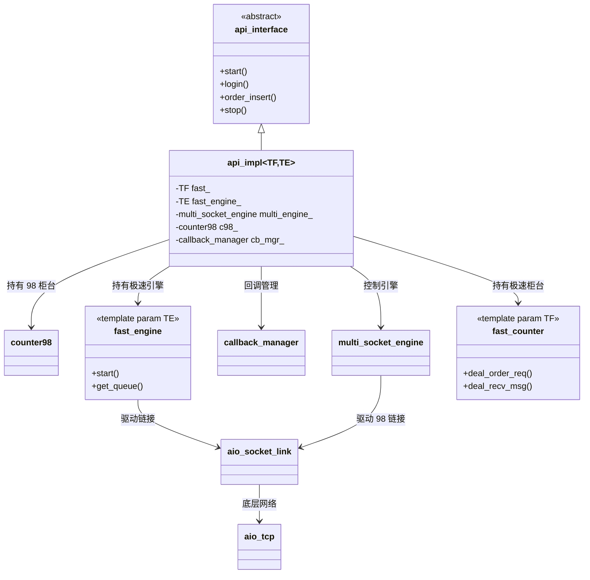

# API 框架技术实现分析

## 1. 模块职责与实现分析
整个 API 框架基于三层以上的分层设计，主要包含以下模块：

### 1.1 API 接口层 (Public API)
- **实现**: `api_interface` 虚基类定义了业务规范；`api_impl<TF, TE>` 是其核心实现类，通过模板参数实例化。
- **职责**: 向上对用户提供统一的交易和查询接口（如 `login`, `order_insert`, `order_query`），屏蔽底层多柜台和多网络 IO 的复杂性。内部持有各个具体组件（极速柜台、综合柜台、极速引擎、回调管理器）。

### 1.2 引擎层 (Engine Layer)
- **实现**: 包括 `multi_socket_engine<TF>`（控制平面和 98 引擎），以及极速引擎（`single_socket_engine`, `tcpdirect_engine`, `idle_engine`）。
- **职责**: 负责网络 IO 事件驱动和定时器驱动（基于 epoll 和 timerfd）。`multi_socket_engine` 管理综合柜台链接和极速网关链接，`fast_engine` 专门管理低延迟的极速业务链接。引擎层持有发送队列，并消费队列数据向网络层发送。

### 1.3 柜台层 (Counter Layer)
- **实现**: 包括 `counter98`（综合柜台）、`fpga_counter_direct` / `fpga_counter_gateway`（FPGA极速柜台）、`gw_counter_direct`（个微软件柜台）。都实现了统一的模板接口。
- **职责**: 负责具体业务协议的打包和解包。在发送时进行业务状态校验，构造具体的协议消息；在接收时解析网络层抛上来的数据流，转换为内部标准的事件对象（如 `OrderRtn`, `TradeRtn`），并推送到回调层。

### 1.4 链接层 (Link Layer)
- **实现**: `aio_socket_link` 包装了普通的异步 TCP (`aio_tcp`)，`tcpdir_link` 包装了 Solarflare 的内核旁路协议 (`TCPDirect`)。
- **职责**: 负责物理网络链路的管理，包括建立连接、接收数据、发送数据以及链接状态机（主备地址切换、断线重连等）。

### 1.5 回调层 (Callback Layer)
- **实现**: `callback_manager` 管理异步事件推送。
- **职责**: 支持直接模式（同步在网络线程调用）和队列模式（通过独立回调线程消费）。负责将业务事件抛给用户实现的 `api_callback`。

## 2. 接口与类型的层次调用
框架接口的调用呈自上而下的流转体系：
1. **接口调用**: 用户调用 `api_interface::order_insert`。
2. **路由分配**: `api_impl` 将请求先路由给极速柜台 `fast_.deal_order_req(req)`。若返回不支持或离线，则**业务降级**给综合柜台 `c98_.deal_order_req(req)`。
3. **协议序列化**: 柜台层（如 `fpga_counter_direct`）校验自身状态，组装特定协议的二进制包流，并调用从引擎层注入的发送队列写入接口 `take_req_que_mem` 和 `cmt_req_que_mem`。
4. **引擎驱动**: 引擎层的 `mthread` (epoll) 线程或 `simple_thread` 从无锁队列中读取待发送数据，触发链接层的 `link_.send_msg`。
5. **底层网络**: `aio_tcp` 或 TCPDirect Stack 将数据推入系统套接字或网卡硬件。

## 3. 技术特点与语法糖

### 3.1 模板静态多态 (CRTP 变体)
- **特点**: `api_impl<TF, TE>` 大量使用了 C++ 模板编程，在编译期静态实例化不同的极速柜台 (`TF`) 和引擎 (`TE`)，如 `api_impl<fpga_counter_direct, tcpdirect_engine<fpga_counter_direct>>`。
- **语法糖注意点**: 避免了底层的 `virtual` 虚函数调用，实现了**零运行时开销**的多态路由，这对于纳秒级的高频交易场景至关重要。

### 3.2 无锁编程与 CAS
- **特点**: 启动状态机 `have_start` 及 AGW 登录状态 `agw_login_state` 使用了基于 CAS (`atomic_cas32`) 的无锁抢占机制。
- **注意点**: CAS 可以有效防止并发调用的多重初始化，同时通过自旋重试保证多线程同步的性能。

### 3.3 跨线程通信模型
- **特点**: 发送队列使用了无锁多写单读队列 `que_mth_buf`，不同业务线程可以并发调用接口写入，而独立的 epoll 引擎线程单点消费并发送。
- **注意点**: 通过内存池 (`shmem_pool`) + 队列的结合，避免了使用繁重的 `std::mutex`。

## 4. 架构 UML 关系图
