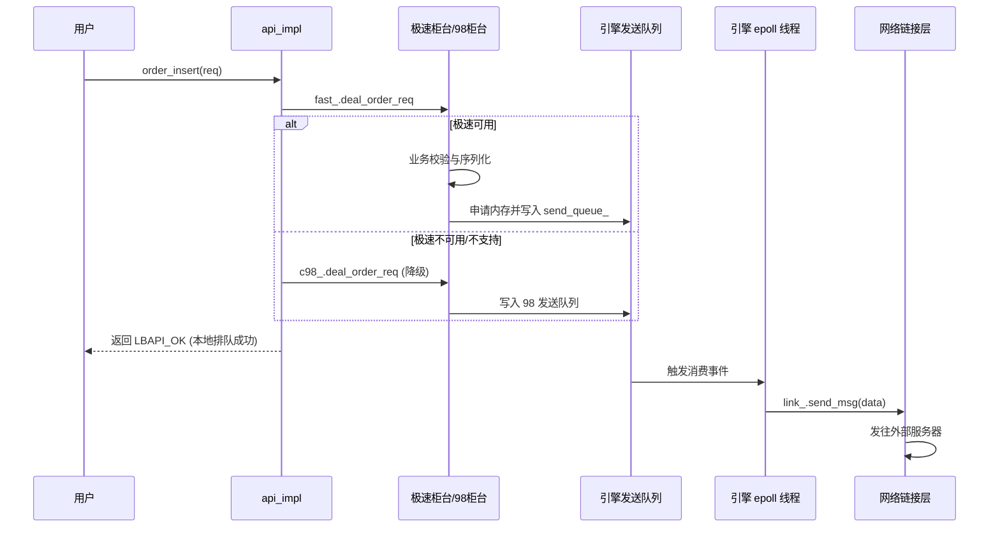

# API 框架数据流转分析

在当前交易 API 框架中，数据流转是系统高并发和低延迟的核心。数据流主要分为业务发送数据流（下行）、应答接收数据流（上行）和登录鉴权流。

## 1. 业务发送数据流 (下行)
下行数据流是指用户从 API 发起业务请求，最终流向交易所柜台的过程。这里以**买卖委托 (Order Insert)** 为例：

1. **接口调用**: 用户调用 `api_impl::order_insert(req)`。
2. **极速优先路由**: `api_impl` 将请求转发给极速柜台 `fast_.deal_order_req(req)`。
3. **柜台状态与打包**: 
   - 极速柜台校验链路状态（`login_state` 和 `trade_link_connect_`）。
   - 计算内存所需大小，向 `fast_engine` 注入的 `send_queue_` 请求一段连续内存。
   - 按照极速协议（如 G1 协议）序列化请求（`build_order_msg`）。
4. **引擎异步发送**:
   - `fast_engine` 所在的工作线程持续消费 `send_queue_`。
   - 发现新的数据事件后，调用 `link_.send_msg` 交给物理网络。
5. **容灾降级流转**: 如果极速柜台离线或不支持该品种（如 ETF/BSE），`deal_order_req` 返回特定错误码，API 层自动捕获并将请求重新转发给 `c98_.deal_order_req(req)`。数据流转入综合柜台的队列和链接。



## 2. 应答接收数据流 (上行)
上行数据流指底层网络收到外部柜台的回报，并反向解析推送到用户的过程。

1. **网络接收**: 底层 `aio_tcp::loop_deal_recv` 在 epoll 线程中收到网络字节流。
2. **链接分发**: `aio_socket_link` 的内部回调触发，并将二进制数据块透传给具体柜台的 `counter.deal_recv_msg`。
3. **协议解包**: 
   - 柜台基于特定的协议消息号（如 `G1_MSG_ORDER_RTN`）路由到对应的处理函数。
   - 对数据进行端序转换和解包，生成标准的业务结构体（如 `OrderRtn`）。
4. **可靠消息去重**: 通过解析协议包体中的 `session_seq_no` 进行重复包过滤，确保消息的 Exactly-Once 语义。
5. **事件回调**:
   - 柜台调用 `cb_mgr_->on_order_rtn` 传递给回调管理器。
   - 根据用户配置的模式：如果是直接模式，直接同步触发 `user_callback_->on_order_rtn`；如果是队列模式，则放入 `cb_queue_`，由独立的后台回调线程消费后再抛给用户。

```mermaid
sequenceDiagram
    participant Network as 网络链接层
    participant Link as aio_socket_link
    participant Counter as 柜台解析层
    participant CBMgr as 回调管理器
    participant Callback as 用户 api_callback
    
    Network->>Link: 接收到字节流
    Link->>Counter: deal_recv_msg(pmsg, len)
    Counter->>Counter: 按 msg_id 解包 (如 G1_MSG_ORDER_RTN)
    Counter->>Counter: session_seq_no 流水去重
    Counter->>CBMgr: cb_mgr_->on_order_rtn(rtn)
    alt 直接模式
        CBMgr->>Callback: 同步调用 on_order_rtn
    else 队列模式
        CBMgr->>CBMgr: 压入回调队列 cb_queue_
        CBMgr-->>Callback: 后台回调线程异步调用
    end
```

## 3. 登录与控制数据流
登录是一个复杂的多阶段控制流：
1. **AGW 启动**: `api->start()` 时，首先启动 `multi_engine`，与 98 柜台建立链接，并同步发送 `AGW_LOGIN` 请求，阻塞等待结果。
2. **账户登录**: 用户调用 `api->login()` 时，数据流向 98 柜台投递 `ACC_LOGIN_REQ`。
3. **级联触发**: 98 柜台账户登录成功后，内部生成针对极速柜台的登录事件（`build_fast_counter_login_event`），极速柜台随之发起登录请求。
4. **最终通知**: 极速柜台返回成功，回填 `session_id` 和鉴权信息后，向上层抛出最终的 `on_login` 成功事件。
