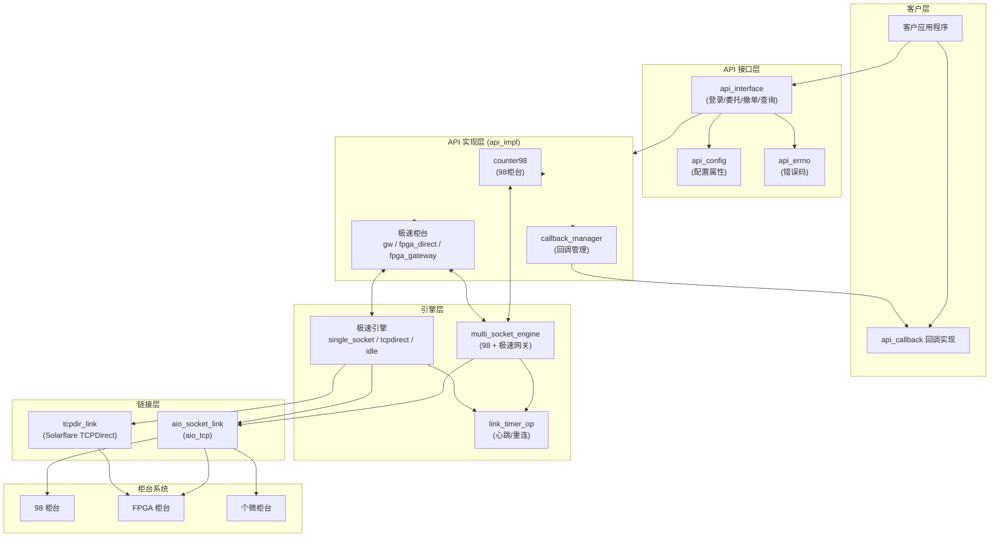
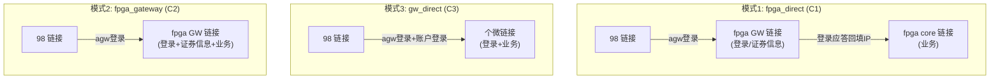
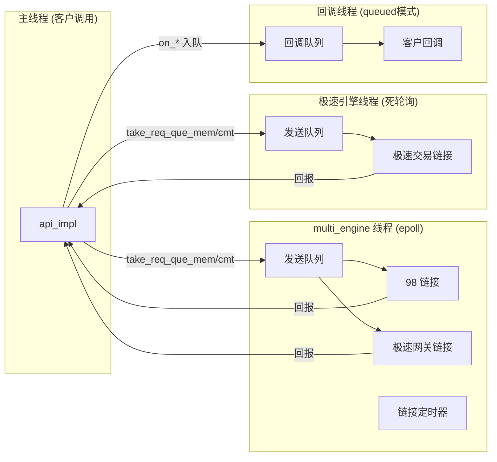
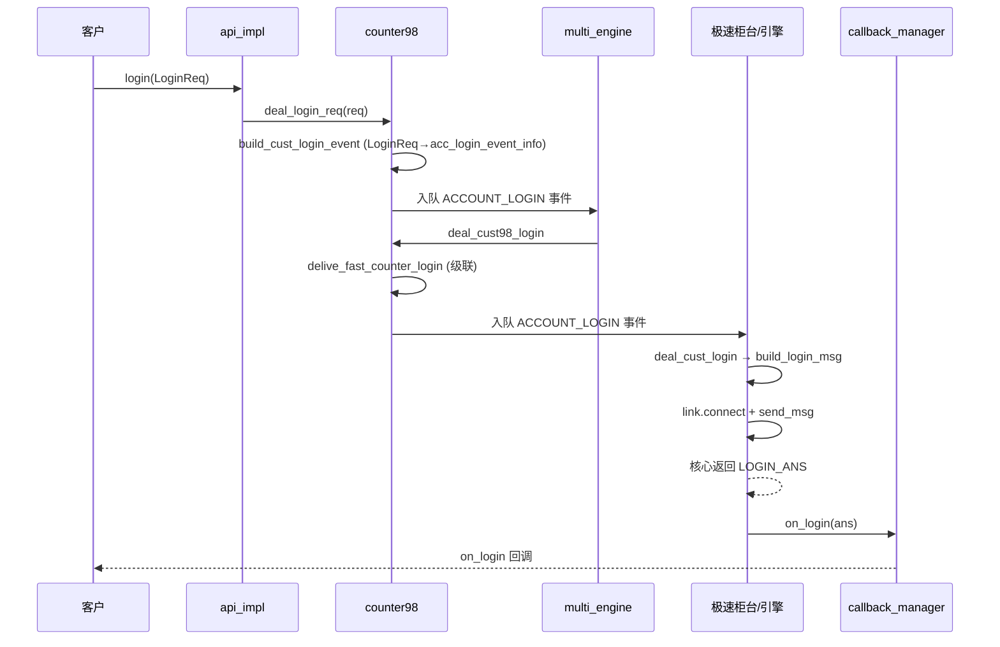
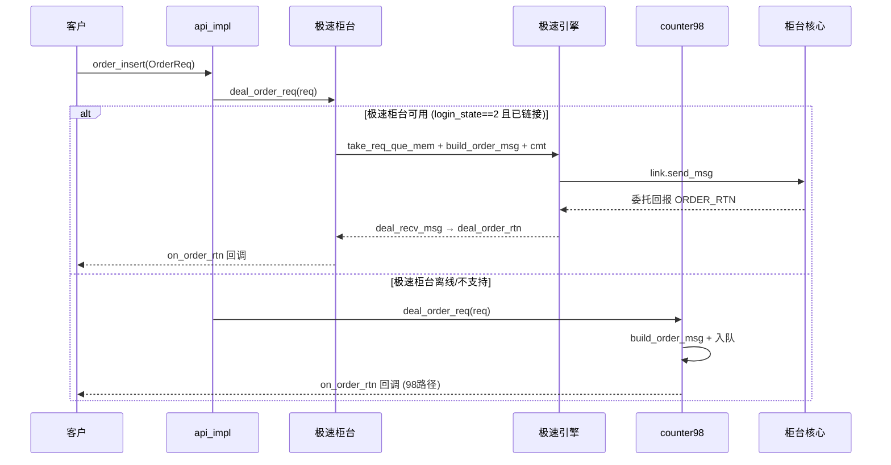
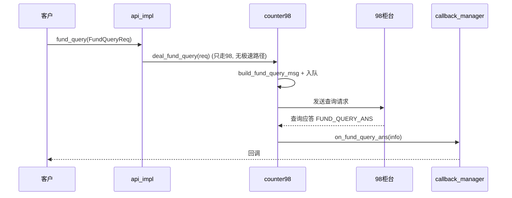
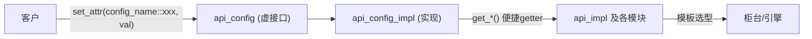
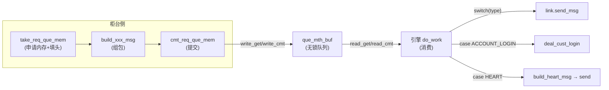
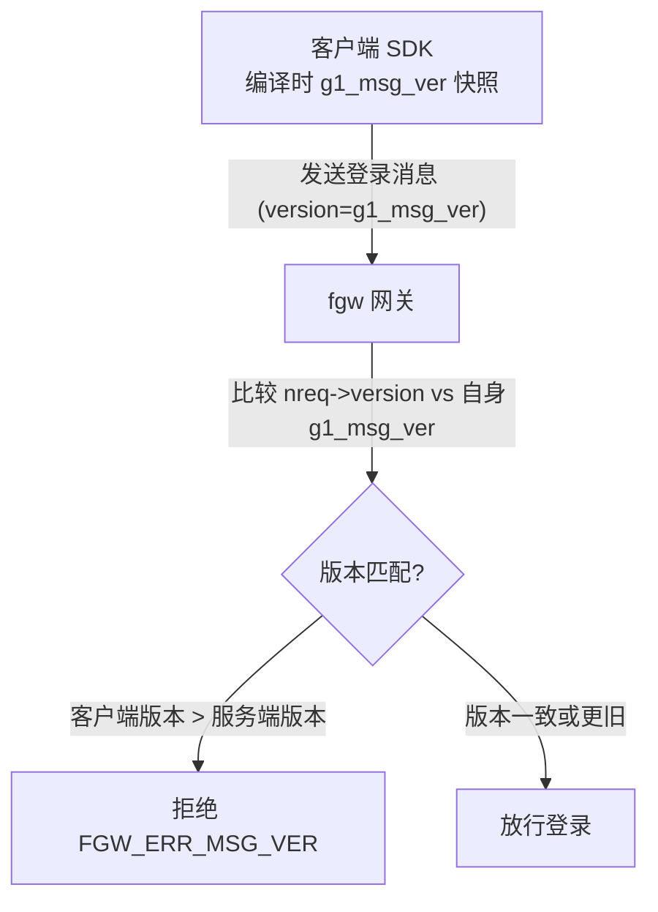
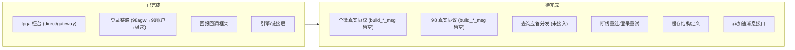

# NewAPI API 架构文档

> 版本：v1.0
> 范围：`trunk/NewAPI/gone/api/`（客户端 API 库）+ `trunk/NewAPI/gone/fgw/`（服务端网关，关联）
> 目标：从整体视角完整描述 API 的架构、模块组成、数据流与线程模型。

---

## 1. 系统概述

NewAPI 是一套对接多个柜台的新版金融系统 API。它通过**统一接口**（`api_interface`）向客户提供登录、委托、撤单、查询等能力，底层支持三种柜台协议：

| 柜台 | 模式 | 特点 |
|------|------|------|
| **98 柜台**（counter98） | 普通 | 登录统一入口、查询唯一通道、委托降级目标 |
| **FPGA 极速柜台** | 直连/网关 | 硬件加速，极低延迟，单客户/多客户两种形态 |
| **个微软件极速柜台**（gw） | 直连 | 软件极速，追求低延迟 |

**核心设计思想**：
1. **柜台与引擎解耦**：柜台懂协议、无线程；引擎懂传输、带线程，通过无锁队列跨线程通信。
2. **统一回调出口**：所有柜台回报收敛到 `callback_manager`，对客户暴露单一 `api_callback` 虚接口。
3. **配置化选型**：通过模板参数在编译期确定柜台和引擎类型，零运行时开销。
4. **下单走极速、查询走 98**：委托/撤单极速柜台优先 + 98 降级；查询统一走 98。

---

## 2. 整体分层架构



---

## 3. 模块组成

### 3.1 接口与配置层（include/）

| 模块 | 职责 |
|------|------|
| `api_interface.h` | API 入口虚基类，静态工厂方法 `create_instance` / `release_instance` |
| `api_config.h` | 配置属性虚接口，`set_attr` / `get_attr` 系列重载 |
| `api_callback.h` | 客户回调接口，所有回报的统一出口 |
| `api_errno.h` | 错误码定义（0 成功，负值错误） |
| `order_trade_type.h` | API 层加速接口的请求/应答/回报结构体 |
| `struct_req.h` / `struct_ans.h` | 个微协议的非加速请求/应答消息体 |
| `common_struct.h` | 个微协议消息体（登录/委托/ETF/信用） |
| `non_fast_msg_head.h` | 非加速消息头（当前为空，待实现） |

### 3.2 实现层（src/）

| 模块 | 职责 |
|------|------|
| `api_instance` | API 核心实现类，持有所有子模块，按配置模板选型 |
| `api_config_impl` | 配置实现类，内部持有所有属性值 |
| `callback_manager` | 回调管理，direct/queued 双模式 |
| `counter98` | 98 柜台协议对象 |
| `fpga_counter_base` | FPGA 柜台公共基类（模板特化多态） |
| `fpga_counter_direct` | FPGA 直连柜台（单客户） |
| `fpga_counter_gateway` | FPGA 网关柜台（多客户） |
| `gw_counter_direct` | 个微直连柜台 |

### 3.3 引擎与链接层（src/）

| 模块 | 职责 |
|------|------|
| `multi_socket_engine` | 多 socket 引擎，管理 98 + 极速网关链接（2 槽） |
| `single_socket_engine` | 单 socket 极速引擎（socket_single 模式） |
| `tcpdirect_engine` | TCPDirect 极速引擎（tcpdirect 模式） |
| `idle_engine` | 空引擎（socket_shared 模式占位） |
| `link_timer_op` | 链接定时事件（心跳发送/超时检测/重连决策） |
| `aio_socket_link` | 基于 aio_tcp 的非阻塞 TCP 链接 |
| `tcpdir_link` | 基于 Solarflare TCPDirect 的链接 |
| `api_event_msg` | 引擎消息队列的事件类型、链接类型、事件结构定义 |

---

## 4. 三种柜台模式



| 模式 | 柜台类型 | 极速链接 | 客户 | 业务通道 |
|------|---------|---------|------|---------|
| **C1** | `fpga_direct` | single_socket / tcpdirect | 单客户 | fpga core 链接 |
| **C2** | `fpga_gateway` | socket_shared | 多客户 | fpga GW 链接 |
| **C3** | `gw_direct` | single_socket / tcpdirect | 单客户 | 个微链接 |

---

## 5. 引擎与线程模型



**线程模型要点**：
1. **主线程**：客户调用 API 接口，组包后写入引擎发送队列（无锁，零阻塞）。
2. **multi_engine 线程**：epoll 驱动，管理 98 链接 + 极速网关链接，也承担极速引擎定时器注册（控制平面）。
3. **极速引擎线程**：死轮询（`need_work()` 恒 true），保证最低延迟，消费极速发送队列。
4. **回调线程**（queued 模式）：消费回调队列，隔离 IO 线程，避免阻塞。

---

## 6. 数据流详解

### 6.1 登录流程



### 6.2 委托流程



### 6.3 回报回调流程

```mermaid
sequenceDiagram
    participant Core as 柜台核心
    participant Link as 链接层
    participant Counter as 柜台
    participant CBM as callback_manager
    participant App as 客户

    Core-->>Link: 回报数据
    Link->>Counter: deal_recv_msg(buf, len, link_type)
    Counter->>Counter: 按 msg_id 分发 → deal_order_rtn/deal_trade_rtn/deal_cancel_rsp
    Counter->>Counter: 解析 + 构造 OrderRtn/StreamInfo
    Counter->>CBM: on_order_rtn(si, rtn)
    alt direct 模式
        CBM-->>App: 直接同步调用 on_order_rtn
    else queued 模式
        CBM->>CBM: 打包入回调队列 + trigger
        CBM->>CBM: 回调线程 do_work 取出
        CBM-->>App: user_callback.on_order_rtn
    end
```

### 6.4 查询流程



---

## 7. 配置体系

配置通过 `api_config` 设置，`api_config_impl` 存储，内部模块通过便捷 getter 读取。



**关键配置**：

| 配置项 | 作用 |
|--------|------|
| `fast_counter_type` | 极速柜台类型（gw_direct/fpga_direct/fpga_gateway） |
| `market_type` | 市场类型（1=上海, 2=深交所/北交所） |
| `speed_link_type` | 极速链接类型（socket_shared/socket_single/tcpdirect） |
| `speed_counter_addr` | 极速柜台地址（含备地址） |
| `counter98_addr` | 98 柜台地址（含备地址） |
| `98agw_user` / `98agw_user_password` | AGW 登录凭据 |
| `callback_mode` | 回调模式（direct/queued） |
| `callback_queue_size_mb` | 回调队列大小 |
| `send_queue_size_mb` | 发送队列大小 |
| `heartbeat_interval` | 心跳间隔 |

---

## 8. 消息队列统一模式

所有跨线程通信（柜台 → 引擎）通过无锁队列 `que_mth_buf` + `link_send_event` 头完成：



```cpp
// link_send_event 头
struct link_send_event {
  int16 link_type;  // 目标链接类型 (LINK_TYPE_98/SPEED_TRADE/SPEED_GW)
  int16 type;       // 事件类型 (SEND_MSG/HEART/ACCOUNT_LOGIN/...)
  int32 data_len;   // 负载长度
  char data[0];     // 柔性数组：业务消息体/事件信息
};
```

---

## 9. 版本校验与跨版本部署



> `version` 不是客户传入的（API 层 `LoginReq` 无此字段），而是 SDK 在 `build_login_msg` 时自动填入编译期常量 `g1_msg_ver`。比较的意义是**检测跨版本部署的兼容性**，防止旧 SDK 接入新协议或超前客户端连旧服务端。（详见 `study/question.md` 2.5 节）

---

## 10. 当前实现状态与待完成事项



### 10.1 各柜台完成度

| 柜台 | 完成度 | 主要待办 |
|------|--------|---------|
| **fpga_counter_base/direct/gateway** | ⭐⭐⭐ 高 | build_login_event 重写、状态字典对齐、地址切换重登 |
| **gw_counter_direct** | ⭐ 低 | 委托/撤单/回报消息体全留空，需正式协议 |
| **counter98** | ⭐ 低 | build_*_msg 全留空、查询应答分发未接入 |

### 10.2 框架层面待办

1. **协议实现**：个微/98 真实协议（当前临时用 g1/c98 占位）。
2. **查询应答分发**：`counter98::deal_recv_msg` 只分发 3 类，查询应答未接入。
3. **登录与重连**：登录异常反复重试、断线自动重登、已登录用户管理。
4. **缓存结构**：counter98.h / gw_counter_direct.h 的 `//todo`。
5. **非加速消息接口**：`struct_req.h` / `struct_ans.h` 配套。
6. **配置化**：登录柜台选择、验密优化待定。

> 详细待办清单和代码实现方案见 `study/question.md` 第六、七章。

---

## 11. 设计要点总结

1. **模板选型，零运行时开销**：柜台/引擎类型在编译期确定，无虚函数多态开销（fpga 多态通过模板特化实现）。
2. **热路径/冷路径分离**：`fpga_cust_info` 中委托/撤单必用字段前置，提升缓存命中。
3. **无锁队列贯穿始终**：所有跨线程通信（柜台→引擎、回调入队）都用 `que_mth_buf`。
4. **死轮询极速引擎**：`need_work()` 恒 true，极速引擎不休眠，保证最低延迟。
5. **统一回调出口**：`callback_manager` 收敛所有回报，direct/queued 双模式自适应。
6. **可靠消息去重**：依据 `session_seq_no` 去重，避免重复回报。
7. **下单走极速、查询走 98**：委托/撤单极速优先 + 降级；查询统一走 98。