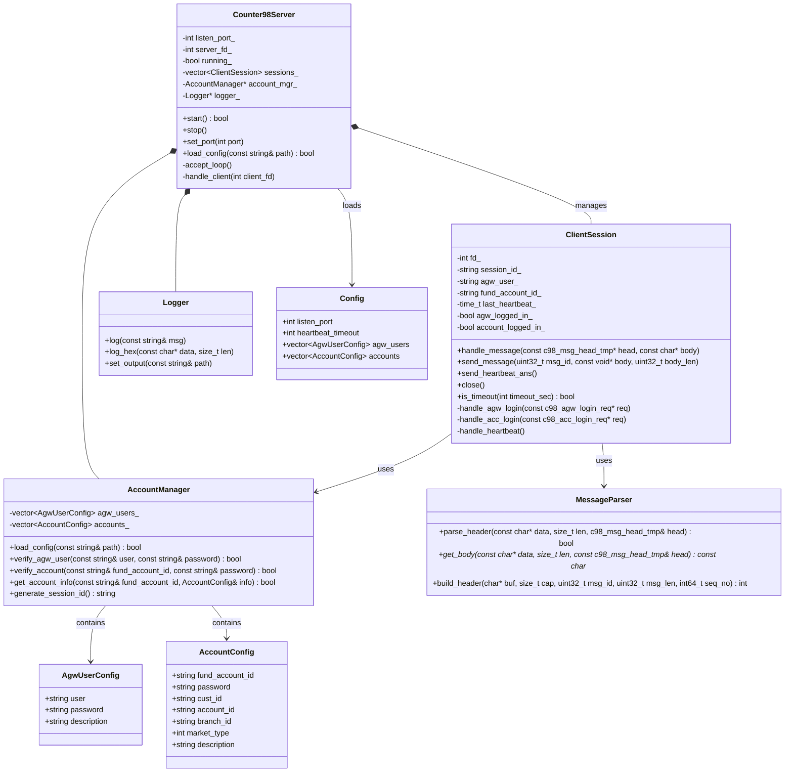
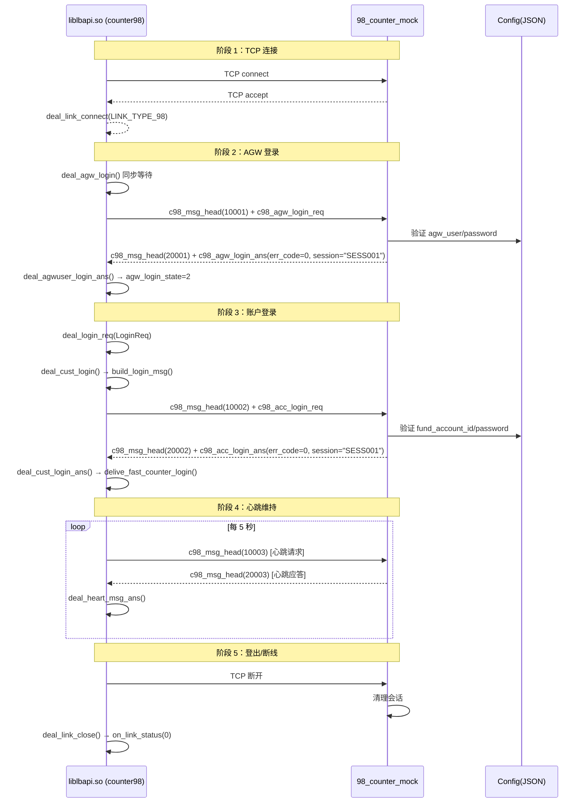
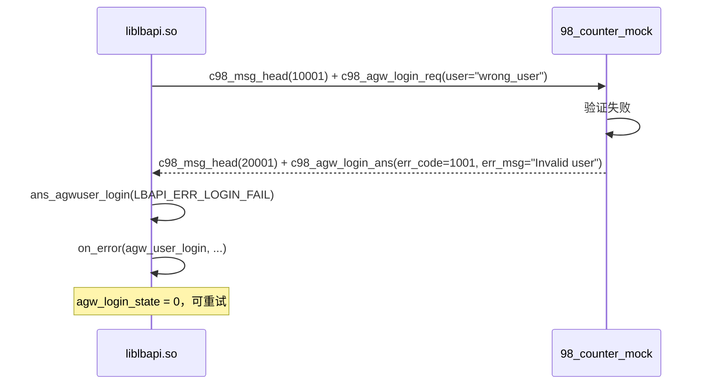
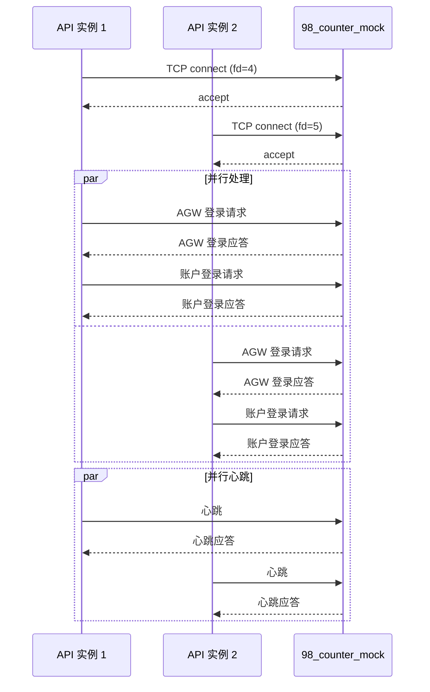

# 98_counter_mock 设计文档

> **目的**：模拟 98 柜台服务端，为 API 的 98_counter 模块提供连接、登录、心跳等基础功能的测试支持。
> **输出目录**：`mock/98_counter/`
> **参考协议**：`c98msg_tmp.h`（临时 98 协议定义）
> **参考实现**：`counter98.h` / `counter98.cpp`
> **参考 CMakeLists**：`trunk/NewAPI/gone/api/CMakeLists.txt`

---

## 目录

1. [模块定位与架构](#1-模块定位与架构)
2. [98 协议分析](#2-98-协议分析)
3. [API 98_counter 模块考察](#3-api-98_counter-模块考察)
4. [功能清单](#4-功能清单)
5. [UML 类图](#5-uml-类图)
6. [时序图](#6-时序图)
7. [项目文件结构](#7-项目文件结构)
8. [CMakeLists.txt 构建方案](#8-cmakeliststxt-构建方案)
9. [配置说明](#9-配置说明)
10. [API 98_counter 模块完善建议](#10-api-98_counter-模块完善建议)

---

## 1. 模块定位与架构

### 1.1 在整体测试架构中的位置

```
┌──────────────────────────────────────────────────────────────┐
│                    API 测试环境                                │
├──────────────────────────────────────────────────────────────┤
│                                                              │
│  ┌──────────────────┐     ┌──────────────────────────────┐  │
│  │  mock_client     │────→│  liblbapi.so (被测 API)      │  │
│  │  (测试驱动)       │     │  ┌───────────────────────┐  │  │
│  └──────────────────┘     │  │ counter98 模块         │  │  │
│                           │  │ (98 协议处理)          │  │  │
│                           │  └───────────┬───────────┘  │  │
│                           └──────────────┼──────────────┘  │
│                                          │                  │
│                                          ▼                  │
│                           ┌──────────────────────────────┐  │
│                           │  98_counter_mock (本组件)     │  │
│                           │  ┌───────────────────────┐  │  │
│                           │  │ TCP Server            │  │  │
│                           │  │ (AGW 登录 + 账户登录   │  │  │
│                           │  │  + 心跳)              │  │  │
│                           │  └───────────────────────┘  │  │
│                           └──────────────────────────────┘  │
│                                                              │
└──────────────────────────────────────────────────────────────┘
```

### 1.2 与 API 98_counter 模块的交互

```
counter98 (API 侧)
    │
    │ ① deal_agw_login() → build_agw_login_msg()
    │    ── TCP send ──→ c98_msg_head_tmp(C98_MSG_AGW_LOGIN_REQ) + c98_agw_login_req
    │
    │ ② ←── TCP recv ── c98_msg_head_tmp(C98_MSG_AGW_LOGIN_ANS) + c98_agw_login_ans
    │    deal_agwuser_login_ans()
    │
    │ ③ deal_login_req() → build_cust_login_event() → LINK_EVENT_TYPE_ACCOUNT_LOGIN
    │    ── TCP send ──→ c98_msg_head_tmp(C98_MSG_ACC_LOGIN_REQ) + c98_acc_login_req
    │
    │ ④ ←── TCP recv ── c98_msg_head_tmp(C98_MSG_ACC_LOGIN_ANS) + c98_acc_login_ans
    │    deal_cust_login_ans()
    │
    │ ⑤ build_heart_msg()
    │    ── TCP send ──→ c98_msg_head_tmp(C98_MSG_HEART_REQ)
    │
    │ ⑥ ←── TCP recv ── c98_msg_head_tmp(C98_MSG_HEART_ANS)
    │    deal_heart_msg_ans()
    │
    ▼
98_counter_mock (本组件)
```

---

## 2. 98 协议分析

### 2.1 报文格式

```
┌──────────────────────┬──────────────────────┐
│ c98_msg_head_tmp 16B │ 消息体 msg_len B     │
│ msg_id(4) | msg_len(4) | seq_no(8)         │
└──────────────────────┴──────────────────────┘
whole_msg_len = sizeof(c98_msg_head_tmp) + msg_len
```

### 2.2 消息类型定义

| 消息号 | 宏定义 | 方向 | 消息体 | 说明 |
|--------|--------|------|--------|------|
| 10001 | `C98_MSG_AGW_LOGIN_REQ` | API→Mock | `c98_agw_login_req` | AGW 登录请求 |
| 20001 | `C98_MSG_AGW_LOGIN_ANS` | Mock→API | `c98_agw_login_ans` | AGW 登录应答 |
| 10002 | `C98_MSG_ACC_LOGIN_REQ` | API→Mock | `c98_acc_login_req` | 账户登录请求 |
| 20002 | `C98_MSG_ACC_LOGIN_ANS` | Mock→API | `c98_acc_login_ans` | 账户登录应答 |
| 10003 | `C98_MSG_HEART_REQ` | API→Mock | 无消息体 | 心跳请求 |
| 20003 | `C98_MSG_HEART_ANS` | Mock→API | 无消息体 | 心跳应答 |

### 2.3 数据结构

```cpp
// 消息头（16 字节）
struct c98_msg_head_tmp {
    uint32_t msg_id;   // 消息号
    uint32_t msg_len;  // 包体长度（不含头）
    int64_t  seq_no;   // 流消息号
};

// AGW 登录请求（API → Mock）
struct c98_agw_login_req {
    int64_t  client_req_no;
    char     agw_user[32];
    char     agw_user_password[256];
    char     version[64];
};

// AGW 登录应答（Mock → API）
struct c98_agw_login_ans {
    int64_t  client_req_no;
    char     agw_user[32];
    char     session[32];     // 会话信息
    int32_t  err_code;        // 错误码
    char     err_msg[128];    // 错误信息
};

// 账户登录请求（API → Mock）
struct c98_acc_login_req {
    int64_t  client_req_no;
    char     cust_id[16];
    char     fund_account_id[16];
    char     branch_id[10];
    char     account_id[12];
    char     password[256];
    char     session[32];
    char     end_code[1024];
    int16_t  market_type;
    uint16_t heart_bt_int;
    char     order_way[2];
    char     version[64];
};

// 账户登录应答（Mock → API）
struct c98_acc_login_ans {
    int64_t  client_req_no;
    char     cust_id[16];
    char     fund_account_id[16];
    char     branch_id[10];
    char     account_id[12];
    char     password[256];
    char     session[32];
    char     user_info[64];
    char     end_code[1024];
    int16_t  market_type;
    uint16_t heart_bt_int;
    char     order_way_ext[2];
    int32_t  err_code;
    char     err_msg[128];
    int64_t  login_time;
};

// 心跳请求/应答：仅消息头，无消息体
```

---

## 3. API 98_counter 模块考察

### 3.1 现有实现分析

通过对 `counter98.h` / `counter98.cpp` 的完整阅读，当前实现状态如下：

#### 3.1.1 AGW 登录（✅ 基本可用）

| 功能 | 状态 | 说明 |
|------|------|------|
| `deal_agw_login()` | ✅ 实现 | 同步等待，CAS 状态机，超时控制 |
| `build_agw_login_msg()` | ✅ 实现 | 构造 `c98_msg_head_tmp` + `c98_agw_login_req` |
| `deal_agwuser_login_ans()` | ✅ 实现 | 解析 AGW 登录应答，设置 `agw_login_state` |
| `ans_agwuser_login()` | ✅ 实现 | 设置状态 + 回调 |

**AGW 登录状态机**：
```
agw_login_state = 0 (未登录)
    ↓ deal_agw_login() 中 CAS(0→1)
agw_login_state = 1 (登录中)
    ↓ deal_agwuser_login_ans() 成功
agw_login_state = 2 (已登录)
    ↓ deal_agwuser_login_ans() 失败
agw_login_state = 0 (未登录，可重试)
```

#### 3.1.2 账户登录（⚠️ 有缺陷）

| 功能 | 状态 | 说明 |
|------|------|------|
| `deal_login_req()` | ✅ 实现 | 将 `LoginReq` 转为 `acc_login_event_info` 入队 |
| `build_cust_login_event()` | ✅ 实现 | 字段转换完整 |
| `deal_cust_login()` | ⚠️ 有缺陷 | `cust_need_login = false` 硬编码，**永远不走账户登录** |
| `build_login_msg()` | ✅ 实现 | 构造 `c98_msg_head_tmp` + `c98_acc_login_req` |
| `deal_cust_login_ans()` | ✅ 实现 | 解析应答，触发极速柜台登录 |
| `delive_fast_counter_login()` | ✅ 实现 | 投递账户登录事件到极速柜台队列 |

**关键缺陷**：`deal_cust_login()` 第 719 行 `bool cust_need_login = false;` 硬编码为 false，导致：
- API 永远不向 98 柜台发送 `C98_MSG_ACC_LOGIN_REQ` 消息
- 直接跳转到 `delive_fast_counter_login()` 进入极速柜台登录阶段
- 98 账户登录链路实际上被跳过

**修复方案**：将 `cust_need_login` 改为 `true`，或基于配置/缓存判断是否需要登录。

#### 3.1.3 心跳（✅ 可用）

| 功能 | 状态 | 说明 |
|------|------|------|
| `build_heart_msg()` | ✅ 实现 | 构造 `c98_msg_head_tmp(C98_MSG_HEART_REQ)` |
| `deal_recv_msg()` 中 `C98_MSG_HEART_ANS` | ✅ 实现 | 调用 `deal_heart_msg_ans()` |

#### 3.1.4 链接管理（✅ 可用）

| 功能 | 状态 | 说明 |
|------|------|------|
| `deal_link_connect()` | ✅ 实现 | 设置 `trade_link_connect_=1`，回调 `on_link_status`，地址切换处理 |
| `deal_link_close()` | ✅ 实现 | 设置 `trade_link_connect_=0`，回调 `on_link_status` |
| `can_link_connect()` | ✅ 实现 | 仅 `LINK_TYPE_98` 返回 true |

#### 3.1.5 其他（❌ 待实现，不影响 mock）

| 功能 | 状态 | 说明 |
|------|------|------|
| `build_order_msg()` | ❌ 空 | 委托消息构造 |
| `build_cancel_msg()` | ❌ 空 | 撤单消息构造 |
| 所有查询消息构造 | ❌ 空 | 查询相关 |
| `deal_send_error()` | ❌ 空 | 发送失败处理 |

### 3.2 总结

**对 mock 开发的影响**：
- mock 需要支持 AGW 登录（`C98_MSG_AGW_LOGIN_REQ/ANS`）和账户登录（`C98_MSG_ACC_LOGIN_REQ/ANS`）两个阶段
- 需要支持心跳（`C98_MSG_HEART_REQ/ANS`）
- 账户登录应答中需要回填 `session`，供 API 侧触发极速柜台登录

**需要修复的 API 缺陷**：
- `deal_cust_login()` 中 `cust_need_login = false` → 应改为 `true` 或实现正确判断逻辑

---

## 4. 功能清单

### 4.1 核心功能

| 编号 | 功能 | 描述 | 优先级 |
|------|------|------|--------|
| F1 | TCP Server | 监听指定端口，接受 API 连接 | P0 |
| F2 | 消息帧解析 | 解析 `c98_msg_head_tmp` 头，提取 msg_id/msg_len | P0 |
| F3 | AGW 登录处理 | 接收 `C98_MSG_AGW_LOGIN_REQ`，返回 `C98_MSG_AGW_LOGIN_ANS` | P0 |
| F4 | 账户登录处理 | 接收 `C98_MSG_ACC_LOGIN_REQ`，返回 `C98_MSG_ACC_LOGIN_ANS` | P0 |
| F5 | 心跳处理 | 接收 `C98_MSG_HEART_REQ`，返回 `C98_MSG_HEART_ANS` | P0 |
| F6 | 登出处理 | 接收连接关闭，清理会话 | P1 |
| F7 | 多连接支持 | 支持多个 API 实例同时连接 | P1 |
| F8 | 配置化账户 | 通过 JSON 配置可用的 AGW 用户和账户信息 | P0 |
| F9 | 日志输出 | 记录所有接收/发送的消息 | P1 |

### 4.2 消息处理规则

| 接收消息 | 处理逻辑 | 返回消息 |
|---------|---------|---------|
| `C98_MSG_AGW_LOGIN_REQ` | 验证 `agw_user`/`agw_user_password`，生成 `session` | `C98_MSG_AGW_LOGIN_ANS` |
| `C98_MSG_ACC_LOGIN_REQ` | 验证 `fund_account_id`/`password`，回填 `session` | `C98_MSG_ACC_LOGIN_ANS` |
| `C98_MSG_HEART_REQ` | 更新最后心跳时间 | `C98_MSG_HEART_ANS` |
| 未知消息 | 记录日志，跳过 | 无返回 |

### 4.3 登录验证规则

**AGW 登录验证**：
```
if (agw_user == config.agw_users[n].user && 
    agw_password == config.agw_users[n].password) {
    err_code = 0;
    session = generate_session_id();
} else {
    err_code = ERR_INVALID_CREDENTIALS;
    err_msg = "Invalid AGW user or password";
}
```

**账户登录验证**：
```
if (fund_account_id == config.accounts[n].fund_account_id &&
    password == config.accounts[n].password) {
    err_code = 0;
    // 回填 cust_id, account_id, session 等
} else {
    err_code = ERR_INVALID_ACCOUNT;
    err_msg = "Invalid account or password";
}
```

---

## 5. UML 类图



---

## 6. 时序图

### 6.1 完整登录 + 心跳流程



### 6.2 AGW 登录失败场景



### 6.3 多连接场景



---

## 7. 项目文件结构

```
mock/98_counter/
├── 98_counter_mock_design.md          ← 本设计文档
├── CMakeLists.txt                      ← 构建文件
├── src/
│   ├── main.cpp                        ← 入口（解析命令行 + 启动服务）
│   ├── counter98_server.h              ← Counter98Server 类声明
│   ├── counter98_server.cpp            ← Counter98Server 实现
│   ├── client_session.h                ← ClientSession 类声明
│   ├── client_session.cpp              ← ClientSession 实现
│   ├── account_manager.h               ← AccountManager 类声明
│   ├── account_manager.cpp             ← AccountManager 实现
│   ├── message_parser.h                ← MessageParser 类声明
│   └── message_parser.cpp              ← MessageParser 实现
└── config/
    └── server_config.json              ← 服务端配置示例
```

---

## 8. CMakeLists.txt 构建方案

### 8.1 构建目标

| 目标 | 类型 | 说明 |
|------|------|------|
| `counter98_mock` | 可执行文件 | 98 柜台模拟服务端 |

### 8.2 依赖

- 标准库（无外部依赖）
- `libpthread`：多线程支持（`std::thread`）
- 头文件：`c98msg_tmp.h`（位于 `trunk/NewAPI/gone/include/`）

### 8.3 CMakeLists.txt 结构

参考 `trunk/NewAPI/gone/api/CMakeLists.txt` 风格：

- 支持独立编译和父模块编译（`BUILD_SUM_COUNT` 判断）
- 独立编译时设置 C++11 标准、编译优化 flags
- `file(GLOB)` 收集源文件
- 头文件路径包含 `../../include`（c98msg_tmp.h）和 `../../api/src`（共用结构体）
- 链接 `pthread`

---

## 9. 配置说明

### 9.1 服务端配置（server_config.json）

```json
{
  "server": {
    "listen_port": 9001,
    "heartbeat_timeout": 30,
    "log_file": "./counter98_mock.log",
    "log_level": "info"
  },
  "agw_users": [
    {
      "user": "agw_user_01",
      "password": "agw_pwd_01",
      "description": "测试 AGW 用户 1"
    },
    {
      "user": "agw_user_02",
      "password": "agw_pwd_02",
      "description": "测试 AGW 用户 2"
    }
  ],
  "accounts": [
    {
      "fund_account_id": "1000000000000001",
      "password": "test_password",
      "cust_id": "C000000000000001",
      "account_id": "A12345678901",
      "branch_id": "0001",
      "market_type": 1,
      "description": "上海测试账户"
    },
    {
      "fund_account_id": "2000000000000002",
      "password": "test_password_2",
      "cust_id": "C000000000000002",
      "account_id": "A12345678902",
      "branch_id": "0002",
      "market_type": 2,
      "description": "深圳测试账户"
    }
  ]
}
```

### 9.2 配置字段说明

| 配置段 | 字段 | 类型 | 说明 |
|--------|------|------|------|
| `server` | `listen_port` | int | 监听端口（默认 9001） |
| `server` | `heartbeat_timeout` | int | 心跳超时秒数（默认 30） |
| `server` | `log_file` | string | 日志文件路径 |
| `server` | `log_level` | string | 日志级别 (debug/info/warn/error) |
| `agw_users[]` | `user` | string | AGW 用户名 |
| `agw_users[]` | `password` | string | AGW 用户密码 |
| `accounts[]` | `fund_account_id` | string | 资金账号 |
| `accounts[]` | `password` | string | 账户密码 |
| `accounts[]` | `cust_id` | string | 客户号 |
| `accounts[]` | `account_id` | string | 股东账号 |
| `accounts[]` | `branch_id` | string | 分支机构 |
| `accounts[]` | `market_type` | int | 市场类型 |

---

## 10. API 98_counter 模块完善建议

### 10.1 必须修复的缺陷

#### 缺陷 1：`deal_cust_login()` 中 `cust_need_login` 硬编码为 false

**位置**：`counter98.cpp` 第 719 行

**当前代码**：
```cpp
int32 counter98::deal_cust_login(const acc_login_event_info &req, char *o_buf, int32 buf_len) {
  // todo : 依据正式协议和柜台规则重写
  bool cust_need_login = false;  // ← 硬编码 false，永远不走账户登录
  if (cust_need_login) {
    return build_login_msg(req, o_buf, buf_len);
  } else {
    return delive_fast_counter_login(req);
  }
}
```

**问题**：`cust_need_login = false` 导致：
1. API 永远不会向 98 柜台发送 `C98_MSG_ACC_LOGIN_REQ`
2. API 直接跳转到极速柜台登录阶段
3. 98 账户登录链路形同虚设

**修复方案**：
```cpp
// 方案一：直接改为 true（适用于 mock 测试）
bool cust_need_login = true;

// 方案二（推荐）：基于缓存判断
// 检查该用户是否已登录过（缓存中已存在有效会话）
bool cust_need_login = !is_cust_logged_in(req.fund_account_id);
// 初始实现可简化为 true
```

#### 缺陷 2：`build_login_msg()` 中 `session` 重复 memcpy

**位置**：`counter98.cpp` 第 745 行和第 750 行

```cpp
std::memcpy(body->session, info.session, sizeof(body->session));  // 第 745 行
// ... 中间代码 ...
std::memcpy(body->session, info.session, sizeof(body->session));  // 第 750 行（重复）
```

**影响**：无功能影响，但代码冗余，应删除第 750 行的重复赋值。

### 10.2 建议改进

| 改进项 | 说明 | 优先级 |
|--------|------|--------|
| 账户登录缓存 | 登录成功后缓存会话，避免重复登录 | P1 |
| 断线重登录 | `deal_link_close` 后自动重登 | P1 |
| 错误码映射 | 完善 98 错误码到 `LBAPI_ERR_*` 的映射 | P2 |
| 心跳超时检测 | 检测 98 心跳超时并触发重连 | P2 |

### 10.3 修复后预期流程

```
API 启动
  → deal_link_connect(LINK_TYPE_98) [连接 98_counter_mock]
  → deal_agw_login() [同步等待]
     → build_agw_login_msg() → send → 98_counter_mock
     ← recv ← 98_counter_mock → deal_agwuser_login_ans()
     → agw_login_state = 2

用户调用 api->login(LoginReq)
  → deal_login_req(LoginReq)
     → build_cust_login_event() → LINK_EVENT_TYPE_ACCOUNT_LOGIN 入队
  → multi_engine 消费事件 → deal_cust_login()
     → cust_need_login = true (修复后)
     → build_login_msg() → send → 98_counter_mock  [新增：真正发送账户登录]
     ← recv ← 98_counter_mock → deal_cust_login_ans()
     → delive_fast_counter_login() [触发极速柜台登录]
```

---

> **文档版本**：v1.0
> **作者**：AI 研发平台
> **更新日期**：2026-09-14
