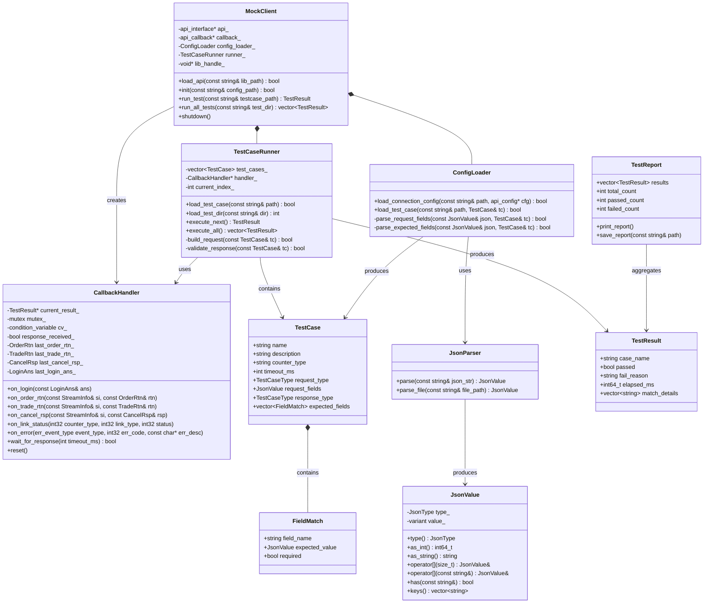
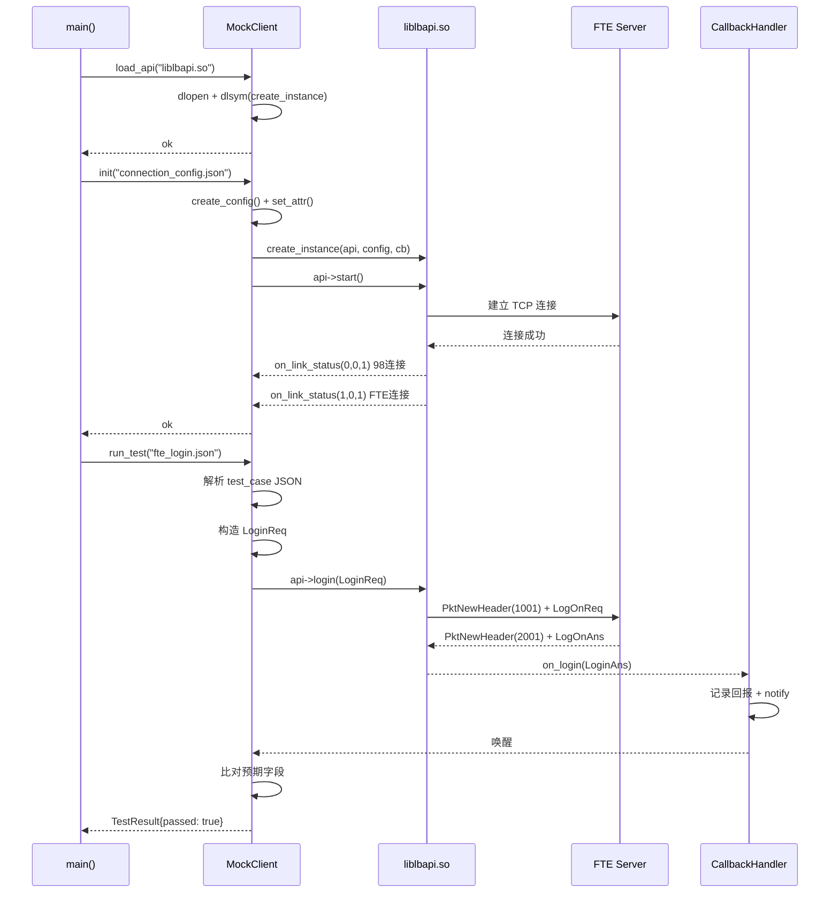
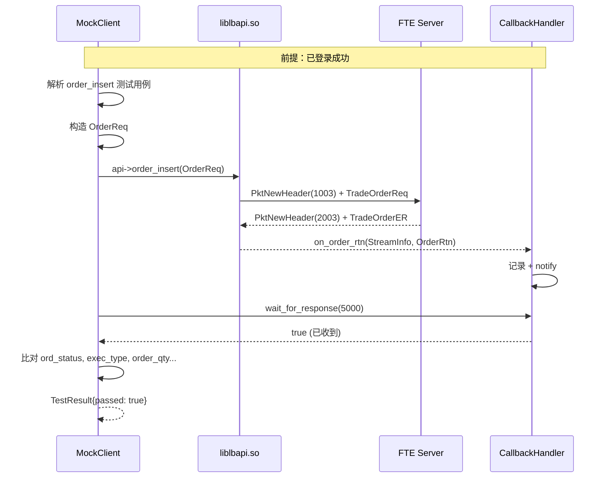
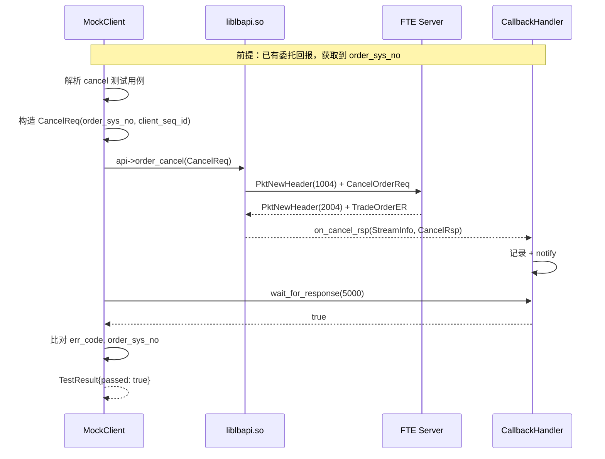

# mock_client 设计文档

> **目的**：模拟真实客户端，通过加载 `liblbapi.so` 动态链接库，向 FTE 柜台发送请求并接收回报，验证 FTE 协议完整链路。
> **输出目录**：`mock/client/`
> **参考协议**：FTE TCP 二进制协议（`gw_head.h`），98 协议（`c98msg_tmp.h`）
> **参考 CMakeLists**：`trunk/NewAPI/gone/api/CMakeLists.txt`

---

## 目录

1. [模块定位与架构](#1-模块定位与架构)
2. [功能清单](#2-功能清单)
3. [配置系统](#3-配置系统)
4. [JSON 工具类（mock/include）](#4-json-工具类mockinclude)
5. [测试用例定义](#5-测试用例定义)
6. [测试执行流程](#6-测试执行流程)
7. [UML 类图](#7-uml-类图)
8. [时序图](#8-时序图)
9. [项目文件结构](#9-项目文件结构)
10. [CMakeLists.txt 构建方案](#10-cmakeliststxt-构建方案)
11. [FTE 柜台测试用例清单](#11-fte-柜台测试用例清单)
12. [未来扩展](#12-未来扩展)

---

## 1. 模块定位与架构

### 1.1 在 NewAPI 框架中的位置

```
┌─────────────────────────────────────────────────────────────┐
│                      mock_client                            │
│  ┌──────────┐  ┌──────────────┐  ┌──────────────────────┐   │
│  │ JSON     │  │ Test Case    │  │ API Loader           │   │
│  │ Config   │→ │ Runner       │→ │ (dlopen liblbapi.so) │   │
│  └──────────┘  └──────┬───────┘  └──────────┬───────────┘   │
│                       │                     │               │
│                       ▼                     ▼               │
│              ┌─────────────────────────────────────┐        │
│              │ Callback Handler                    │        │
│              │ (on_login / on_order_rtn / ...)     │        │
│              └─────────────────────────────────────┘        │
└─────────────────────────────────────────────────────────────┘
                              │
                              ▼
┌─────────────────────────────────────────────────────────────┐
│                   liblbapi.so (被测对象)                      │
│  ┌──────────┐  ┌──────────────┐  ┌──────────────────────┐   │
│  │ API      │→ │ gw_counter   │→ │ FTE TCP Binary      │   │
│  │ Interface│  │ _direct      │  │ Protocol             │   │
│  └──────────┘  └──────────────┘  └──────────────────────┘   │
└─────────────────────────────────────────────────────────────┘
                              │
                              ▼
               ┌─────────────────────────┐
               │   FTE 模拟交易所         │
               │   (或真实 FTE 服务端)     │
               └─────────────────────────┘
```

### 1.2 与 API 的交互层级

```
mock_client (测试驱动)
    │ api_config::create_config() + set_attr()
    │ api_interface::create_instance()
    │ api->start()
    │ api->login(LoginReq)
    │ api->order_insert(OrderReq)
    │ api->order_cancel(CancelReq)
    ▼
api_interface (虚接口层)
    │
    ▼
api_impl<gw_counter_direct, single_socket_engine>
    │  fast_ = gw_counter_direct (FTE 协议处理)
    │  multi_engine_ (控制平面)
    ▼
FTE TCP Binary Protocol → FTE 服务端
    │
    ▼ (回报)
callback_manager → mock_client::on_*()
```

---

## 2. 功能清单

### 2.1 核心功能

| 编号 | 功能 | 描述 | 优先级 |
|------|------|------|--------|
| F1 | API 动态库加载 | 通过 `dlopen` 加载 `liblbapi.so`，获取工厂函数符号 | P0 |
| F2 | 配置化连接 | 通过 JSON 配置 API 实例参数（地址、市场、柜台类型等） | P0 |
| F3 | 配置化测试用例 | 通过 JSON 定义测试请求和预期回报 | P0 |
| F4 | 测试用例执行器 | 按顺序执行测试用例，比对预期回报 | P0 |
| F5 | FTE 登录测试 | 构造 `LoginReq` → 验证 `LoginAns` | P0 |
| F6 | FTE 委托测试 | 构造 `OrderReq` → 验证 `OrderRtn` | P0 |
| F7 | FTE 撤单测试 | 构造 `CancelReq` → 验证 `CancelRsp` | P0 |
| F8 | FTE ETF 测试 | 构造 ETF `OrderReq` → 验证 `TradeRtn` | P1 |
| F9 | FTE 心跳测试 | 验证心跳正常维持，无断线回调 | P0 |
| F10 | 回调处理 | 实现 `api_callback` 全部虚方法，记录/比对回报 | P0 |
| F11 | 测试报告输出 | 输出测试结果（通过/失败/断言详情） | P1 |

### 2.2 回调接口实现

| 回调方法 | 用途 | 预期验证 |
|----------|------|----------|
| `on_login(LoginAns)` | 验证登录结果 | err_code==0, 字段匹配 |
| `on_order_rtn(StreamInfo, OrderRtn)` | 验证委托回报 | ord_status, exec_type 匹配 |
| `on_trade_rtn(StreamInfo, TradeRtn)` | 验证成交回报 | last_px, last_qty 匹配 |
| `on_cancel_rsp(StreamInfo, CancelRsp)` | 验证撤单响应 | err_code 匹配 |
| `on_link_status(int32, int32, int32)` | 验证链接状态 | 连接成功回调 |
| `on_error(err_event_type, int32, char*)` | 错误处理 | 记录错误信息 |

---

## 3. 配置系统

### 3.1 连接配置（connection_config.json）

```json
{
  "api_instance_name": "fte_test_client",
  "market_type": 1,
  "fast_counter_type": 1,
  "speed_link_type": 1,
  "speed_counter_addr": {
    "ip": "127.0.0.1",
    "port": 33001
  },
  "counter98_addr": {
    "ip": "127.0.0.1",
    "port": 9001
  },
  "98agw_user": "agw_user_01",
  "98agw_user_password": "agw_pwd_01",
  "heartbeat_interval": 5,
  "agw_user_login_timeout": 10,
  "log_level": 1,
  "log_output_dir": "./api_log"
}
```

**字段说明**：

| 配置项 | 类型 | 对应 config_name | 说明 |
|--------|------|------------------|------|
| `api_instance_name` | string | `api_instance_name` | API 实例名称 |
| `market_type` | int | `market_type` | 1=上海, 2=深圳 |
| `fast_counter_type` | int | `fast_counter_type` | 1=gw_direct |
| `speed_link_type` | int | `speed_link_type` | 1=socket_single |
| `speed_counter_addr` | object | `speed_counter_addr` | FTE 服务端地址 |
| `counter98_addr` | object | `counter98_addr` | 98 柜台地址 |
| `98agw_user` | string | `98agw_user` | AGW 用户 |
| `98agw_user_password` | string | `98agw_user_password` | AGW 密码 |
| `heartbeat_interval` | int | `heartbeat_interval` | 心跳间隔（秒） |
| `agw_user_login_timeout` | int | `agw_user_login_timeout` | AGW 登录超时 |
| `log_level` | int | `log_level` | 日志级别 |
| `log_output_dir` | string | `log_output_dir` | 日志输出目录 |

### 3.2 测试用例配置（test_case_*.json）

每个 JSON 文件定义一个测试用例，包含请求和预期回报：

```json
{
  "test_case": {
    "name": "FTE 登录测试",
    "description": "测试 FTE 柜台登录功能",
    "counter_type": "fte",
    "timeout_ms": 10000
  },
  "request": {
    "type": "login",
    "fields": {
      "client_req_no": 1001,
      "fund_account_id": "1000000000000001",
      "branch_id": "0001",
      "account_id": "A12345678901",
      "cust_id": "C000000000000001",
      "password": "test_password",
      "order_way_ext": "01",
      "user_info": "test_user",
      "client_feature_code": ""
    }
  },
  "expected_response": {
    "type": "login",
    "fields": {
      "err_code": 0,
      "market_type": 1
    },
    "validate": ["err_code", "market_type"]
  }
}
```

**请求类型枚举**：

| type | 对应 API 方法 | 预期响应回调 |
|------|--------------|-------------|
| `login` | `api->login(LoginReq)` | `on_login(LoginAns)` |
| `order_insert` | `api->order_insert(OrderReq)` | `on_order_rtn(OrderRtn)` |
| `etf_order_insert` | `api->etf_order_insert(OrderReq)` | `on_trade_rtn(TradeRtn)` |
| `order_cancel` | `api->order_cancel(CancelReq)` | `on_cancel_rsp(CancelRsp)` |
| `wait_heartbeat` | 等待心跳 | `on_link_status` 保持连接 |

---

## 4. JSON 工具类（mock/include）

### 4.1 设计

提供轻量级的 JSON 解析和序列化工具，不依赖第三方库（兼容 gcc 4.8.5）。

```cpp
namespace mock {

/// JSON 值类型枚举
enum class JsonType {
    Null, Bool, Int, Double, String, Array, Object
};

/// JSON 值节点
class JsonValue {
public:
    JsonType type() const;
    
    // 类型安全访问
    bool as_bool() const;
    int64_t as_int() const;
    double as_double() const;
    std::string as_string() const;
    
    // 容器访问
    size_t size() const;
    JsonValue& operator[](size_t index);      // array
    JsonValue& operator[](const std::string& key); // object
    bool has(const std::string& key) const;
    
    // 迭代
    std::vector<std::string> keys() const;
};

/// JSON 解析器
class JsonParser {
public:
    /// 从字符串解析 JSON
    static JsonValue parse(const std::string& json_str);
    /// 从文件解析 JSON
    static JsonValue parse_file(const std::string& file_path);
};

/// JSON 序列化器
class JsonWriter {
public:
    static std::string write(const JsonValue& val, bool pretty = true);
};

/// 配置加载器
class ConfigLoader {
public:
    /// 加载连接配置
    static bool load_connection_config(const std::string& path, 
                                        lb_api::api_config* cfg);
    /// 加载测试用例配置
    static bool load_test_case(const std::string& path,
                                TestCase& tc);
};

} // namespace mock
```

### 4.2 JSON 格式要求

- 支持标准 JSON 语法（对象、数组、字符串、数字、布尔、null）
- 字符串使用双引号
- 数字支持整数和浮点数
- 不支持注释（保持标准兼容）

---

## 5. 测试用例定义

### 5.1 测试用例数据结构

```cpp
/// 测试用例类型
enum class TestCaseType {
    Login,
    OrderInsert,
    EtfOrderInsert,
    OrderCancel,
    WaitHeartbeat
};

/// 字段匹配规则
struct FieldMatch {
    std::string field_name;     // 字段名（支持点号路径，如 "err_code"）
    JsonValue expected_value;   // 预期值
    bool required;              // 是否必须匹配
};

/// 测试用例定义
struct TestCase {
    std::string name;           // 用例名称
    std::string description;    // 用例描述
    std::string counter_type;   // 柜台类型 ("fte" / "98" / "g1")
    int timeout_ms;             // 超时时间(毫秒)
    
    TestCaseType request_type;  // 请求类型
    JsonValue request_fields;   // 请求字段
    
    TestCaseType response_type; // 预期响应类型
    std::vector<FieldMatch> expected_fields; // 预期字段匹配
};

/// 测试结果
struct TestResult {
    std::string case_name;
    bool passed;
    std::string fail_reason;
    int64_t elapsed_ms;
    std::vector<std::string> match_details; // 字段匹配详情
};
```

### 5.2 字段匹配规则

| 规则 | 说明 | 示例 |
|------|------|------|
| **精确匹配** | 预期值与实际值完全相等 | `err_code` == 0 |
| **模糊匹配** | 预期值为 null 时跳过验证 | `err_msg` == null → 不验证 |
| **存在性检查** | 检查字段是否存在 | `fund_account_id` 非空 |
| **范围检查** | 数值在预期范围内 | `login_time` > 0 |

---

## 6. 测试执行流程

### 6.1 整体流程

```
┌────────────────────────────────────────────────────────────┐
│                    测试执行主流程                            │
├────────────────────────────────────────────────────────────┤
│  1. 解析命令行参数 (--config, --testcase, --help)          │
│  2. 加载连接配置 JSON → api_config                         │
│  3. dlopen(liblbapi.so) → 获取 create_instance 符号        │
│  4. create_instance(api, config, callback)                 │
│  5. api->start() 启动所有链接                              │
│  6. 循环加载测试用例 JSON 文件                              │
│     ├─ 构造请求 (LoginReq / OrderReq / CancelReq)          │
│     ├─ 调用对应 API 方法                                   │
│     ├─ 等待回调 (超时控制)                                 │
│     ├─ 比对预期回报字段                                    │
│     └─ 记录测试结果                                        │
│  7. api->stop() 停止链接                                   │
│  8. release_instance(api) 释放实例                         │
│  9. 输出测试报告                                           │
└────────────────────────────────────────────────────────────┘
```

### 6.2 回调等待机制

```
┌──────────┐     ┌──────────────┐     ┌──────────────┐
│ 主线程   │     │ 回调线程     │     │ 测试用例队列  │
├──────────┤     ├──────────────┤     ├──────────────┤
│ 发送请求 │     │              │     │              │
│ → 等待   │     │ 收到回报     │     │              │
│          │←────│ → 记录结果   │     │              │
│          │     │ → signal     │     │              │
│ 被唤醒   │     │              │     │              │
│ 比对字段 │     │              │     │              │
│ 输出结果 │     │              │     │              │
└──────────┘     └──────────────┘     └──────────────┘
```

使用 `std::condition_variable` 实现同步等待：

```cpp
// 回调函数中记录回报并通知
void on_order_rtn(const StreamInfo& si, const OrderRtn& rtn) override {
    std::lock_guard<std::mutex> lock(mutex_);
    last_order_rtn_ = rtn;
    rtn_received_ = true;
    cv_.notify_one();
}

// 主线程等待回报
bool wait_for_response(int timeout_ms) {
    std::unique_lock<std::mutex> lock(mutex_);
    return cv_.wait_for(lock, std::chrono::milliseconds(timeout_ms),
                        [this]{ return rtn_received_; });
}
```

---

## 7. UML 类图



---

## 8. 时序图

### 8.1 登录测试时序



### 8.2 委托测试时序



### 8.3 撤单测试时序



---

## 9. 项目文件结构

```
mock/
├── client/
│   ├── mock_client_design.md          ← 本设计文档
│   ├── CMakeLists.txt                  ← 构建文件
│   ├── src/
│   │   ├── main.cpp                    ← 入口（解析命令行 + 驱动测试）
│   │   ├── mock_client.h               ← MockClient 类声明
│   │   ├── mock_client.cpp             ← MockClient 实现
│   │   ├── test_case_runner.h          ← TestCaseRunner 类声明
│   │   ├── test_case_runner.cpp        ← TestCaseRunner 实现
│   │   ├── callback_handler.h          ← CallbackHandler 类声明
│   │   ├── callback_handler.cpp        ← CallbackHandler 实现
│   │   ├── test_report.h              ← TestReport 类声明
│   │   └── test_report.cpp            ← TestReport 实现
│   └── config/
│       ├── connection_config.json      ← 连接配置示例
│       └── test_cases/
│           ├── fte_login.json          ← FTE 登录测试
│           ├── fte_order.json          ← FTE 委托测试
│           ├── fte_cancel.json         ← FTE 撤单测试
│           └── fte_heartbeat.json      ← FTE 心跳测试
├── include/
│   ├── json_utils.h                   ← JSON 解析/序列化工具类
│   └── json_utils.cpp                 ← JSON 工具实现
└── 98_counter/
    └── 98_counter_mock_design.md       ← 98_counter_mock 设计文档
```

---

## 10. CMakeLists.txt 构建方案

### 10.1 构建目标

| 目标 | 类型 | 说明 |
|------|------|------|
| `mock_client` | 可执行文件 | 测试客户端主程序 |

### 10.2 依赖

- `liblbapi.so`：运行时动态加载（`dlopen`），编译时仅需头文件
- `libdl`：`dlopen` / `dlsym` / `dlclose`
- `libpthread`：`std::thread` / `std::mutex` / `std::condition_variable`

### 10.3 CMakeLists.txt 结构

参考 `trunk/NewAPI/gone/api/CMakeLists.txt` 风格：

- 支持独立编译和父模块编译（`BUILD_SUM_COUNT` 判断）
- 独立编译时设置 C++11 标准、编译优化 flags
- `file(GLOB)` 收集源文件
- 头文件路径包含 API 的 include 目录和 mock/include 目录
- 链接 `pthread dl`

---

## 11. FTE 柜台测试用例清单

| 编号 | 用例名称 | 请求类型 | 验证重点 | 依赖 |
|------|---------|---------|---------|------|
| TC01 | FTE 登录成功 | `login` | err_code==0, market_type 匹配 | 无 |
| TC02 | FTE 登录失败-密码错误 | `login` | err_code!=0, err_msg 非空 | 无 |
| TC03 | FTE 委托买入 | `order_insert` | ord_status, exec_type, order_qty | TC01 |
| TC04 | FTE 委托卖出 | `order_insert` | ord_status, exec_type, side | TC01 |
| TC05 | FTE 委托撤单 | `order_cancel` | err_code==0, order_sys_no 匹配 | TC03 |
| TC06 | FTE ETF 申购 | `etf_order_insert` | business_type, exec_type | TC01 |
| TC07 | FTE ETF 赎回 | `etf_order_insert` | business_type, exec_type | TC01 |
| TC08 | FTE 心跳维持 | `wait_heartbeat` | 30s 内无断线回调 | TC01 |
| TC09 | FTE 重复登录 | `login` | 已登录状态处理 | TC01 |
| TC10 | API 异常处理 | `order_insert` | 未登录时返回错误 | 无 |

**字段映射参考**：

| NewAPI 字段 | FTE 字段 | 测试数据 |
|-------------|---------|---------|
| `fund_account_id` | `fund_account_id` | `"1000000000000001"` |
| `branch_id` | `branch_id` | `"0001"` |
| `account_id` | `account_id` | `"A12345678901"` |
| `cust_id` | `cust_id` | `"C000000000000001"` |
| `security_id` | `security_id` | `"60000001"` |
| `market_id` | `market_id` | `1` (上海) |
| `side` | `side` | `'1'` (买入) `'2'` (卖出) |
| `order_type` | `order_type` | `'2'` (限价) |
| `order_qty` | `order_qty` | `100` |
| `order_price` | `order_price` | `100000` (放大10000=10元) |
| `client_seq_id` | `client_seq_id` | `10001` |

---

## 12. 未来扩展

### 12.1 98_counter 协议支持

- 新增 `TestCaseType::AgwLogin` 类型
- 新增 `TestCaseType::AccountLogin` 类型
- 98 协议使用 `c98msg_tmp.h` 结构体

### 12.2 G1_counter 协议支持

- 新增 G1 协议消息构造
- 使用 `g1msghead.h` / `g1trademsg.h` 结构体

### 12.3 高级功能

| 功能 | 描述 | 优先级 |
|------|------|--------|
| 批量测试 | 一次运行全部测试用例 | P2 |
| 测试报告 HTML | 输出 HTML 格式测试报告 | P2 |
| 参数化测试 | 同一用例多组参数 | P2 |
| 随机测试数据 | 自动生成随机字段值 | P3 |
| 性能测试 | 记录请求响应延迟 | P3 |
| 断线重连测试 | 模拟网络中断 | P3 |

---

> **文档版本**：v1.0
> **作者**：AI 研发平台
> **更新日期**：2026-09-14
