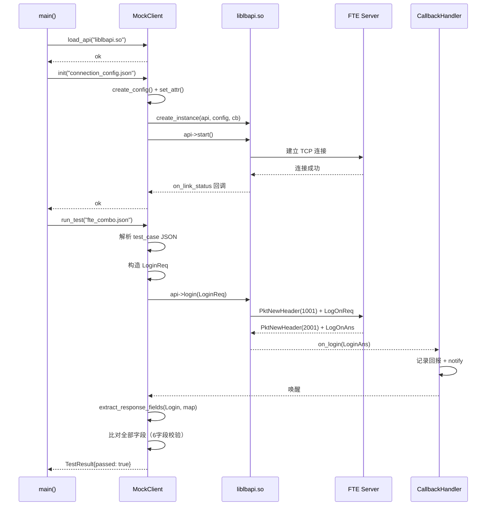
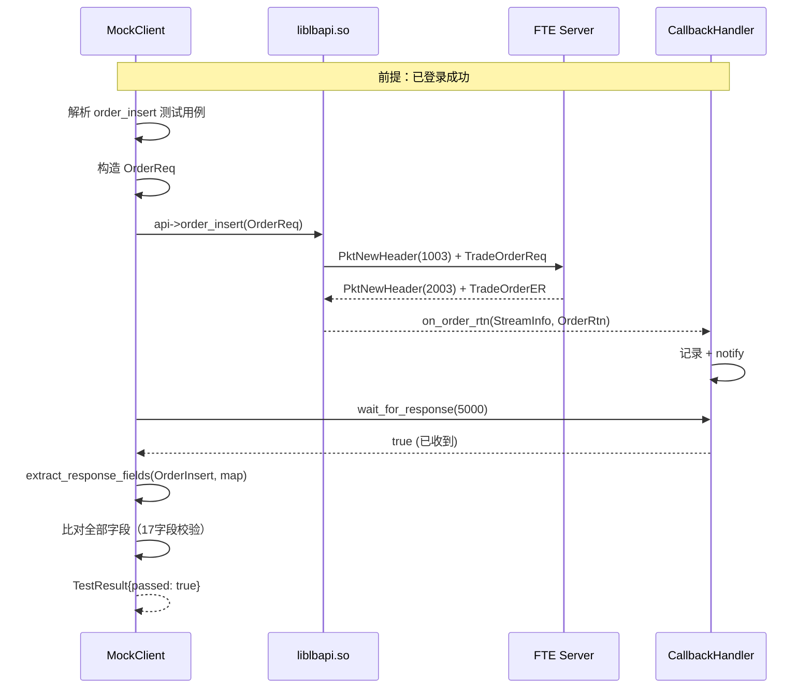
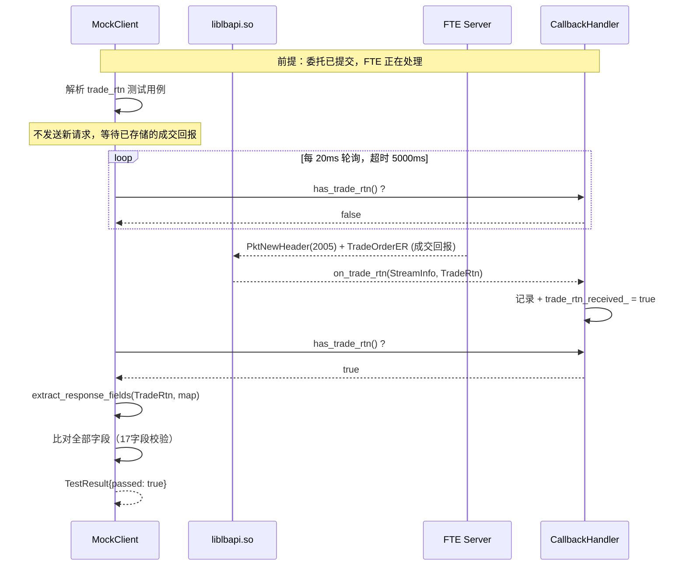
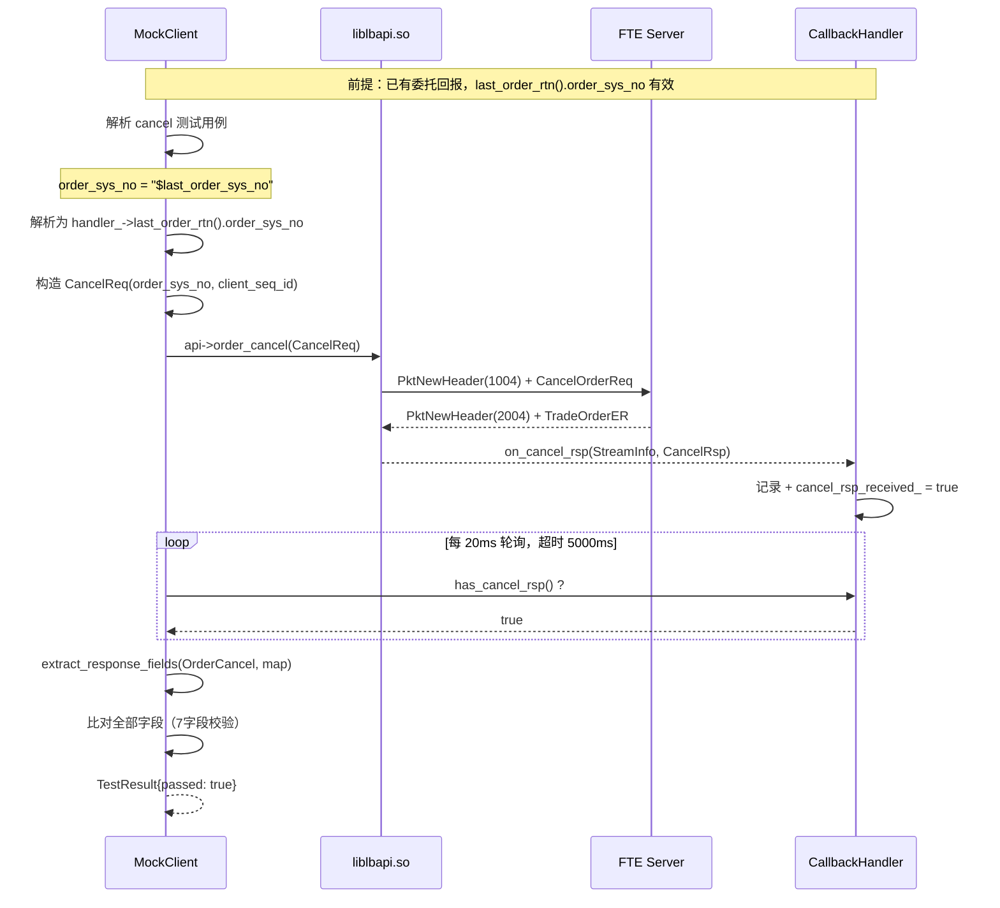

# mock_client 设计文档

> **目的**：模拟真实客户端，通过加载 `liblbapi.so` 动态链接库，向 FTE 柜台发送请求并接收回报，验证 FTE 协议完整链路。
> **输出目录**：`mock/client/`
> **参考协议**：FTE TCP 二进制协议（`gw_head.h`），98 协议（`c98msg_tmp.h`）
> **参考 CMakeLists**：`trunk/NewAPI/gone/api/CMakeLists.txt`

---

## 目录

1. [模块定位与架构](#1-模块定位与架构)
2. [功能清单](#2-功能清单)
3. [配置系统](#3-配置系统)
4. [JSON 工具类（mock/include）](#4-json-工具类mockinclude)
5. [测试用例定义与 JSON 格式](#5-测试用例定义与-json-格式)
6. [测试执行流程](#6-测试执行流程)
7. [UML 类图](#7-uml-类图)
8. [时序图](#8-时序图)
9. [代码说明](#9-代码说明)
10. [使用说明](#10-使用说明)
11. [项目文件结构](#11-项目文件结构)
12. [FTE 柜台测试用例清单](#12-fte-柜台测试用例清单)
13. [未来扩展](#13-未来扩展)
14. [gw_counter 模块性能分析与优化](#14-gwcounter-模块性能分析与优化)

---

## 1. 模块定位与架构

### 1.1 在 NewAPI 框架中的位置

```
┌─────────────────────────────────────────────────────────────┐
│                      mock_client                            │
│  ┌──────────┐  ┌──────────────┐  ┌──────────────────────┐   │
│  │ JSON     │  │ Test Case    │  │ API Loader           │   │
│  │ Config   │→ │ Runner       │→ │ (链接 liblbapi.so)   │   │
│  └──────────┘  └──────┬───────┘  └──────────┬───────────┘   │
│                       │                     │               │
│                       ▼                     ▼               │
│              ┌─────────────────────────────────────┐        │
│              │ Callback Handler                    │        │
│              │ (on_login / on_order_rtn / ...)     │        │
│              └─────────────────────────────────────┘        │
└─────────────────────────────────────────────────────────────┘
                              │
                              ▼
┌─────────────────────────────────────────────────────────────┐
│                   liblbapi.so (被测对象)                      │
│  ┌──────────┐  ┌──────────────┐  ┌──────────────────────┐   │
│  │ API      │→ │ gw_counter   │→ │ FTE TCP Binary      │   │
│  │ Interface│  │ _direct      │  │ Protocol             │   │
│  └──────────┘  └──────────────┘  └──────────────────────┘   │
└─────────────────────────────────────────────────────────────┘
                              │
                              ▼
               ┌─────────────────────────┐
               │   FTE 模拟交易所         │
               │   (或真实 FTE 服务端)     │
               └─────────────────────────┘
```

### 1.2 与 API 的交互层级

```
mock_client (测试驱动)
    │ api_config::create_config() + set_attr()
    │ api_interface::create_instance()
    │ api->start()
    │ api->login(LoginReq)
    │ api->order_insert(OrderReq)
    │ api->order_cancel(CancelReq)
    ▼
api_interface (虚接口层)
    │
    ▼
api_impl<gw_counter_direct, single_socket_engine>
    │  fast_ = gw_counter_direct (FTE 协议处理)
    │  multi_engine_ (控制平面)
    ▼
FTE TCP Binary Protocol → FTE 服务端
    │
    ▼ (回报)
callback_manager → mock_client::on_*()
```

### 1.3 关键设计原则

| 原则 | 说明 |
|------|------|
| **零外部依赖** | JSON 解析、配置加载均为自实现，不依赖第三方库，兼容 gcc 4.8.5 |
| **配置驱动** | 连接参数、测试用例均通过 JSON 配置，无需修改代码即可扩展 |
| **逐字段校验** | 回报校验覆盖结构体全部字段，动态字段（时间戳/流水号）通过 `null` 跳过 |
| **异步兼容** | 成交回报(2005)等异步消息通过轮询等待机制处理，不依赖同步回调顺序 |

---

## 2. 功能清单

### 2.1 核心功能

| 编号 | 功能 | 描述 | 优先级 |
|------|------|------|--------|
| F1 | API 库加载 | 链接 `liblbapi.so`，调用工厂函数创建 API 实例 | P0 |
| F2 | 配置化连接 | 通过 JSON 配置 API 实例参数（地址、市场、柜台类型等） | P0 |
| F3 | 配置化测试用例 | 通过 JSON 定义测试请求和预期回报 | P0 |
| F4 | 测试用例执行器 | 按顺序执行测试用例，比对预期回报 | P0 |
| F5 | FTE 登录测试 | 构造 `LoginReq` → 验证 `LoginAns` | P0 |
| F6 | FTE 委托测试 | 构造 `OrderReq` → 验证 `OrderRtn` | P0 |
| F7 | FTE 撤单测试 | 构造 `CancelReq` → 验证 `CancelRsp` | P0 |
| F8 | FTE 成交回报测试 | 异步等待 `TradeRtn`(2005) → 验证全部字段 | P0 |
| F9 | FTE ETF 测试 | 构造 ETF `OrderReq` → 验证 `TradeRtn` | P1 |
| F10 | FTE 心跳测试 | 验证心跳正常维持，无断线回调 | P0 |
| F11 | 回调处理 | 实现 `api_callback` 全部虚方法，记录/比对回报 | P0 |
| F12 | 测试报告输出 | 输出测试结果（通过/失败/字段校验详情） | P1 |
| F13 | 逐字段校验 | 自动提取回报结构体全部字段，逐个比对 | P1 |
| F14 | 动态字段引用 | 撤单请求支持 `$last_order_sys_no` 引用上一笔委托流水号 | P1 |

### 2.2 回调接口实现

| 回调方法 | 用途 | 预期验证 |
|----------|------|----------|
| `on_login(LoginAns)` | 验证登录结果 | err_code==0, 字段匹配 |
| `on_order_rtn(StreamInfo, OrderRtn)` | 验证委托回报 | ord_status, exec_type 匹配 |
| `on_trade_rtn(StreamInfo, TradeRtn)` | 验证成交回报 | last_px, last_qty 匹配 |
| `on_cancel_rsp(StreamInfo, CancelRsp)` | 验证撤单响应 | err_code 匹配 |
| `on_link_status(int32, int32, int32)` | 验证链接状态 | 连接成功回调 |
| `on_error(err_event_type, int32, char*)` | 错误处理 | 记录错误信息 |

---

## 3. 配置系统

### 3.1 连接配置（connection_config.json）

```json
{
  "api_instance_name": "fte_test_client",
  "market_type": 1,
  "fast_counter_type": 1,
  "speed_link_type": 1,
  "speed_counter_addr": {
    "ip": "127.0.0.1",
    "port": 33001
  },
  "counter98_addr": {
    "ip": "127.0.0.1",
    "port": 9001
  },
  "98agw_user": "agw_user_01",
  "98agw_user_password": "agw_pwd_01",
  "heartbeat_interval": 5,
  "agw_user_login_timeout": 10,
  "log_level": 1,
  "log_output_dir": "./api_log"
}
```

**字段说明**：

| 配置项 | 类型 | 对应 config_name | 说明 |
|--------|------|------------------|------|
| `api_instance_name` | string | `api_instance_name` | API 实例名称 |
| `market_type` | int | `market_type` | 1=上海, 2=深圳 |
| `fast_counter_type` | int | `fast_counter_type` | 1=gw_direct |
| `speed_link_type` | int | `speed_link_type` | 1=socket_single |
| `speed_counter_addr` | object | `speed_counter_addr` | FTE 服务端地址 |
| `counter98_addr` | object | `counter98_addr` | 98 柜台地址 |
| `98agw_user` | string | `98agw_user` | AGW 用户 |
| `98agw_user_password` | string | `98agw_user_password` | AGW 密码 |
| `heartbeat_interval` | int | `heartbeat_interval` | 心跳间隔（秒） |
| `agw_user_login_timeout` | int | `agw_user_login_timeout` | AGW 登录超时 |
| `log_level` | int | `log_level` | 日志级别 |
| `log_output_dir` | string | `log_output_dir` | 日志输出目录 |

### 3.2 测试用例配置（test_case_*.json）

每个 JSON 文件定义一组测试用例，包含请求和预期回报。支持单用例文件和组合文件（`test_cases` 数组）。

**请求类型枚举**：

| type | 对应 API 方法 | 预期响应回调 |
|------|--------------|-------------|
| `login` | `api->login(LoginReq)` | `on_login(LoginAns)` |
| `order_insert` | `api->order_insert(OrderReq)` | `on_order_rtn(OrderRtn)` |
| `order_rtn` | （同 order_insert） | `on_order_rtn(OrderRtn)` |
| `etf_order_insert` | `api->etf_order_insert(OrderReq)` | `on_trade_rtn(TradeRtn)` |
| `order_cancel` | `api->order_cancel(CancelReq)` | `on_cancel_rsp(CancelRsp)` |
| `cancel_rsp` | （同 order_cancel） | `on_cancel_rsp(CancelRsp)` |
| `trade_rtn` | 不发送请求，等待异步 2005 | `on_trade_rtn(TradeRtn)` |
| `wait_heartbeat` | 等待心跳 | `on_link_status` 保持连接 |
| `heartbeat_ok` | （同 wait_heartbeat） | 心跳维持正常 |

---

## 4. JSON 工具类（mock/include）

### 4.1 设计

提供轻量级的 JSON 解析和序列化工具，不依赖第三方库（兼容 gcc 4.8.5）。

```cpp
namespace mock {

/// JSON 值类型枚举
enum class JsonType { Null, Bool, Int, Double, String, Array, Object };

/// JSON 值节点
class JsonValue {
public:
    JsonType type() const;
    bool is_null() const;
    bool is_int() const;
    bool is_string() const;
    bool is_object() const;

    // 类型安全访问
    bool as_bool() const;
    int64_t as_int() const;
    double as_double() const;
    std::string as_string() const;

    // 容器访问
    size_t size() const;
    JsonValue& operator[](size_t index);                 // array
    JsonValue& operator[](const std::string& key);       // object
    bool has(const std::string& key) const;

    // 迭代
    std::vector<std::string> keys() const;
};

/// JSON 解析器
class JsonParser {
public:
    static JsonValue parse(const std::string& json_str);
    static JsonValue parse_file(const std::string& file_path);
};

/// JSON 序列化器
class JsonWriter {
public:
    static std::string write(const JsonValue& val, bool pretty = true);
};

} // namespace mock
```

### 4.2 JSON 格式要求

- 支持标准 JSON 语法（对象、数组、字符串、数字、布尔、null）
- 字符串使用双引号
- 数字支持整数和浮点数
- 不支持注释（保持标准兼容）

---

## 5. 测试用例定义与 JSON 格式

### 5.1 数据结构

```cpp
/// 测试用例类型
enum class TestCaseType {
    Login,          // 登录
    OrderInsert,    // 委托
    EtfOrderInsert, // ETF 委托
    OrderCancel,    // 撤单
    TradeRtn,       // 成交回报（异步）
    WaitHeartbeat,  // 心跳等待
    Unknown         // 未知
};

/// 字段匹配规则
struct FieldMatch {
    std::string field_name;     // 字段名
    JsonValue expected_value;   // 预期值（null 表示跳过校验）
    bool required;              // 是否必须匹配
};

/// 测试用例定义
struct TestCase {
    std::string name;           // 用例名称
    std::string description;    // 用例描述
    std::string counter_type;   // 柜台类型 ("gw_direct" / "98" / "g1")
    int timeout_ms;             // 超时时间(毫秒)

    TestCaseType request_type;  // 请求类型
    JsonValue request_fields;   // 请求字段

    TestCaseType response_type; // 预期响应类型
    std::vector<FieldMatch> expected_fields; // 预期字段匹配列表
};

/// 测试结果
struct TestResult {
    std::string case_name;
    bool passed;
    std::string fail_reason;
    int64_t elapsed_ms;
    std::vector<std::string> match_details; // 字段匹配详情
};
```

### 5.2 JSON 格式详解

**组合测试用例文件**（`fte_combo.json`）：

```json
{
  "test_cases": [
    {
      "test_case": {
        "name": "FTE 登录测试",
        "description": "验证 FTE 登录应答的所有字段",
        "counter_type": "gw_direct",
        "timeout_ms": 5000
      },
      "request": {
        "type": "login",
        "fields": {
          "client_req_no": 1001,
          "fund_account_id": "1000000000000001",
          "branch_id": "0001",
          "account_id": "A12345678901",
          "cust_id": "C000000000000001",
          "password": "TEST000000001",
          "order_way_ext": "7",
          "user_info": "mock_client"
        }
      },
      "expected_response": {
        "type": "login",
        "fields": {
          "client_req_no": null,          ← null = 跳过校验（动态字段）
          "cust_id": "C000000000000001",  ← 非 null = 精确比对
          "fund_account_id": "1000000000000001",
          "account_id": "A12345678901",
          "branch_id": "0001",
          "market_type": 1,
          "err_code": 0,
          "err_msg": null,               ← 跳过
          "login_time": null             ← 跳过
        }
      }
    }
  ]
}
```

**字段匹配规则**：

| 规则 | JSON 表示 | 说明 | 示例 |
|------|-----------|------|------|
| **精确匹配** | 非 null 标量值 | 预期值与实际值完全相等 | `"err_code": 0` |
| **动态跳过** | `null` | 跳过该字段校验（流水号/时间戳） | `"order_sys_no": null` |
| **字符串裁剪** | 自动 | 定长 char 数组自动裁剪末尾 `\0`/空格 | `"cust_id": "C000000000000001"` |
| **动态引用** | `"$last_order_sys_no"` | 引用上一笔委托的 order_sys_no | `"order_sys_no": "$last_order_sys_no"` |

### 5.3 各回报类型的完整字段

**LoginAns 字段**：

| 字段 | 类型 | 说明 | 是否动态 |
|------|------|------|----------|
| `client_req_no` | int32 | 客户端请求号 | ✅ 动态 |
| `cust_id` | char[16] | 客户号 | |
| `fund_account_id` | char[16] | 资金账号 | |
| `account_id` | char[16] | 账户号 | |
| `branch_id` | char[8] | 分支机构 | |
| `market_type` | int16 | 市场类型 | |
| `err_code` | int32 | 错误码 | |
| `err_msg` | char[64] | 错误信息 | ✅ 动态 |
| `login_time` | int32 | 登录时间 | ✅ 动态 |

**OrderRtn 字段**：

| 字段 | 类型 | 说明 | 是否动态 |
|------|------|------|----------|
| `cust_id` | char[16] | 客户号（FTE 返回 fund_account_id） | |
| `fund_account_id` | char[16] | 资金账号 | |
| `account_id` | char[16] | 账户号 | |
| `branch_id` | char[8] | 分支机构 | |
| `side` | char | 买卖方向（'1'=买, '2'=卖） | |
| `order_type` | char | 订单类型（'2'=限价） | |
| `order_status` | uint16 | 订单状态（0=受理中） | |
| `policy_id` | uint16 | 策略编号 | |
| `market_type` | int16 | 市场类型 | |
| `reserved` | int16 | 保留字段 | |
| `security_id` | char[8] | 证券代码 | |
| `order_price` | int64 | 订单价格（放大 10000） | |
| `order_qty` | int64 | 订单数量 | |
| `client_seq_id` | int64 | 客户端流水号 | ✅ 动态 |
| `rtn_type` | int32 | 回报类型（1=委托回报） | |
| `err_code` | int32 | 错误码 | |
| `order_sys_no` | int64 | 柜台流水号 | ✅ 动态 |
| `frozen_amount` | int64 | 冻结金额 | ✅ 动态 |
| `fee` | int64 | 手续费 | |
| `trade_qty` | int64 | 成交数量 | ✅ 动态 |
| `cancel_qty` | int64 | 撤单数量 | |
| `order_time` | int32 | 委托时间 | ✅ 动态 |
| `update_time` | int32 | 更新时间 | ✅ 动态 |

**TradeRtn 字段**（继承 OrderRtn 全部字段 + 成交特有字段）：

| 字段 | 类型 | 说明 | 是否动态 |
|------|------|------|----------|
| `exec_time` | int32 | 成交时间 | ✅ 动态 |
| `exec_id` | char[16] | 成交编号 | ✅ 动态 |
| `exec_price` | int64 | 成交价格 | |
| `exec_qty` | int64 | 成交数量 | |
| `exec_amount` | double | 成交金额 | ✅ 动态 |
| `exec_fee` | double | 成交费用 | ✅ 动态 |

**CancelRsp 字段**：

| 字段 | 类型 | 说明 | 是否动态 |
|------|------|------|----------|
| `client_req_no` | int32 | 客户端请求号 | ✅ 动态 |
| `cust_id` | char[16] | 客户号 | |
| `fund_account_id` | char[16] | 资金账号 | |
| `account_id` | char[16] | 账户号 | |
| `branch_id` | char[8] | 分支机构 | |
| `market_type` | int16 | 市场类型 | |
| `order_sys_no` | int64 | 柜台流水号 | ✅ 动态 |
| `client_seq_id` | int64 | 客户端流水号 | ✅ 动态 |
| `err_code` | int32 | 错误码（50046=订单已成交无法撤单） | |
| `rej_api` | int32 | API 拒绝码 | |

---

## 6. 测试执行流程

### 6.1 整体流程

```
┌────────────────────────────────────────────────────────────┐
│                    测试执行主流程                            │
├────────────────────────────────────────────────────────────┤
│  1. 解析命令行参数 (--config, --testcase, --help)          │
│  2. 加载连接配置 JSON → api_config                         │
│  3. 链接 liblbapi.so → 创建 API 实例                       │
│  4. api->start() 启动所有链接                              │
│  5. 循环加载测试用例 JSON 文件                              │
│     ├─ 构造请求 (LoginReq / OrderReq / CancelReq)          │
│     ├─ 调用对应 API 方法                                   │
│     ├─ 等待回调 (通用 / 特定响应)                          │
│     ├─ 提取回报全部字段 → 逐个比对                         │
│     └─ 记录测试结果                                        │
│  6. api->stop() 停止链接                                   │
│  7. release_instance(api) 释放实例                         │
│  8. 输出测试报告                                           │
└────────────────────────────────────────────────────────────┘
```

### 6.2 回调等待机制

**通用等待**（登录、委托）：
使用 `std::condition_variable` 实现同步等待，回调函数中 `notify_one()` 唤醒主线程。

**特定响应等待**（撤单）：
撤单应答可能被中间的其他回报（如 2003 委托回报）干扰，使用 `has_cancel_rsp()` 特定标志位进行主动轮询等待。

**异步等待**（成交回报 2005）：
成交回报是异步消息，无需发送请求，使用主动轮询 `has_trade_rtn()` 等待（超时 5s）。

```
┌──────────┐     ┌──────────────┐     ┌──────────────┐
│ 主线程   │     │ 回调线程     │     │ 测试用例队列  │
├──────────┤     ├──────────────┤     ├──────────────┤
│ 发送请求 │     │              │     │              │
│ → 等待   │     │ 收到回报     │     │              │
│          │←────│ → 记录结果   │     │              │
│          │     │ → signal     │     │              │
│ 被唤醒   │     │              │     │              │
│ 提取字段 │     │              │     │              │
│ 逐个比对 │     │              │     │              │
│ 输出结果 │     │              │     │              │
└──────────┘     └──────────────┘     └──────────────┘
```

### 6.3 逐字段校验流程

```
收到回报 (LoginAns / OrderRtn / TradeRtn / CancelRsp)
    │
    ▼
extract_response_fields(type, actual_map)
    │  遍历回报结构体所有字段
    │  定长 char 数组 → trim_fixed() 裁剪末尾 \0/空格
    │  数值字段 → std::to_string()
    ▼
map<string, string> actual = {
    "cust_id": "1000000000000001",
    "err_code": "0",
    "order_price": "250200",
    ...
}
    │
    ▼
遍历 JSON expected_fields
    ├─ 值为 null → 跳过（动态字段）
    ├─ 非 null → 从 actual 获取对应值 → 字符串比较
    │
    ▼
输出结果: "字段 'err_code': 预期=0, 实际=0 ✓"
```

---

## 7. UML 类图

```mermaid
classDiagram
    class MockClient {
        -api_interface* api_
        -api_callback* callback_
        -TestCaseRunner* runner_
        -TestReport report_
        +load_api(const string& lib_path) bool
        +init(const string& config_path) bool
        +run_test(const string& testcase_path) TestResult
        +run_all_tests(const string& test_dir) vector~TestResult~
        +shutdown()
    }

    class TestCaseRunner {
        -vector~TestCase~ test_cases_
        -CallbackHandler* handler_
        -lb_api::api_interface* api_
        +load_test_case(const string& path) bool
        +load_test_dir(const string& dir) int
        +execute_all() vector~TestResult~
        -send_request(const TestCase& tc) bool
        -wait_for_response(int timeout_ms) bool
        -validate_response(const TestCase& tc, vector~string~& details) bool
        -match_field(const string& field, const JsonValue& expected,
                     const string& actual, string& detail) bool
        -extract_response_fields(TestCaseType type, map~string,string~& out)
        -trim_fixed(const char* data, size_t len) string
        -parse_type(const string& type_str) TestCaseType
    }

    class CallbackHandler {
        -LoginAns last_login_ans_
        -OrderRtn last_order_rtn_
        -TradeRtn last_trade_rtn_
        -CancelRsp last_cancel_rsp_
        -mutex mutex_
        -condition_variable cv_
        -bool response_received_
        -bool trade_rtn_received_
        -bool cancel_rsp_received_
        +on_login(const LoginAns& ans)
        +on_order_rtn(const StreamInfo& si, const OrderRtn& rtn)
        +on_trade_rtn(const StreamInfo& si, const TradeRtn& rtn)
        +on_cancel_rsp(const StreamInfo& si, const CancelRsp& rsp)
        +on_link_status(int32 counter_type, int32 link_type, int32 status)
        +on_error(err_event_type event_type, int32 err_code, const char* err_desc)
        +has_response() bool
        +has_trade_rtn() bool
        +has_cancel_rsp() bool
        +wait_for_response(int timeout_ms) bool
        +reset()
    }

    class TestCase {
        +string name
        +string description
        +string counter_type
        +int timeout_ms
        +TestCaseType request_type
        +JsonValue request_fields
        +TestCaseType response_type
        +vector~FieldMatch~ expected_fields
    }

    class TestResult {
        +string case_name
        +bool passed
        +string fail_reason
        +int64_t elapsed_ms
        +vector~string~ match_details
    }

    class FieldMatch {
        +string field_name
        +JsonValue expected_value
        +bool required
    }

    class TestReport {
        +vector~TestResult~ results
        +void add_result(const TestResult& r)
        +void print()
        +void save(const string& path)
    }

    MockClient *-- TestCaseRunner
    MockClient --> CallbackHandler : creates
    MockClient --> TestReport : aggregates
    TestCaseRunner --> CallbackHandler : uses
    TestCaseRunner --> TestCase : contains
    TestCaseRunner --> TestResult : produces
    TestCase *-- FieldMatch : contains
    TestReport --> TestResult : aggregates
```

---

## 8. 时序图

### 8.1 登录测试时序



### 8.2 委托测试时序



### 8.3 成交回报异步等待时序



### 8.4 撤单测试时序（含动态 order_sys_no）



---

## 9. 代码说明

### 9.1 main.cpp

**职责**：程序入口，解析命令行参数，驱动测试执行。

**命令行参数**：

| 参数 | 默认值 | 说明 |
|------|--------|------|
| `--config <path>` | `config/connection_config.json` | 连接配置文件路径 |
| `--lib <path>` | `../../build_cmake/lib/liblbapi.so` | liblbapi.so 路径 |
| `--testcase <path>` | （可选） | 单个测试用例 JSON 文件路径 |
| `--testdir <path>` | `config/test_cases` | 测试用例目录 |
| `--report <path>` | `test_report.txt` | 测试报告输出路径 |
| `--help` | - | 打印帮助信息 |

**执行模式**：
- **单用例模式**：指定 `--testcase`，运行单个 JSON 文件
- **目录模式**：不指定 `--testcase`，运行 `--testdir` 目录下所有 JSON 文件

**关键代码**：
```cpp
// 单用例模式
if (!testcase_path.empty()) {
    mock::TestResult r = client.run_test(testcase_path);
    client.report().print();
}
// 目录模式
else {
    client.run_all_tests(test_dir);
    client.report().print();
}
```

**注意**：测试完成后会 sleep 2 秒等待异步回报（如成交回报 2005）到达后处理，再关闭 API。

### 9.2 mock_client.h / mock_client.cpp

**职责**：封装 API 实例的创建、初始化和测试执行。

**关键方法**：

| 方法 | 说明 |
|------|------|
| `load_api(lib_path)` | 链接 liblbapi.so（当前为直接链接，保留参数供未来 dlopen 扩展） |
| `init(config_path)` | 加载 JSON 配置 → 创建 api_config → 设置属性 → 创建回调 → create_instance → api->start() → 创建 TestCaseRunner |
| `run_test(testcase_path)` | 加载单个测试用例 JSON → execute_all() → 记录结果到 report_ |
| `run_all_tests(test_dir)` | 加载目录下所有测试用例 → 逐个 execute_all() → 记录结果 |
| `shutdown()` | api->stop() → release_instance() → 释放 runner_ 和 callback_ |

**初始化流程**：
```cpp
bool MockClient::init(const std::string& config_path) {
    // 1. 加载 JSON 配置
    JsonValue config = JsonParser::parse_file(config_path);
    // 2. 创建 API 配置
    lb_api::api_config* cfg = lb_api::api_config::create_config();
    // 3. 设置属性（market_type, fast_counter_type, speed_link_type, 地址, 心跳等）
    cfg->set_attr("market_type", ...);
    cfg->set_attr("fast_counter_type", ...);
    // ...
    // 4. 创建回调
    callback_ = new CallbackHandler();
    // 5. 创建 API 实例
    lb_api::api_interface::create_instance(api_, *cfg, callback_);
    // 6. 启动
    api_->start();
    // 7. 创建测试执行器
    runner_ = new TestCaseRunner(api_, callback_);
}
```

### 9.3 test_case_runner.h / test_case_runner.cpp

**职责**：测试用例加载、执行和结果校验的核心模块（~22KB，核心逻辑所在）。

**关键方法**：

| 方法 | 行数 | 说明 |
|------|------|------|
| `load_test_case(path)` | ~50 | 解析 JSON 文件，提取 test_cases 数组，逐个调用 load_single_case |
| `load_single_case(root, test_case)` | ~60 | 解析 test_case 元信息、request、expected_response；支持新旧两种 JSON 格式 |
| `execute_all()` | ~60 | 遍历所有测试用例，逐个执行 |
| `execute(tc)` | ~120 | 单个用例执行：发送请求 → 等待响应 → 验证字段 |
| `send_request(tc)` | ~90 | 根据 request_type 构造并发送请求（LoginReq/OrderReq/CancelReq） |
| `wait_for_response(timeout)` | 委托给 handler | 通用条件变量等待 |
| `validate_response(tc, details)` | ~10 | 入口：提取全部字段 → 遍历比对 |
| `extract_response_fields(type, out)` | ~100 | 核心：遍历回报结构体全部字段，写入 map |
| `trim_fixed(data, len)` | ~10 | 裁剪定长 char 数组的 `\0`/空格填充 |
| `match_field(field, expected, actual, detail)` | ~20 | 单个字段比对（字符串比较） |
| `parse_type(type_str)` | ~15 | 字符串 → TestCaseType 枚举 |

**load_single_case 的 JSON 格式兼容**：
```cpp
// 新格式：fields 对象的所有键，null=跳过
JsonValue fields = exp["fields"];
if (fields.is_object()) {
    std::vector<std::string> keys = fields.keys();
    for (auto& key : keys) {
        FieldMatch fm;
        fm.field_name = key;
        fm.expected_value = fields[key];
        fm.required = !fields[key].is_null();
        test_case.expected_fields.push_back(fm);
    }
}
// 旧格式兼容：validate 数组 + fields 对象
else {
    JsonValue validate = exp["validate"];
    for (size_t i = 0; i < validate.size(); i++) {
        // ...
    }
}
```

**extract_response_fields 实现**：
```cpp
void TestCaseRunner::extract_response_fields(TestCaseType type,
                                              std::map<std::string, std::string>& out) {
    switch (type) {
    case TestCaseType::Login: {
        const auto& ans = handler_->last_login_ans();
        out["cust_id"] = trim_fixed(ans.cust_id.data(), ans.cust_id.size());
        out["fund_account_id"] = trim_fixed(ans.fund_account_id.data(), ans.fund_account_id.size());
        out["err_code"] = std::to_string(ans.err_code);
        out["market_type"] = std::to_string(ans.market_type);
        // ... 全部字段
        break;
    }
    case TestCaseType::OrderInsert:
    case TestCaseType::EtfOrderInsert: {
        const auto& rtn = handler_->last_order_rtn();
        out["side"] = std::string(1, rtn.side);
        out["order_status"] = std::to_string((int)rtn.order_status);
        out["order_price"] = std::to_string(rtn.order_price);
        // ... 全部 22 个字段
        break;
    }
    case TestCaseType::TradeRtn: {
        const auto& rtn = handler_->last_trade_rtn();
        // OrderRtn 全部字段 + 成交特有字段
        out["exec_price"] = std::to_string(rtn.exec_price);
        out["exec_qty"] = std::to_string(rtn.exec_qty);
        // ...
        break;
    }
    case TestCaseType::OrderCancel: {
        const auto& rsp = handler_->last_cancel_rsp();
        // ... 全部 10 个字段
        break;
    }
    }
}
```

**trim_fixed 实现**（注意：使用 `std::string` 构造字符集，避免 C 字符串截断）：
```cpp
std::string TestCaseRunner::trim_fixed(const char* data, size_t len) {
    std::string s(data, len);
    size_t e = s.find_last_not_of(std::string(" \0", 2));  // 同时裁剪空格和 \0
    if (e == std::string::npos) return "";
    return s.substr(0, e + 1);
}
```

**撤单请求的 $last_order_sys_no 解析**：
```cpp
JsonValue osn = tc.request_fields["order_sys_no"];
int64_t order_sys_no = 0;
if (osn.is_string() && osn.as_string() == "$last_order_sys_no") {
    order_sys_no = handler_->last_order_rtn().order_sys_no;
} else {
    order_sys_no = osn.as_int();
}
req.order_sys_no = order_sys_no;
```

**execute 中的特定响应等待**：
```cpp
// 成交回报(2005)异步等待
if (tc.response_type == TestCaseType::TradeRtn) {
    while (!handler_->has_trade_rtn() && elapsed < timeout_ms) {
        std::this_thread::sleep_for(std::chrono::milliseconds(20));
    }
}
// 撤单特定等待
else if (tc.response_type == TestCaseType::OrderCancel) {
    while (!handler_->has_cancel_rsp() && elapsed < timeout_ms) {
        std::this_thread::sleep_for(std::chrono::milliseconds(20));
    }
}
// 通用等待
else if (!handler_->wait_for_response(tc.timeout_ms)) {
    // 超时处理
}
```

### 9.4 callback_handler.h / callback_handler.cpp

**职责**：实现 `api_callback` 全部虚方法，记录回报数据，提供线程安全的查询和等待接口。

**成员变量**：

| 变量 | 类型 | 说明 |
|------|------|------|
| `last_login_ans_` | LoginAns | 最近一次登录应答 |
| `last_order_rtn_` | OrderRtn | 最近一次委托回报 |
| `last_trade_rtn_` | TradeRtn | 最近一次成交回报 |
| `last_cancel_rsp_` | CancelRsp | 最近一次撤单应答 |
| `response_received_` | bool | 是否有任何响应到达 |
| `trade_rtn_received_` | bool | 是否有成交回报到达 |
| `cancel_rsp_received_` | bool | 是否有撤单应答到达 |
| `mutex_` | std::mutex | 线程安全锁 |
| `cv_` | std::condition_variable | 等待/通知条件变量 |

**关键方法**：

| 方法 | 说明 |
|------|------|
| `on_login(ans)` | 记录 login_ans，设置 response_received_=true，notify |
| `on_order_rtn(si, rtn)` | 记录 order_rtn，设置 response_received_=true，notify |
| `on_trade_rtn(si, rtn)` | 记录 trade_rtn，设置 trade_rtn_received_=true，notify |
| `on_cancel_rsp(si, rsp)` | 记录 cancel_rsp，设置 cancel_rsp_received_=true，notify |
| `wait_for_response(timeout)` | 条件变量等待（通用） |
| `reset()` | 重置所有 received_ 标志位（每次发送新请求前调用） |

**reset 实现**：
```cpp
void CallbackHandler::reset() {
    std::lock_guard<std::mutex> lock(mutex_);
    response_received_ = false;
    cancel_rsp_received_ = false;
    trade_rtn_received_ = false;
}
```

### 9.5 test_report.h / test_report.cpp

**职责**：收集测试结果，输出测试报告。

**关键方法**：

| 方法 | 说明 |
|------|------|
| `add_result(r)` | 添加单个测试结果 |
| `print()` | 打印汇总报告（总计/通过/失败） |
| `save(path)` | 保存详细报告到文件（包含字段校验详情） |

**报告格式**：
```
总计: 4 | 通过: 4 | 失败: 0
[PASS] FTE 登录测试 (0ms)
       字段 'err_code': 预期=0, 实际=0 ✓
       字段 'market_type': 预期=1, 实际=1 ✓
       [Summary] 校验字段数=6, 跳过动态字段数=3
[PASS] FTE 委托买入测试 (0ms)
       字段 'order_status': 预期=0, 实际=0 ✓
       字段 'order_qty': 预期=100, 实际=100 ✓
       ...
       [Summary] 校验字段数=17, 跳过动态字段数=6
[FAIL] FTE 撤单测试 (23ms) - 字段验证失败
       字段 'err_code': 预期=0, 实际=50046 ✗
       字段 'rej_api': 预期=0, 实际=0 ✓
```

### 9.6 json_utils.h / json_utils.cpp

**职责**：轻量级 JSON 解析/序列化，零外部依赖，兼容 gcc 4.8.5。

**关键特性**：

| 特性 | 说明 |
|------|------|
| 递归下降解析 | 支持嵌套对象和数组 |
| Unicode 转义 | 支持 `\uXXXX` 转义序列 |
| 严格模式 | 字符串必须双引号，不支持注释 |
| 类型安全 | 类型不匹配时返回默认值（非异常） |

**已知限制**：
- 不支持浮点数科学计数法
- 不支持大整数（超出 int64_t 范围）

---

## 10. 使用说明

### 10.1 编译

**前提**：已编译 `liblbapi.so`（项目根目录执行 `./build.sh`）

**编译 mock_client**：
```bash
# 在项目根目录
./build.sh -DBUILD_MOCK=ON

# 指定构建类型
./build.sh Release -DBUILD_MOCK=ON
./build.sh Debug -DBUILD_MOCK=ON
```

**产物**：`build_cmake/bin/mock_client`（可执行文件，~1MB）

### 10.2 运行

**基本运行**（运行 config/test_cases/ 目录下所有测试用例）：
```bash
cd trunk/NewAPI/gone/api/mock/client
LD_LIBRARY_PATH=../../../../build_cmake/lib \
  ../../../../build_cmake/bin/mock_client
```

**运行单个测试用例**：
```bash
LD_LIBRARY_PATH=../../../../build_cmake/lib \
  ../../../../build_cmake/bin/mock_client \
  --testcase config/test_cases/fte_combo.json
```

**指定 liblbapi.so 路径**：
```bash
LD_LIBRARY_PATH=/custom/path/lib \
  ../../../../build_cmake/bin/mock_client \
  --lib /custom/path/lib/liblbapi.so
```

**指定报告输出路径**：
```bash
../../../../build_cmake/bin/mock_client --report /tmp/my_report.txt
```

**查看帮助**：
```bash
../../../../build_cmake/bin/mock_client --help
```

### 10.3 测试用例编写指南

#### 基本结构

```json
{
  "test_cases": [
    {
      "test_case": {
        "name": "测试名称",
        "description": "测试描述",
        "counter_type": "gw_direct",
        "timeout_ms": 5000
      },
      "request": {
        "type": "login",
        "fields": { ... }
      },
      "expected_response": {
        "type": "login",
        "fields": { ... }
      }
    }
  ]
}
```

#### 请求字段编写

| 请求类型 | 必需字段 | 说明 |
|----------|---------|------|
| `login` | `fund_account_id`, `branch_id`, `account_id`, `cust_id`, `password` | 登录请求 |
| `order_insert` | `fund_account_id`, `branch_id`, `side`, `security_id`, `order_price`, `order_qty`, `market_type` | 委托请求 |
| `order_cancel` | `fund_account_id`, `branch_id`, `order_sys_no`, `client_seq_id` | 撤单请求（`order_sys_no` 支持 `$last_order_sys_no`） |
| `wait_heartbeat` | 无 | 心跳等待 |

#### 预期字段编写

- **精确值**：直接写入预期值，如 `"err_code": 0`
- **动态跳过**：写入 `null`，如 `"order_sys_no": null`
- **字符串字段**：写入裁剪后的值（不含末尾 `\0`/空格填充），如 `"cust_id": "1000000000000001"`
- **char 类型**：写入字符字符串，如 `"side": "1"`、`"order_type": "2"`

#### 常见测试用例模板

**登录测试**：
```json
{
  "test_case": { "name": "FTE 登录测试", "counter_type": "gw_direct", "timeout_ms": 5000 },
  "request": {
    "type": "login",
    "fields": {
      "fund_account_id": "1000000000000001",
      "password": "TEST000000001"
    }
  },
  "expected_response": {
    "type": "login",
    "fields": {
      "cust_id": "C000000000000001",
      "fund_account_id": "1000000000000001",
      "err_code": 0,
      "market_type": 1,
      "client_req_no": null,
      "login_time": null
    }
  }
}
```

**委托测试**：
```json
{
  "test_case": { "name": "FTE 委托买入测试", "counter_type": "gw_direct", "timeout_ms": 5000 },
  "request": {
    "type": "order_insert",
    "fields": {
      "fund_account_id": "1000000000000001",
      "branch_id": "0001",
      "side": "1",
      "order_type": "2",
      "security_id": "600007",
      "order_price": 250200,
      "order_qty": 100,
      "market_type": 1
    }
  },
  "expected_response": {
    "type": "order_rtn",
    "fields": {
      "side": "1",
      "order_type": "2",
      "order_status": 0,
      "order_price": 250200,
      "order_qty": 100,
      "err_code": 0,
      "rtn_type": 1,
      "order_sys_no": null,
      "client_seq_id": null
    }
  }
}
```

**撤单测试**（使用上一笔委托的 order_sys_no）：
```json
{
  "test_case": { "name": "FTE 撤单测试", "counter_type": "gw_direct", "timeout_ms": 5000 },
  "request": {
    "type": "order_cancel",
    "fields": {
      "fund_account_id": "1000000000000001",
      "branch_id": "0001",
      "order_sys_no": "$last_order_sys_no",
      "client_seq_id": 0
    }
  },
  "expected_response": {
    "type": "cancel_rsp",
    "fields": {
      "cust_id": "1000000000000001",
      "fund_account_id": "1000000000000001",
      "err_code": 50046,
      "rej_api": 0
    }
  }
}
```

**成交回报校验**（异步等待 2005）：
```json
{
  "test_case": { "name": "FTE 成交回报校验", "counter_type": "gw_direct", "timeout_ms": 5000 },
  "request": {
    "type": "order_insert",
    "fields": {}
  },
  "expected_response": {
    "type": "trade_rtn",
    "fields": {
      "exec_price": 250200,
      "exec_qty": 100,
      "trade_qty": 100,
      "order_status": 3,
      "exec_time": null,
      "exec_id": null
    }
  }
}
```

### 10.4 常见问题

**Q: 编译失败，找不到头文件？**
A: 确保已先编译 `liblbapi.so`（项目根目录 `./build.sh`），mock_client 依赖 API 的头文件。

**Q: 运行时报 "create_instance 失败"？**
A: 检查连接配置（`connection_config.json`）是否正确，特别是 `speed_counter_addr` 和 `counter98_addr` 的地址/端口。

**Q: 测试超时（等待回报超时）？**
A: 检查 FTE 服务端是否运行，以及 `counter98_mock`（端口 9001）是否启动。

**Q: 登录失败（err_code != 0）？**
A: 检查 `connection_config.json` 中的 `98agw_user`/`98agw_user_password`，以及 FTE 的 `passwd_map_` 配置。

**Q: 撤单测试失败（err_code=50046）？**
A: 这是正常行为——订单已成交无法撤单。如需要测试撤单成功，需使用未成交的订单。

**Q: 撤单测试 cancel_rsp 字段为空？**
A: 确保 JSON 中 `order_sys_no` 使用 `"$last_order_sys_no"` 引用了有效的委托流水号。

**Q: 成交回报测试未收到 2005？**
A: 检查 FTE 的心跳超时配置。如果 FTE 心跳周期过短（如 < 100ms），连接会在 2005 到达前断开。

**Q: 如何查看详细日志？**
A: 设置 `connection_config.json` 的 `log_level` 为 0（调试级别），日志输出到 `log_output_dir` 目录。

---

## 11. 项目文件结构

```
mock/
├── client/
│   ├── mock_client_design.md          ← 本设计文档
│   ├── mock_client_test.md            ← 测试记录文档（问题/修复/结果）
│   ├── CMakeLists.txt                  ← 构建文件
│   ├── src/
│   │   ├── main.cpp                    ← 入口（解析命令行 + 驱动测试）
│   │   ├── mock_client.h               ← MockClient 类声明
│   │   ├── mock_client.cpp             ← MockClient 实现
│   │   ├── test_case_runner.h          ← TestCaseRunner 类声明
│   │   ├── test_case_runner.cpp        ← TestCaseRunner 实现（核心逻辑）
│   │   ├── callback_handler.h          ← CallbackHandler 类声明
│   │   ├── callback_handler.cpp        ← CallbackHandler 实现
│   │   ├── test_report.h              ← TestReport 类声明
│   │   └── test_report.cpp            ← TestReport 实现
│   └── config/
│       ├── connection_config.json      ← 连接配置示例
│       └── test_cases/
│           ├── fte_combo.json          ← 组合测试（登录+委托+成交回报+撤单）
│           ├── fte_login.json          ← FTE 登录测试（单用例）
│           ├── fte_order.json          ← FTE 委托测试（单用例）
│           ├── fte_cancel.json         ← FTE 撤单测试（单用例）
│           └── fte_heartbeat.json      ← FTE 心跳测试
├── include/
│   ├── json_utils.h                   ← JSON 解析/序列化工具类
│   └── json_utils.cpp                 ← JSON 工具实现
└── 98_counter/
    └── 98_counter_mock_design.md       ← 98_counter_mock 设计文档
```

---

## 12. FTE 柜台测试用例清单

| 编号 | 用例名称 | 请求类型 | 验证重点 | 依赖 |
|------|---------|---------|---------|------|
| TC01 | FTE 登录成功 | `login` | err_code==0, market_type, cust_id, fund_account_id, account_id, branch_id 全部匹配 | 无 |
| TC02 | FTE 登录失败-密码错误 | `login` | err_code!=0, err_msg 非空 | 无 |
| TC03 | FTE 委托买入 | `order_insert` | 17字段校验：side, order_type, order_status, policy_id, market_type, reserved, security_id, order_price, order_qty, rtn_type, err_code, fee, cancel_qty, cust_id, fund_account_id, account_id, branch_id | TC01 |
| TC04 | FTE 委托卖出 | `order_insert` | 同上，side='2' | TC01 |
| TC05 | FTE 成交回报校验 | `trade_rtn` | 17字段校验：OrderRtn 全部字段 + exec_price, exec_qty, trade_qty | TC03 |
| TC06 | FTE 委托撤单 | `order_cancel` | 7字段校验：err_code, rej_api, cust_id, fund_account_id, account_id, branch_id, market_type | TC03 |
| TC07 | FTE ETF 申购 | `etf_order_insert` | business_type, exec_type | TC01 |
| TC08 | FTE ETF 赎回 | `etf_order_insert` | business_type, exec_type | TC01 |
| TC09 | FTE 心跳维持 | `wait_heartbeat` | 30s 内无断线回调 | TC01 |
| TC10 | FTE 重复登录 | `login` | 已登录状态处理 | TC01 |
| TC11 | API 异常处理 | `order_insert` | 未登录时返回错误 | 无 |

**字段映射参考**：

| NewAPI 字段 | FTE 字段 | 测试数据 |
|-------------|---------|---------|
| `fund_account_id` | `fund_account_id` | `"1000000000000001"` |
| `branch_id` | `branch_id` | `"0001"` |
| `account_id` | `account_id` | `"A12345678901"` |
| `cust_id` | `cust_id` | `"C000000000000001"`（FTE 回报中可能用 fund_account_id） |
| `security_id` | `security_id` | `"600007"` |
| `market_type` | `market_type` | `1` (上海) |
| `side` | `side` | `'1'` (买入) `'2'` (卖出) |
| `order_type` | `order_type` | `'2'` (限价) |
| `order_qty` | `order_qty` | `100` |
| `order_price` | `order_price` | `250200`（放大 10000=25.02 元） |
| `client_seq_id` | `client_seq_id` | `0` |

---

## 13. 未来扩展

### 13.1 98_counter 协议支持

- 新增 `TestCaseType::AgwLogin` 类型
- 新增 `TestCaseType::AccountLogin` 类型
- 98 协议使用 `c98msg_tmp.h` 结构体

### 13.2 G1_counter 协议支持

- 新增 G1 协议消息构造
- 使用 `g1msghead.h` / `g1trademsg.h` 结构体

### 13.3 高级功能

| 功能 | 描述 | 优先级 |
|------|------|--------|
| 批量测试 | 一次运行全部测试用例 | P2 |
| 测试报告 HTML | 输出 HTML 格式测试报告 | P2 |
| 参数化测试 | 同一用例多组参数 | P2 |
| 随机测试数据 | 自动生成随机字段值 | P3 |
| 性能测试 | 记录请求响应延迟 | P3 |
| 断线重连测试 | 模拟网络中断 | P3 |

---

## 14. gw_counter 模块性能分析与优化

> **分析对象**：`gw_counter_direct`（个微软件极速柜台直连模式）
> **分析范围**：从「API 接口层发起请求」→「gw_counter 组包」→「入队」→「引擎线程发送给柜台」的完整发送路径，以及回报接收路径。
> **分析基准**：单笔委托报文约 118 字节（PktNewHeader 8B + TradeOrderReq 106B + 校验和 4B）。

### 14.1 完整处理流程拆解

```
api_interface / api_impl<TF,TE>          （API 接口层）
   │  调用 deal_order_req(req)
   ▼
gw_counter_direct::deal_order_req()      （业务发送函数）
   ├─ ① 检查 trade_link_connect_ / login_state          [状态判断]
   ├─ ② take_req_que_mem() → que_mth_buf::write_get_mth [队列取内存，多写加锁]
   ├─ ③ build_order_msg(req, o_buf)                     [组包]
   │     ├─ 3.1 GwSessionCache::get_session()           [会话查找：mutex + 哈希 + string]
   │     ├─ 3.2 构造 PktNewHeader + TradeOrderReq body  [栈上对象 + 多次 memcpy]
   │     ├─ 3.3 space_pad() × 5                         [补空格，5 次数组遍历]
   │     ├─ 3.4 header.encode()                         [2 次 ByteSwap32 + memcpy]
   │     ├─ 3.5 body.encode()                           [逐字段 memcpy + 5 次字节序转换]
   │     ├─ 3.6 GenerateSzCheckSum()                    [逐字节求和 %256，O(n)]
   │     └─ 3.7 ByteSwap32 + memcpy 校验和
   └─ ④ cmt_req_que_mem() → write_cmt_mth()             [队列提交]
   ▼
engine（引擎线程）→ link → TCP send()                  [发送给柜台]
```

### 14.2 性能瓶颈定位与耗时分析

按「单笔委托」估算相对开销（绝对值随硬件与并发度波动，重点看**相对占比**与**放大因子**）：

| 环节 | 位置 | 开销特征 | 相对占比 | 高并发放大 |
|------|------|---------|---------|-----------|
| **会话查找** | `GwSessionCache::get_session()` | 全局 `std::mutex` 加锁 + `unordered_map` 哈希 + `std::string` 构造（`fa_key`） | 中 | **高**（全局锁竞争） |
| **校验和** | `GenerateSzCheckSum()` | 对 [头+体] 逐字节 `sum += buf[i]`，O(n) 循环 | 中 | 中（线性，随消息变长） |
| **消息构建** | `build_order_msg` 的 memcpy + space_pad | 先逐字段 `memcpy`，再 `space_pad` 遍历补空格（同一数组遍历两次） | 中 | 中 |
| **序列化** | `body.encode()` | 逐字段 `HostToNetwork` 字节序转换 + 多次小 `memcpy` | 低-中 | 低 |
| **中间拷贝** | 栈上 `body` → `encode` 到 o_buf | 存在一次「构造到局部再序列化拷贝」 | 低 | 低 |
| **队列操作** | `write_get_mth` / `write_cmt_mth` | 多写队列加锁 + 内存申请 | 中 | 中 |
| **日志输出** | `info_log` / `snprintf`（尤其 `deal_recv_msg`） | 每条消息打日志，含 hexbuf 构造 | 低-中 | **高**（I/O 放大） |
| **非原子状态** | `++session_seq_` / `login_state` / `trade_link_connect_` | 普通成员变量，多线程访问有数据竞争 | 低 | 取决于线程模型 |

**结论（瓶颈排序）**：
1. **GwSessionCache 全局互斥锁** —— 单连接场景下本可避免，却每次请求都做锁 + 哈希查找，是首要瓶颈。
2. **日志输出** —— 每笔委托/回报都打日志，生产高吞吐下 I/O 开销显著放大。
3. **消息构建的重复遍历与多次小拷贝** —— 单笔开销不大，但高吞吐下累计明显。
4. **校验和逐字节循环** —— 线性开销，消息较大（如 ETF 含成分券）时更突出。

### 14.3 优化方案

#### 方案 A（推荐）：会话信息缓存到 counter 实例，消除全局锁
- **现状**：`build_order_msg` 每次调用 `GwSessionCache::instance().get_session()`，做全局 mutex 锁 + `unordered_map` 哈希 + `std::string` 构造。
- **优化**：个微柜台是**单 TCP 链接**，一个 `gw_counter_direct` 实例同时只服务一个会话。在 `deal_cust_login` 登录成功时，把 `account_id` / `cust_id` 等静态会话字段直接缓存到 counter 的成员变量（如 `session_account_id_` / `session_cust_id_`）。
- **效果**：委托/撤单路径零锁、零哈希、零 string 构造，直接读成员变量。
- **注意**：需在 `deal_link_close` 时清空缓存，保证断线重登后数据正确。

#### 方案 B：合并 memcpy 与空格填充，减少遍历
- **现状**：先 `memcpy` 数据，再 `space_pad()` 遍历同一数组补空格。
- **优化**：实现 `copy_and_pad(dest, src, n)`，一次循环完成「拷贝 + 尾部补空格」，将同一数组的两次遍历合并为一次。

#### 方案 C：校验和计算与序列化合并
- **现状**：`body.encode()` 写完后再单独 `GenerateSzCheckSum()` 遍历一遍。
- **优化**：在 `encode` 过程中边写边累加字节和，序列化完成即得到校验和，消除第二次遍历。
- **进阶**：对消息中固定不变的部分（fund_account_id / branch_id / account_id / cust_id）预先编码并缓存，仅对变化字段（client_seq_id / order_qty / order_price）重算，可显著降低高频委托的重复计算。

#### 方案 D：直接构建到队列内存，减少中间拷贝
- **现状**：栈上构造 `TradeOrderReq body`，再 `body.encode()` 拷贝到 o_buf。
- **优化**：参考 `fpga_counter_direct` 的做法，直接在 `take_req_que_mem` 返回的队列内存里构建 `link_send_event + 消息`，省去局部对象与序列化之间的中间拷贝。
- **权衡**：FTE 结构体需做字节序转换，直接构建需保证字段按网络序写入，实现复杂度略增。

#### 方案 E：日志分级与降噪
- **现状**：`deal_recv_msg` 每条消息都构造 `hexbuf` + `snprintf` 打 `info_log`。
- **优化**：将高频日志（每笔委托/回报/心跳）降级为 debug 级别，生产配置 `log_level` 关闭；仅保留错误与关键状态日志。

#### 方案 F：原子化状态变量
- **现状**：`++session_seq_`、`login_state`、`trade_link_connect_` 为普通成员变量。
- **优化**：若存在多线程访问，改用 `std::atomic` 或 `__atomic_*` 内建，消除数据竞争。

### 14.4 优先级与收益评估

| 优先级 | 方案 | 预期收益 | 实现成本 | 风险 |
|--------|------|---------|---------|------|
| P0 | A（会话缓存到实例） | 消除全局锁竞争，收益最大 | 低 | 需处理断线清缓存 |
| P0 | E（日志降噪） | 高吞吐下 I/O 显著下降 | 低 | 需保留错误日志 |
| P1 | B（合并拷贝+填空） | 减少数组重复遍历 | 低 | 低 |
| P1 | C（校验和合并） | 减少一次 O(n) 遍历 | 中 | 中 |
| P2 | D（直接构建到队列） | 减少中间拷贝 | 中 | 中 |
| P2 | F（原子化状态） | 消除数据竞争 | 低 | 低 |

### 14.5 后续验证建议
- 在 mock_client 中增加「性能测试」用例类型，记录单笔委托从 `deal_order_req` 到发送的耗时（可借助 `std::chrono::steady_clock`）。
- 用 `perf` / `gprof` 对 `build_order_msg`、`GenerateSzCheckSum`、`GwSessionCache::get_session` 采样，验证优化前后热点占比变化。

---

> **文档版本**：v2.1
> **作者**：AI 研发平台
> **更新日期**：2026-09-15
> **主要更新**：
> - v2.1: 新增 §14 gw_counter 模块性能分析与优化（全流程拆解、瓶颈定位、6 项优化方案与优先级）
> - v2.0: 新增 TradeRtn 异步等待、逐字段校验机制、`$last_order_sys_no` 动态引用、特定响应等待、完整代码说明和使用说明
> - v1.0: 初始版本